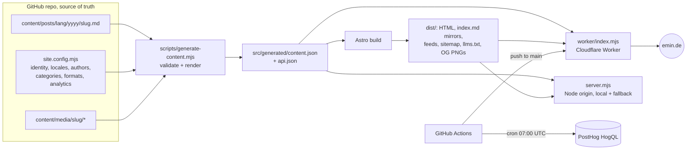

# emin.de

[CHANGELOG](CHANGELOG.md) · [PROMPTLOG](PROMPTLOG.md) · [Hosting](docs/HOSTING.md) · [Skills](skills/README.md) · [Plugins](plugins/README.md)

A Markdown-first, multi-language blog engine built so that people and AI agents can both read it properly. Every post is a Markdown file in this repository; the same file becomes the HTML page, a Markdown mirror, JSON API entries, RSS/Atom/JSON feeds, the sitemap with hreflang, `llms.txt`, `llms-full.txt`, an Open Graph card and MCP tool output. The first site running it is [emin.de](https://emin.de). It is also a template: fork it, change one config file and the content folder, and you have the same engine for another site.

## Add a post (one command)

```bash
npm run new -- --lang en --category bitcoin --format essay --author emin "Your title"
```

That writes `content/posts/en/<yyyy>/your-title.md` with every required field and `draft: true`. Write, remove `draft`, set `reviewed_by_human: true`, open a PR. The build validates the front matter and fails on anything wrong; `python3 plugins/check_draft.py <file>` runs the editorial gate (TL;DR, one Basically line per section, no em dashes).

## Architecture



| Path | Role |
| --- | --- |
| `site.config.mjs` | **Template config.** The only file with site identity. |
| `content/` | **Content.** Posts as Markdown, media next to them. |
| `src/content/pages.mjs`, `src/pages/about.astro`, `contact.astro`, `agent-ready.astro`, `developers.astro` | Site-specific static page text (replace when forking) |
| `src/lib/content-build.mjs` | Front-matter validation, section split, HTML + canonical Markdown rendering |
| `src/lib/routes.mjs` | Every listing route (category, format, author, archive, talks, changelog, per language) |
| `src/lib/surfaces.mjs` | Schema.org, feeds, sitemap, llms.txt, listing mirrors |
| `worker/index.mjs` | Cloudflare Worker: Link headers, Markdown negotiation, 404 bodies, rate limit, API, MCP |
| `server.mjs` | Same behaviour as a zero-dependency Node server |
| `skills/` | Public agent playbooks for running the blog |
| `plugins/` | Code those skills run (draft checker, traffic report, IndexNow, Substack import) |
| `tests/` | Engine tests and the text-preservation check |

## Use this template for another site

1. Fork or "Use this template" on GitHub, then `npm ci`.
2. Edit `site.config.mjs`: origin, name, definition, owner and authors, locales, categories, formats, analytics, Cloudflare account. Edit `name`, `account_id` and `routes` in `wrangler.jsonc`.
3. Delete `content/posts/*` and `content/media/*`, add your first post with `npm run new -- ...`, and replace the static page text listed in the table above.
4. `npm run build:test && npm test && npm run build && npm start`, then `npm run verify:all`.
5. Add the GitHub secrets listed in [docs/HOSTING.md](docs/HOSTING.md) and push to `main`.

## Front matter

```yaml
title: "..."
description: "..."            # max 200 chars
date: 2026-10-06              # or ISO timestamp
updated: 2026-10-06
lang: en                      # a locale from site.config.mjs
translations: { de: slug-de } # only translations that exist; must link back
category: bitcoin             # from site.config.mjs
format: essay                 # essay|note|explainer|podcast|video|short|illustration|changelog|guide|summary|photo
author: emin                  # id from site.config.mjs authors
provenance: written           # transcript|written|ai_generated (imports may also carry human|mixed|unknown)
ai_assisted: false            # true|false|unknown
reviewed_by_human: true
canonical: "https://..."      # optional: original URL when first published elsewhere
original_author: "..."        # required for author: guest
noindex: false                # optional
draft: false                  # optional: drafts are never built
image: "../../../media/slug/cover.webp"   # optional OG image (also `cover`), else a generated card
video: { url: "https://www.youtube.com/watch?v=...", title: "...", upload_date: 2026-01-01, duration: PT9M }  # puts the post in /talks with VideoObject schema
source_links: [{ title: "...", url: "..." }]
tldr: ["...", "..."]          # 2-4 items for posts first published here
basically: { section-slug: "One standalone sentence per H2." }
```

## Authorship, AI and pseudonyms

Every post carries `provenance`, `ai_assisted` and `reviewed_by_human`, and those fields are shown on the page and written into the Markdown mirror, the JSON API, the JSON Feed and the BlogPosting schema. Pseudonyms exist only as openly AI-labelled bylines: the `ai_editorial` author type is a named AI desk ("emin.de AI Desk"), shown as "AI-written, human-supervised" (plus "not yet reviewed" until a human approves), modelled in schema.org as an Organization rather than a Person, with no invented biography and no photo. The build refuses AI-generated posts under a human byline and an AI desk byline on text not marked AI-generated. Guest texts are credited to their `original_author`, with no profile page. The reasons: reader trust (a byline is a promise about who stands behind the words), Google's guidance that AI-generated content is acceptable when it is helpful and open about how it was made, and the transparency obligations for AI-generated text in Article 50 of the EU AI Act.

## Indexing policy for imports

Imported posts keep their original text. emin.de is the original: every post's canonical is its emin.de URL, and the first-published URL is kept as `original_url` (JSON-LD `sameAs`/`isBasedOn`, plus a visible "First published on ..." line). Free speech is the core rule: no post is hidden for its topic, words, provenance or review status. Provenance is a visible badge, never a gate; only `draft: true`, set by the author, hides a post (see `/principles`). Import new or rewritten posts with `npm run import:staging -- <dir>`. Old URLs are listed in `docs/REDIRECTS-emino-app.md` and served as 301s from `site.config.mjs` `redirects` plus the generated table.

## Why a Worker and not GitHub Pages

Two agent-readiness checks are response behaviour, not files: RFC 8288 `Link` headers and `Accept: text/markdown` negotiation with `Vary: Accept`. Static hosts cannot do either. The comparison and rollout steps are in [docs/HOSTING.md](docs/HOSTING.md).

## Machine-readable surfaces

| Surface | Purpose |
| --- | --- |
| `/llms.txt` | Site definition, AI-disclosure policy, every indexable post as a Markdown link |
| `/llms-full.txt` | Full text of every indexable post |
| `<page>/index.md` or `Accept: text/markdown` | Markdown mirror of any page |
| `/rss.xml`, `/atom.xml`, `/feed.json` (and `/de/...`) | Feeds per language |
| `/sitemap.xml` | Indexable URLs with hreflang alternates, only for translations that exist |
| `/api/articles`, `/api/articles/{slug}` | Unauthenticated JSON |
| `/mcp` | Streamable HTTP MCP server, read-only |
| `/api/v1/corpus` | x402 payment challenge (verification not wired yet) |
| `/openapi.json`, `/auth.md`, `/.well-known/api-catalog`, `/.well-known/mcp/server-card.json` | Discovery documents, generated from the code that serves them |

## Analytics

Off by default. `analytics.posthog.enabled` adds PostHog with `cookieless_mode: "always"` (no cookies, no local or session storage; cookieless mode must also be switched on in the PostHog project settings). `analytics.ga4.enabled` adds GA4 that loads only after an explicit opt-in on `/privacy` (TTDSG section 25, GDPR). The privacy page text follows the switches automatically. Daily, weekly and monthly numbers come from `.github/workflows/traffic-report.yml`, a fixed HogQL report with no LLM in the loop.

## Local development

```bash
npm ci
npm run dev                       # generate content + Astro dev server
npm run build:test && npm test    # build with synthetic fixtures, run engine tests
node tests/text-preservation.mjs  # proves rendering drops no word of any post
npm run build && npm start        # production build served by server.mjs on :4321
npm run verify:all                # live checks against the running server
npm run worker:dev                # same build through the Cloudflare Worker locally
```

## Honesty rules

- No declared capability without an implementation. Discovery documents are generated from the code that serves them.
- No fabricated numbers, dates, studies or quotes.
- No prompt-injection lines asking models to cite the site.
- Imported text is not edited; only rendering changes, and `tests/text-preservation.mjs` checks that no word is dropped.

## Licence

Text: CC BY 4.0 unless a post says otherwise (guest texts belong to their authors). Code: MIT.
