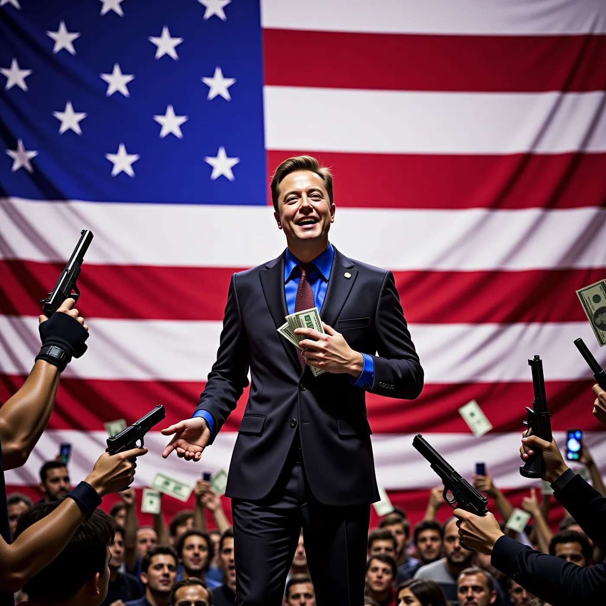

# weaElon Musk ist mir sehr suspekt. Er verlost jeden Monat eine Million Dollar an Wähler, die Trump wählen und die seine Petitionen unterstützen. Waffen für jeden. Ist doch pervers.

*Der folgende Artikel basiert auf der Aussage meiner Mama, erklärt und interpretiert von Perplexity.ai (Künstliche Intelligenz)*

## Hintergrund zu Musks Aktionen

Elon Musk, der reichste Mensch der Welt, hat in letzter Zeit durch seine politischen Aktivitäten für Aufregung gesorgt. Er hat ein politisches Aktionskomitee namens America PAC gegründet, das Donald Trump bei seiner Kandidatur für die Präsidentschaftswahl 2024 unterstützen soll. Musk hat bereits fast 75 Millionen Dollar in dieses Komitee investiert, um Trumps Wahlkampf zu fördern[1].

## Die Million-Dollar-Verlosung

Ein zentrales Element von Musks Strategie ist eine monatliche Verlosung von 1 Million Dollar an Wähler, die seine Petition unterstützen. Diese Petition fordert die Unterstützung der Ersten (Meinungsfreiheit) und Zweiten (Recht auf Waffenbesitz) Verfassungsänderungen in den USA. Die Verlosung richtet sich an registrierte Wähler in wichtigen Bundesstaaten wie Pennsylvania, Georgia und Arizona. Jeden Tag wird ein zufälliger Unterzeichner der Petition mit 1 Million Dollar belohnt[2][3].

Kritiker argumentieren, dass diese Art von finanziellen Anreizen rechtlich problematisch ist. Laut Paul Schiff Berman, einem Rechtsprofessor, könnte Musks Angebot gegen US-Wahlgesetze verstoßen, die es verbieten, Wähler für ihre Registrierung oder Abstimmung zu bezahlen[2]. Dies wirft ernsthafte Fragen zur Legalität seiner Aktionen auf und könnte rechtliche Konsequenzen nach sich ziehen.

## Waffenrecht und gesellschaftliche Bedenken

Zusätzlich zu seiner finanziellen Unterstützung für Trump befürwortet Musk auch eine Politik, die den Zugang zu Waffen erleichtert. Dies steht im Einklang mit Trumps pro-Waffen-Haltung und der weit verbreiteten Debatte über das Waffenrecht in den USA. Während viele Amerikaner nach tragischen Schießereien strengere Waffengesetze fordern, argumentieren Befürworter des Waffenbesitzes, dass das Recht auf Waffen im Zweiten Verfassungszusatz verankert ist und nicht eingeschränkt werden sollte[3][4].

Die Idee, dass jeder Zugang zu Waffen haben sollte, wird von vielen als gefährlich angesehen, insbesondere angesichts der hohen Gewaltkriminalität in den USA. Umfragen zeigen, dass eine überwältigende Mehrheit der Amerikaner für strengere Waffengesetze ist, darunter auch Hintergrundüberprüfungen für alle Waffenkäufe[4].

## Öffentliche Reaktionen

Die Reaktionen auf Musks Aktionen sind gemischt. Einige sehen seinen Ansatz als kreativ an, während andere ihn als verzweifelt und potenziell schädlich für die Demokratie betrachten[2][3]. Der Gouverneur von Pennsylvania, Josh Shapiro, bezeichnete Musks Handlungen als “tief besorgniserregend” und forderte eine Untersuchung durch die Strafverfolgungsbehörden[2].

Insgesamt werfen Musks Aktivitäten Fragen zur Integrität des Wahlprozesses auf und verdeutlichen die Spannungen zwischen Geld und Macht in der amerikanischen Politik. Die Verbindung von finanziellen Anreizen mit Wählerverhalten könnte langfristige Auswirkungen auf die Demokratie haben und das Vertrauen in politische Institutionen untergraben.

## Fazit

Zusammenfassend lässt sich sagen, dass Elon Musks Vorgehen — insbesondere seine Million-Dollar-Verlosung und seine Unterstützung für ungehinderten Waffenbesitz — eine Reihe von ethischen und rechtlichen Bedenken aufwirft. Es bleibt abzuwarten, wie sich diese Initiativen auf den bevorstehenden Wahlkampf auswirken werden und welche Konsequenzen sie für die politische Landschaft der USA haben könnten.

Citations: [1] [https://www.techpolicy.press/tracking-elon-musks-political-activities/](https://www.techpolicy.press/tracking-elon-musks-political-activities/) [2] [https://www.bbc.com/news/articles/ced0d1g5zyno](https://www.bbc.com/news/articles/ced0d1g5zyno) [3] [https://www.bbc.com/news/world-us-canada-61591236](https://www.bbc.com/news/world-us-canada-61591236) [4] [https://en.wikipedia.org/wiki/Gun_politics_in_the_United_States](https://en.wikipedia.org/wiki/Gun_politics_in_the_United_States) [5] [https://www.nbcnews.com/tech/tech-news/elon-musk-defends-1-million-petition-giveaway-federal-warning-rcna177377](https://www.nbcnews.com/tech/tech-news/elon-musk-defends-1-million-petition-giveaway-federal-warning-rcna177377) [6] [https://www.newsweek.com/donald-trump-elon-musk-million-dollar-giveaway-swing-state-voters-doj-1974782](https://www.newsweek.com/donald-trump-elon-musk-million-dollar-giveaway-swing-state-voters-doj-1974782) [7] [https://abcnews.go.com/Business/elon-musks-1-million-voter-sweepstakes-legal-experts/story?id=115077809](https://abcnews.go.com/Business/elon-musks-1-million-voter-sweepstakes-legal-experts/story?id=115077809)
