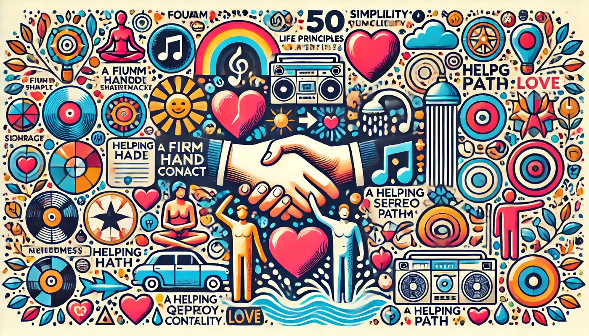

Text von [Pat Divilly](https://medium.com/bigger-picture/lifelessons-advice-from-an-80-year-old-man-799510fb0f91), aus dem Englischen übersetzt.

Eine Liste mit 50 Ratschlägen von einem 80 Jährigen. Ich teile sie hier auf Deutsch, weil man sie immer wieder lesen kann.

1. Haben Sie einen festen Händedruck.
2. Schauen Sie den Leuten in die Augen.
3. Singen Sie unter der Dusche.
4. Besitzen Sie ein großartiges Stereo-System.
5. Wenn Sie in einem Kampf sind, schlagen Sie zuerst und schlagen Sie hart.
6. Bewahren Sie Geheimnisse.
7. Geben Sie niemals jemanden auf. Wunder geschehen jeden Tag.
8. Nehmen Sie immer eine ausgestreckte Hand an.
9. Seien Sie mutig. Auch wenn Sie es nicht sind, tun Sie so. Niemand kann den Unterschied erkennen.
10. Pfeifen Sie.
11. Vermeiden Sie sarkastische Bemerkungen.
12. Wählen Sie Ihren Lebenspartner sorgfältig. Aus dieser einen Entscheidung werden 90 % Ihres Glücks und Elends entstehen.
13. Machen Sie es sich zur Gewohnheit, nette Dinge für Menschen zu tun, die es nie herausfinden werden.
14. Verleihen Sie nur Bücher, die Sie nie wiedersehen möchten.
15. Entziehen Sie niemandem die Hoffnung; es könnte alles sein, was er hat.
16. Lassen Sie Kinder beim Spielen gewinnen.
17. Geben Sie Menschen eine zweite Chance, aber keine dritte.
18. Seien Sie romantisch.
19. Werden Sie die positivste und enthusiastischste Person, die Sie kennen.
20. Lockern Sie sich. Entspannen Sie. Abgesehen von seltenen lebenswichtigen Angelegenheiten ist nichts so wichtig, wie es zuerst scheint.
21. Lassen Sie das Telefon nicht wichtige Momente unterbrechen. Es ist für unsere Bequemlichkeit da, nicht für den Anrufer.
22. Seien Sie ein guter Verlierer.
23. Seien Sie ein guter Gewinner.
24. Denken Sie zweimal nach, bevor Sie einem Freund ein Geheimnis anvertrauen.
25. Wenn jemand Sie umarmt, lassen Sie ihn der Erste sein, der loslässt.
26. Seien Sie bescheiden. Vieles wurde schon vor Ihrer Geburt erreicht.
27. Halten Sie es einfach.
28. Hüten Sie sich vor der Person, die nichts zu verlieren hat.
29. Brennen Sie keine Brücken. Sie werden überrascht sein, wie oft Sie denselben Fluss überqueren müssen.
30. Leben Sie Ihr Leben so, dass Ihr Epitaph lauten könnte: Keine Reue.
31. Seien Sie kühn und mutig. Wenn Sie auf Ihr Leben zurückblicken, werden Sie die Dinge, die Sie nicht getan haben, mehr bereuen als die, die Sie getan haben.
32. Verschwenden Sie niemals eine Gelegenheit, jemandem zu sagen, dass Sie ihn lieben.
33. Erinnern Sie sich, dass niemand es alleine schafft. Haben Sie ein dankbares Herz und erkennen Sie schnell diejenigen an, die Ihnen geholfen haben.
34. Übernehmen Sie die Kontrolle über Ihre Einstellung. Lassen Sie nicht zu, dass jemand anderes sie für Sie wählt.
35. Besuchen Sie Freunde und Verwandte, wenn sie im Krankenhaus sind; Sie müssen nur ein paar Minuten bleiben.
36. Beginnen Sie jeden Tag mit etwas Ihrer Lieblingsmusik.
37. Nehmen Sie sich hin und wieder die landschaftliche Route.
38. Senden Sie viele Valentinskarten. Unterschreiben Sie sie mit „Jemand, der dich großartig findet“.
39. Nehmen Sie den Hörer mit Begeisterung und Energie in Ihrer Stimme ab.
40. Halten Sie ein Notizbuch und einen Bleistift auf Ihrem Nachttisch. Million-Dollar-Ideen kommen manchmal um 3 Uhr morgens.
41. Zeigen Sie Respekt für jeden, der arbeitet, unabhängig davon, wie trivial sein Job ist.
42. Schicken Sie Ihren Liebsten Blumen. Denken Sie später an einen Grund.
43. Machen Sie jemandes Tag, indem Sie die Maut für das Auto hinter Ihnen bezahlen.
44. Werden Sie zum Helden von jemandem.
45. Heiraten Sie nur aus Liebe.
46. Zählen Sie Ihre Segnungen.
47. Komplimentieren Sie das Essen, wenn Sie als Gast im Haus von jemandem sind.
48. Winken Sie den Kindern im Schulbus zu.
49. Denken Sie daran, dass 80 % des Erfolgs in jedem Job auf Ihrer Fähigkeit beruhen, mit Menschen umzugehen.
50. Erwarten Sie nicht, dass das Leben fair ist.
