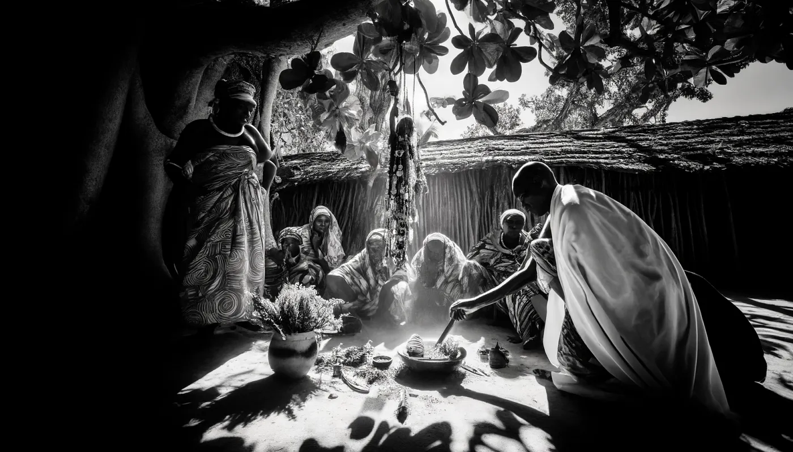

Sansibar und Pemba haben reiche Geschichten, die mit schwarzer Magie und traditionellen spirituellen Praktiken verflochten sind. Diese Inseln sind bekannt für ihr kulturelles Erbe, das Glauben an übernatürliche Wesen und die Verwendung von traditioneller Medizin umfasst.

## Shetani und Popobawa

Shetani: Auf Sansibar und Pemba sind Shetani Geister oder Dämonen, von denen angenommen wird, dass sie menschliche Angelegenheiten beeinflussen. Der Mwinyi Mkuu, oder Großherr, hatte historisch gesehen Macht durch die Kontrolle dieser Geister und das Vorhersehen der Zukunft. Die Ruinen des Palastes des Mwinyi Mkuu in Dunga sollen nachts von diesen Geistern heimgesucht werden​ ([Siyabona](https://www.siyabona.com/shetani-zanzibar.html))​.

Popobawa: Dieser berüchtigte Geist terrorisierte die Menschen auf Pemba und später auf Sansibar. Es wird gesagt, dass Popobawa seine Opfer lähmt und missbraucht, was jedes Mal, wenn er angeblich erscheint, zu Massenhysterie führt​ ([Siyabona](https://www.siyabona.com/shetani-zanzibar.html))​.

## Traditionelle Heiler (Waganga)

Waganga, oder traditionelle Heiler, spielen eine entscheidende Rolle bei der Bewältigung des Einflusses von Shetani und anderen Geistern. Diese Heiler verwenden eine Kombination aus Kräuterheilmitteln und spirituellen Ritualen, um Krankheiten zu behandeln und böswillige Geister zu vertreiben. Ihre Praktiken sind tief in der lokalen Kultur verwurzelt und werden oft über Generationen weitergegeben​ ([Siyabona](https://www.siyabona.com/shetani-zanzibar.html))​​ ([Voices of Africa](https://voicesofafrica.co.za/believe-it-or-not-witchcraft-in-kenya/))​.

## Dschinn (Genies)

Beeinflusst durch islamische Traditionen ist auch der Glaube an Dschinn (Genies) weit verbreitet. Es wird angenommen, dass diese Wesen Wünsche erfüllen und Einzelpersonen schützen können, wenn sie richtig beschworen und kontrolliert werden. Diese Art von Magie beinhaltet Rituale, die oft islamische Gebete mit traditionellen Praktiken verbinden. Es ist üblich, dass Menschen die Dienste eines Mganga in Anspruch nehmen, um mit Dschinn und anderen übernatürlichen Wesen umzugehen​ ([Voices of Africa](https://voicesofafrica.co.za/believe-it-or-not-witchcraft-in-kenya/))​.

## Kulturelle Integration

Das kulturelle Gefüge von Sansibar und Pemba ist eine Mischung aus afrikanischen, arabischen, persischen und indischen Einflüssen. Diese Mischung hat einzigartige spirituelle Praktiken geschaffen, bei denen schwarze Magie und traditionelle Heilung mit dem islamischen Glauben koexistieren. Der Gebrauch von Schutzzaubern, Ritualen und Geisterbeschwörungen ist weit verbreitet und spiegelt das synkretische spirituelle Umfeld der Inseln wider​ ([Indigo Safaris](https://www.indigosafaris.com/pemba_island_history_and_culture.html))​​ ([Tanzania Odyssey](https://www.tanzaniaodyssey.com/blog/cadogan-guide-to-tanzania-the-indian-ocean-islands-pemba/))​.

Diese Praktiken sind ein wesentlicher Teil der lokalen Kultur und ziehen sowohl Gläubige, die Hilfe suchen, als auch Forscher an, die sich für traditionelle afrikanische Spiritualität interessieren. Die abgelegene und weniger entwickelte Natur der Inseln hat es diesen Traditionen ermöglicht, relativ unverändert über Jahrhunderte hinweg zu bestehen.

*Dieser Artikel wurde gemeinsam von emino.ai, Bane und ChatGPT verfasst.*
