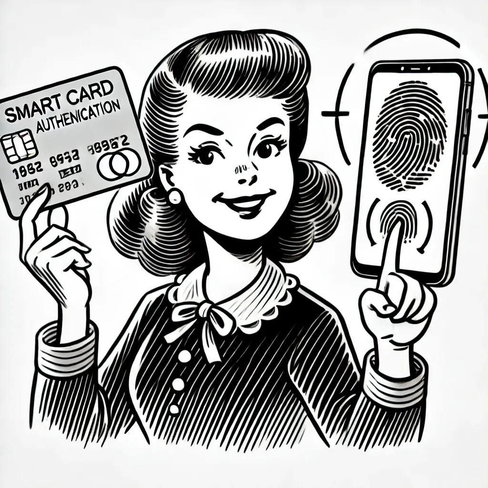
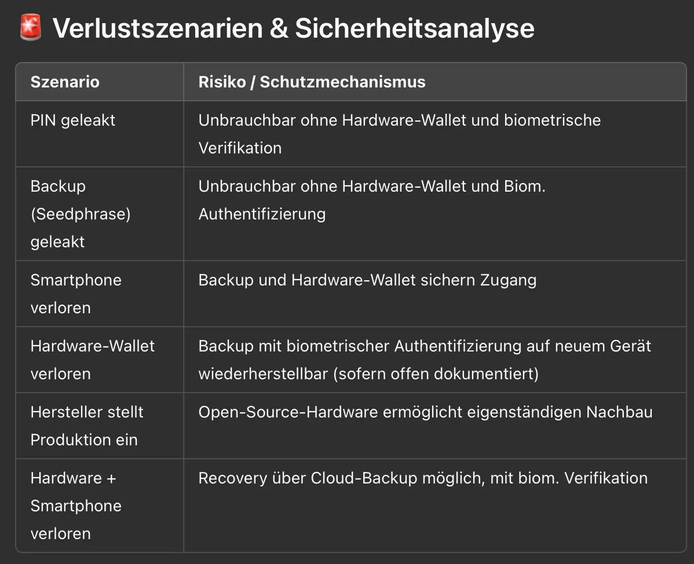

Heute schreibe ich eine Stunde über Nuri, das Bitcoin Wallet für alle. Mein Wunsch ist es, ein Bitcoin Wallet zu entwickeln, welche besonders einfach benutzbar ist. Wie bei jedem Wallet beginnt der Prozess mit der Installation. Der Nutzer lädt sich die Nuri Wallet App herunter, und startet diese auf seinem Smartphone. Der erste Schritt ist immer das generieren oder erstellen des privaten Schlüssel. Der private Schlüssel ist das Passwort zum Bitcoin der Nutzer. Traditionelle Wallets generieren in der Regel 12–24 Wörter, welche diesen privaten Schlüssel repräsentieren und vom Nutzer an einem sicheren Ort aufgeschrieben und aufbewahrt werden müssen. Der Schlüssel wird in der Regel nur benötigt, sollte der Nutzer sein Handy verlieren, um die Bitcoin Wallet wiederherzustellen.

Hier diverse Schritte und Möglichkeiten:
1. Der Private Schlüssel wird auf dem Handy generiert
2. Der Private Schlüssel wird auf dem Handy gespeichert und mit einem Pin, Passwort oder Biometrie verschlüsselt 
3. Der Private Schlüssel wird vom Nutzer manuell auf Papier aufgeschrieben (ein Paper-Backup wird erstellt)
4. Der Private Schlüssel wird vom Nutzer in der Cloud gespeichert (Google Drive, iCloud) und in der Regel mit einem Pin oder Passwort verschlüsselt
5. Der Private Schlüssel wird mit einem zusätzlichen Pin oder Passwort geschützt (Salt)
6. Der Private Schlüssel wird auf einem externen Hardware Wallet generiert
7. Der Private Schlüssel wird auf einem externen Wallet gespeichert und mit einem Pin Code, Passwort oder Biometrie verschlüsselt

Die Liste kann endlos weitergeführt werden, an kreativen Ansätzen fehlt es nicht. Die Schlussfolgerung ist jedoch, das sichere erstellen und aufbewahren des privaten Schlüssel ist der erste, und mitunter wichtigste Schritt. Wird der Schlüssel nicht sicher erstellt, so kann er theoretisch im Prozess von einem Dritten gesehen oder abgegriffen werden. Der Gefahrfaktor Nummer eins ist hierbei fast immer der Mensch.

Insbesondere bei Nutzern, die das erste Mal mit dem Sichern eines privaten Schlüssel konfrontiert werden, und ungeübt sind digitale Geheimnisse sicher aufzubewaren und aufzuschreiben, kann es dazu führen das der private Schlüssel abfotografiert wird, oder in die persönliche Notes app kopiert oder vielleicht sogar per Email oder Whatsapp irgendwo hingeschickt wird.

Wenn der Schlüssel angezeigt wird, entstehen automatisch Fehler. Das Ziel von Nuri ist es, es faktisch unmöglich zu machen, den Schlüssel zu verlieren.

Welche Probleme müssen also gelöst werden um den privaten Schlüssel privat zu halten?

1. Wenn es nur einen Schlüssel gibt, und dieser Schlüssel gefunden wird, ist das ein Problem (man erhält direkt Zugriff auf das Wallet und kann die Bitcoin bewegen). Die gängigste Lösung hier ist es nicht einen Schlüssel, sondern mehrere Schlüssel zu kombinieren. Ein Schlüssel auf dem Telefon, ein Schlüssel auf dem Hardware Wallet und weitere Schlüssel als Backup in der Cloud oder auf dem Server eines Custodian
2. PIN-Codes und Passwörter, die als zusätzlicher Schutz dienen, sind problematisch für viele Nutzer, da diese Passwörter und PIN codes gerne vergessen oder unsichere PIN und Passwörter wählen, die letztendlich keinen Schutz für den verschlüsselten Schlüssel darstellen.

Die Lösung von Nuri ist, dass der Nutzer durch die Generierung und Backup des Schlüssels so durchgeführt werden, dass sowohl die Erstellung als auch die Sicherung der Schlüssels ohne einen Single-Point-Of-Failure durchgeführt werden kann.

Von wem und wo könnten Schlüssel generiert werden.
1. Auf dem Hardware Wallet, verschlüsselt durch Biometrie des Nutzers
2. Auf dem Telefon, verschlüsselt durch das Hardware Wallet
3. Auf dem Telefon, verschlüsselt durch ein Passwort, PIN oder Biometrie
4. Auf dem Server von Nuri

Es muss sichergestellt werden, dass ein einzelner Schlüssel kein Zugriff auf das Wallet hat, und das beim Verlust von einem oder mehreren Schlüsseln, die Wiederherstellung des Wallet möglich ist.

Verlustszenarien sind
1. Verlust des Telefon
2. Verlust des Hardware Wallet
3. Verlust des Telefon und Hardware Wallet
4. Verlust des PIN und Passwort zum Backup/Cloud Account, E-Mail Inbox, oder Nuri.com Account (normalerweise gesichert durch Email und Passwort oder Social Login wie Google Login oder Apple Login)

Die 100% Absicherung vor Verlust ist nicht möglich. Gestaltet man den Wiederherstellungsprozess zu einfach, so erleichtert man es auch potentiellen Angreifern, diesen Prozess zu wiederholen und Zugriff auf das Wallet zu erhalten.

Gestaltet man den Wiederherstellungsprozess zu kompliziert, begibt man sich in die Gefahr, dass der Nutzer Fehler bei der Sicherung, oder Wiederherstellung begeht.

Der Weg wie Nuri plant den Schlüssen zu erstellen

1. Ein Schlüssel wird auf dem Telefon generiert und mit Biometrie, PIN oder Passwort verschlüsselt. Der Schlüssel vom Telefon, wird ebenfalls in der Cloud gebackupt
2. Ein Schlüssel wird auf dem Nuri Server erstellt, dort ebenfalls verschlüsselt
3. Ein Schlüssel wird auf dem Nuri Hardware Wallet erstellt und mit dem Fingerabdruck von Nuri verschlüsselt
4. Weitere Schlüssel können an Freunde und Familie geschickt werden
5. Ein Recovery-Sheet kann als Master-Backup erstellt werden (single point of failure!)

Schafft es ein Angreifer Zugriff auf das Telefon eines Nutzers zu erhalten, könnte er sowohl Zugriff auf den Telefon-Key erhalten. Schafft er es ebenfalls Zugriff auf den Nuri-Server Key zu erhalten, so hätte der Angreifer 2 Schlüssel die genügen um Zugriff auf das Wallet zu erhalten.

Der Schlüssel auf dem Nuri Server könnte durch eine leichte Entropy (Fingerabdruck) in Kombination mit einer Gesichtserkennung (Face-ID) verschlüsselt sein, und oder einem Pin und Passwort, welches den Zugriff erschwert.

In der Praxis wäre es am besten wenn mehrere Schlüssel auf dem Hardware Wallet erstellt werden, anschließend werden diese Schlüssel mit Biometrie verschlüsselt, dann exportiert und zum Beispiel auf dem Telefon des Nutzers, in der Nuri cloud oder am Cloud Backup des Nutzers gespeichert.

Ein Risiko hier ist, dass sollte die Nuri Firma und ihr Hardware Produkt verschwinden, dann wäre das Wiederherstellen des Schlüssels sehr schwierig bis unmöglich, da die benötigte Entropy aus Finger nicht möglich wäre, oder nur sehr schwierig.

Insgesamt ist die Herausforderung ein sicheres Backup und eine sichere Generierung von privaten Schlüsseln zu gewährleisten, eine der größten Herausforderungen in cryptografischen Bereich. Nur testet zur Zeit verschiedene Wege und Möglichkeiten.

Im Verlauf dieses “Brainstorming” habe ich auch Fragen und Antworten aus anderen Quellen gesammelt, eine Zusammenfassung folgt hier:

## Sichere Biometrie-basierte Schlüsselverwaltung und -Backup

## 🎯 Zielsetzung

Ein **idiotensicheres, sicheres System zur Erstellung, Speicherung und Wiederherstellung kryptografischer Schlüssel** auf Basis von Biometrie (Fingerabdruck, Gesichtserkennung) in Kombination mit PIN oder Passwörtern und Hardware-Wallets.

## 🔑 Anforderungen und Ziele

- Sichere **lokale Generierung** kryptografischer Schlüssel auf Hardware-Wallets oder Smartphones.
- Sichere externe Backups in Cloud, Smartphone, oder offline.
- Schlüssel-Backups verschlüsselt durch Biometrie (Fingerabdruck und/oder Gesichtserkennung), optional ergänzt durch PIN/Passwort.
- Vermeidung von Single-Point-of-Failure.
- Open-Source-Hardware, um unabhängige Reproduzierbarkeit zu gewährleisten.

## 📌 Mögliche Schlüsselgenerierung und Sicherung

1. Schlüsselgenerierung auf dem Hardware-Wallet (Smartcard), geschützt mit biometrischer Authentifizierung (Fingerabdruck).
2. Schlüsselgenerierung auf Smartphone, verschlüsselt mit Schlüssel des Hardware-Wallets.
3. Speicherung des verschlüsselten Schlüssels auf Smartphone, Cloud oder offline Backup.
4. Optionale Speicherung eines Recovery-Schlüssels bei Familie/Freunden oder mittels Recovery-Sheet (Achtung: Single Point of Failure!).

## 🚩 Herausforderungen und Risiken

Entropie und Sicherheit
- Biometrische Daten alleine (Fingerabdruck ~10–20 Bits, Gesicht ~10–20 Bits) bieten allein nicht genügend Entropie für sichere kryptografische Schlüsselableitung.
- Kombination aus Fingerabdruck, Gesicht und PIN erhöht Entropie erheblich und bietet akzeptable Sicherheit.

Hardware-Abhängigkeit
- Proprietäre Hardware-Lösungen bergen das Risiko, dass Nutzer den Zugang verlieren, wenn das Produkt nicht mehr hergestellt wird.
- **Open-Source**-Hardware/Firmware reduziert dieses Risiko erheblich, da Nutzer das System im Notfall nachbauen können.

## 🔓 Sicherheitsarchitektur (empfohlen)

Schlüsselgenerierung und Verschlüsselung
- Seed (12 Wörter) auf Hardware Wallet generiert.
- Seed verschlüsselt durch Kombination:
  - Fingerabdruck als biometrischer Faktor (“13. Wort”).
  - Optionaler PIN oder Passwort (“14. Wort”).
- Nutzung einer robusten Key Derivation Function (Argon2, PBKDF2).
- Verschlüsselte Speicherung des Backups extern.

**Recovery-Prozess**
Zur Wiederherstellung werden benötigt:
- Verschlüsseltes Backup
- Hardware Wallet zur biometrischen Authentifizierung
- Optionaler PIN-Code/Passwort

## ⚠️ Herausforderungen

- **Biometrische Variabilität:** Erfordert Techniken wie Fuzzy Extractors zur zuverlässigen Ableitung von Schlüsseln.
- **Hardware-Lock-In:** Offene Standards und offene Hardware-Spezifikationen dringend empfohlen, um langfristigen Zugriff sicherzustellen.
- **Benutzerfreundlichkeit:** Balance zwischen Sicherheit und einfacher Bedienbarkeit.

## ✅ Empfohlene Maßnahmen zur Risikominimierung

- Nutzung offener, standardisierter biometrischer Formate (ISO/IEC).
- Offenlegung und Dokumentation aller kryptografischen Verfahren und Hardware-Designs.
- Etablierung redundanter Backup- und Recovery-Verfahren (Cloud, Familie, Hardware, Papier).

## 🎖️ Fazit

Die Kombination aus Fingerabdruck, optionaler Gesichtserkennung, einer kurzen PIN und offener Hardware-Architektur bietet:

- Hohe Sicherheit gegen Angriffe und Verluste.
- Einfache Bedienbarkeit und Nutzerfreundlichkeit.
- Zukunftssicherheit durch Open-Source-Standards.

Dieser Ansatz stellt eine sehr sichere und praktikable Lösung für die Schlüsselverwaltung dar, solange biometrische Faktoren mit ergänzenden Sicherheitselementen (PIN, Passwort) und einer robusten Hardware- und Backup-Infrastruktur kombiniert werden.
