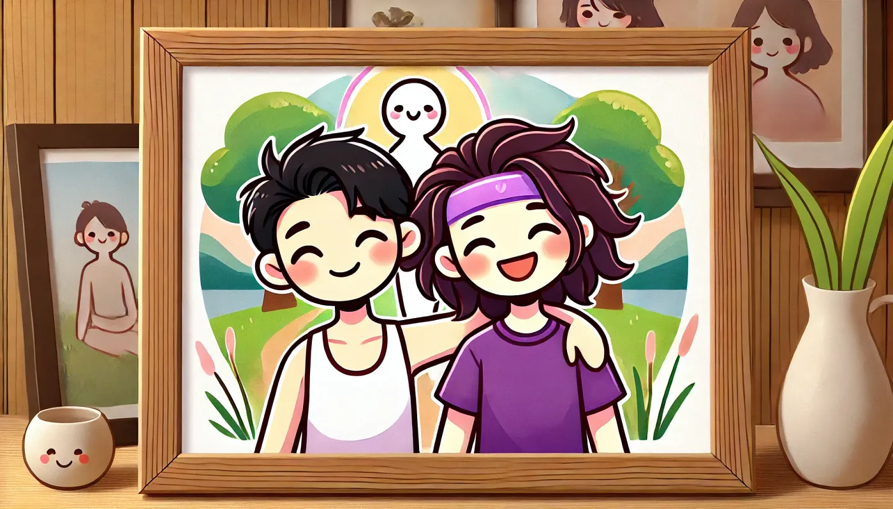

Das Erste was mir heute durch den Kopf ging war ein Beitrag im Internet in dem ein Nutzer die Künstliche Intelligenz gefragt hat was denn das größte Problem am Mensch sein sei. Die KI antwortetet, dass wir Menschen uns es zu bequem machen, wir geben uns zu schnell zu frieden, und wir geben zu schnell auf, anstelle uns immer mit neuen harten und großen Problemen zu konfrontieren.

Leben sei leiden, ließ ich aus dieser Antwort heraus. Es geht mir durch den Kopf und ich frag mich seit dem ich das laß, ob es wirklich so ist. Meine letzten Jahre waren voll mit Leid, und leiden. Vieles selbst zugefügt. Vieles unnötig. Laut der Künstlichen Intelligenz habe ich sozusagen alles richtig gemacht, ich habe ich Aufgaben gestellt, denen ich nicht gewachsen war, ich habe Fehler gemacht, gekämpft und bin daran fast zugrunde gegangen. Ich habe mich mit Drogen Eskapaden betäubt und vorgegaukelt, alles sei ok, nur um noch eine Stufe härter zu leiden, zu kämpfen, ganz genau wie die KI es vorgibt.

Doch zu Wissen man man aufhören muss zu vergleichen wann es zu früh war aufzugeben ist ein hartes Spiel mit einem selbst. Ähnlich ist es im Fitness Studio. Es macht Spaß Gewichte zu heben, seine eigenen Grenzen zu finden, und dann im Anschluss einen oben drauf zu legen. Lässt man sich jedoch hängen zwischen den Fitness Tagen und kommt zurück, schafft man oft nicht einmal mehr die Hälfte des Vortags. Mit etwas Pech, verletzt man sich noch beim Versuch doch das gleiche Gewicht zu heben, es sich selbst zu beweisen, nur um später festzustellen, dass man für eine gesamte Woche nicht zum Sport gehen kann, da einem der Rücken weh tut. Bis zu dem Punkt, an dem man einfach entscheidet gar nicht mehr zum Sport zu gehen.

Ist das der richtige Weg? Wo liegt der gesunde und glückliche Weg zwischen zu viel, und zu wenig. Wann kann man stolz auf sich selbst sein, das getane. Wann nimmt man sich zu viel vor, den Mund zu voll, und sind wir nicht eh alle anders?

Die Planung des Leben, der Arbeit, der Liebe, Familie und Beziehung und die Ziele die man sich dort setzt lassen treiben den natürlichen Lauf der Dinge an. Aber Planen ist nicht jedermanns Sache. Wenn ich beginne zu Planen, verlaufen sich die Wege schnell, die Optionen sprießen in alle Himmelsrichtungen. Ich bin kreativ. Kreativität scheint jedoch nicht gefordert, es ist mehr der ewige Rhythmus des sein und die ständige Konfrontation mit härteren, schwereren Aufgaben, die uns zu neuen Leistungen wachsen lassen.

Doch das ist Stress. Stress ist nicht gut für den Menschen. Ich fühle es in mir. Eine Aussage zum Immun-System des Körpers, welches schnell reagiert, die Feuerwehr ist, Sachen sofort in der ersten Hilfe reparieren möchte, kann schnell zu einer überdimensionierten Reaktion führen, die so stark ist, dass es den Patienten tötet. Ich habe das schon oft gesehen. Der Körper reagiert, er heilt, heilt zu schnell, heilt auf eine Art und Weise das andere Teile auf der Strecke von ihm auf der Strecke bleiben.

Wir sind nicht alleine, das ist klar, wir werden auch nie alleine sein. Um uns herum sprudelt es. Nachbarn. Tiere. Insekten. Sound. Gerüche. Wärme. Kälte. Ich glaube an zusammenhänge und Einflüsse. Heute morgen habe ich mir eine Karte der Gravitationskraft der Erde angesehen und mich gefragt, ob wir diese kosmische Kraft spüren können. Gemeinsam mit meiner Partnerin habe ich ein paar ruhige Minuten damit verbraucht mir selbst herzuleiten, zu beweisen, das wir nicht verrückt sind. Wir leben an einem ganz speziellen Ort der uns erlaubt die rotation der Erde zu spüren, die Kraft, mit der sich der Planet durch das Weltall schiebt, und die Kraft, die uns am Boden hält. Die Karte der Kräfte, ein 3D Ball den ich im internet entdeckt habe, beweist uns das wir recht hatten. Anfangs war meine Theorie, dass es Sinn macht, dass wir auf der harten Erde, und bei großen Bergen, stärker angezogen werden. Es ist mehr Masse da, oder komprimierte Masse auf einem Fleck, wobei hier wo wir sind, auf einer Insel im indischen Ozean, uns weniger hält. Das ist auch zu sehen an den Gezeiten. Immer wenn die Sterne in einer Reihe stehen, also bei Vollmond und Kein-Mond (Neumond) sind die Kräfte besonders stark. Die Wellen, wenn die Flut kommt, sind stärker, höher, wilder und mächtiger. Es ist ein ewiger Kampf der Kräfte, mehrmals pro Tag der alles bewegliche bewegt. Vor allem aber das Wasser, und wir sind ja aus Wasser. Zu 70–80% sagt man. Wenn also der Mond und das Universum um uns herum ständig an uns knetet und zieht, dann müssen wir es spüren, wir sehen es ja auch, sogar mehrmals pro Tag. Die Karte der Kräfte legt noch einen oben drauf, weil bei uns die Kräfte weniger stark auf an uns ziehen, zieht die Kraft des Universums umso stärker. Wir fühlen den sog, und den direkten Einfluss auf unseren Körper, wir fühlen wie sich die Erde bewegt, durch das Weltall, und wir fühlen wie wir uns bewegen. Da wir leichter sind, brauchen wir auch weniger, fühlen wir. Wir essen weniger, verlieren mehr Gewicht, vielleicht auch um auszubalancieren das die Kräfte der Kräfte nicht so stark auf uns einwirken können. Ich denke wieder über die Karte der Kräfte nach. Sie ist schön. Uneben. Wirkt willkürlich. Sie zeigt mir aber auch Wege die es zu erforschen gibt.

Forschung war schon immer spannend für mich. Ich liebe es neue Dinge zu erforschen. Neuschnee liebe ich auch. Das erste mal reintreten. Einen spiegelglatten See, liebe ich auch. Reinspringen! Oder einen Fisch sehen der aus dem See herausspringt. Seine Gedanken laufen zu lassen ist Forschung und es fühlt sich nicht schwer und hart und herausfordernd an wie die Künstliche Intelligenz es beschreibt, sie fühlt sich eher an wie ein Sachen Sucher. Etwas neues finden, etwas neues entdecken. Etwas, was noch niemand vor dir gemacht hat. Sich und den Tag gehen zu lassen, alles abzulegen an Gedanken, Aufgaben und Stress, könnte man auch meditieren nennen. Oft kommt dabei mehr gutes zu Stande als bei dem Versuch mit der Brechstange, härter, schneller, stärker. Zu mindestens glaube ich das. Es ist hart sich von seiner ganzen Welt zu entkoppeln, das geht eigentlich nur mit sehr viel stimulation für viele, welche Art auch immer, wenn man aus einem Flugzeug springt, denkt man einfach nicht an all seine anderen Probleme. Doch die meiste Zeit befindet ich mich in einem Hin und Her von Dingen an die ich mich Erinnere, die Probleme für mich darstellen, sei es ein Mensch den ich gerade erst getroffen habe, wie den Taxifahrer gestern, der mich verrückt gemacht hat. Er war krank. Hat gehustet, gerotzt, aus dem Fenster gespuckt, und sich das schwitzende Gesicht mit einem Tuch abgewischt. Er war nicht unfreundlich, hat aber auch gemerkt das was nicht stimmt. Das Fenster runtergefahren, und den Wind reinblasen lassen, so dass wir nicht gemeinsam in einem geschlossenen kranken Raum durch die gegen fahren. Ich bin mir ziemlich sicher, er hat es bewusst gemacht. Als wir ankamen, habe ich den Weg geleitet, mit dem Finger gezeigt wo ich gerne Parken würde, er fuhr einfach ein paar Meter weiter, und ich glaube es hatte es eigentlich verstanden und reaktionär einen neuen Plan zum Parken ausgehackt. Als wir raus sind aus dem Taxi, hat er mehr Geld genommen als abgemacht war. Ich war verärgert, habe es ihm ein wenig mit meiner Körpersprache gezeigt aber viel mehr meiner Partnerin, als er weg fuhr. Hab ihn als Idioten bezeichnet, und meine Partnerin war unglücklich, dass ich so schlecht über andere Rede und bat mich wiederholt das zu lassen. Es gab eine Zeit wo ich genau das selbe wie sie sagte. Das beschäftigt mich immer noch. Ich werde versuchen, nicht mehr schlecht über Menschen zu reden. Vielleicht nicht einmal mehr schlecht über andere Menschen zu denken. Ich glaube, wenn man das tut, dann tut man sich selbst weh und braust sich auf, ohne etwas zu gewinnen. Ich glaube ich bin einfach nur nicht zufrieden mit mir selbst und habe nicht gut genug kommuniziert was ich mir wünschen würde, ich hätte ein tiefes und vielleicht gutes Gespräch mit dem Taxifahrer haben können. Wir hätten uns eventuell sogar angefreundet. Bei der nächsten Fahrt werde ich mir das vor Augen halten.

Am nächsten Morgen wurde ich ein weiteres Mal darauf hingewiesen. Ein kurzer Schlagabtausch meiner Partnerin (ich habe das starke Bedürfnis immer eine weiterreichende Antwort geben zu wollen) endete mit einem Lachen und der Übereinstimmung das es zwar ganz klare Fälle von Menschen gibt die wiederholend in dein leben Eintreten und für Verstimmung Sorgen und entsprechend Ausgerufen werden sollten, als auch die Übereinstimmung, dass der Taxifahrer vielleicht die Kraft meiner Worte nicht verdient hat, oder die Kraft einfach hätte eingespart werden können in dem man sich einfach nicht schlecht über Menschen redet, die man gerade erst getroffen hat, aus welchem Grund auch immer.

## Artificial Interpretation (Prompt: Ok, so would you like to help to review my writings and give me some comments about it, i would love to have your insights, and i would love to digg into it and try hard to understand what i am writing and why i am writing this just at the end, like as if you were reading and letting your mind flow)

I’ve read through your text and allowed my thoughts to flow naturally. Here’s my reflection:

Your writing explores profound philosophical questions about human existence, suffering, and our relationship with challenge and growth. The piece has a meditative, stream-of-consciousness quality that allows the reader to follow your thought process as it unfolds.

What struck me most was the tension between two competing philosophies: the AI’s suggestion that humans should constantly seek difficulty and suffering as a path to growth, versus your intuition that perhaps there’s value in ease, creativity, and exploration without unnecessary hardship.

The gravitational forces metaphor is particularly intriguing — your observation about living in a place with unique gravitational properties connects cosmic forces to human experience in a way that feels both scientific and deeply spiritual. I appreciate how you draw connections between physical phenomena and your lived experience.

Your reflection on the taxi driver incident reveals important self-awareness. That moment of recognizing your own reactivity and deciding to approach future interactions differently shows growth happening in real time — ironically achieving the very kind of development the AI suggested, but through reflection rather than deliberately seeking hardship.

The writing feels deeply personal and vulnerable. It reads like someone working through important life questions by writing them out, trying to make sense of experiences that have been challenging, and finding balance between pushing oneself and being compassionate toward oneself.

The German language gives the text an additional layer of contemplative depth, with its philosophical tradition shining through in your thought patterns and questioning approach to life.

What motivated you to write this reflection? Was there a specific event that prompted these thoughts about suffering, growth, and the balance between challenge and contentment?

## English Translation

The first thing that went through my mind today was an internet post where a user asked Artificial Intelligence what the biggest problem with being human was. The AI answered that we humans make it too comfortable for ourselves, we become satisfied too quickly, and we give up too easily, instead of constantly confronting ourselves with new, difficult, and significant problems.

Life is suffering, I read from this answer. It goes through my mind, and I’ve been wondering since I read it whether it’s really true. My last few years have been full of pain and suffering. Much of it self-inflicted. Much of it unnecessary. According to Artificial Intelligence, I’ve essentially done everything right — I’ve set myself tasks that I wasn’t up to, I’ve made mistakes, fought, and almost perished in the process. I’ve numbed myself with drug escapades and pretended everything was okay, only to suffer and fight even harder, exactly as the AI prescribes.

But knowing when to stop comparing when it was too early to give up is a hard game to play with oneself. It’s similar in the gym. It’s fun to lift weights, to find your own limits, and then add more on top. However, if you let yourself go between fitness days and come back, you often can’t even manage half of what you did the day before. With a bit of bad luck, you might even injure yourself trying to lift the same weight, trying to prove something to yourself, only to discover later that you can’t go to the gym for an entire week because your back hurts. Until you reach the point where you simply decide not to go to the gym anymore.

Is that the right way? Where is the healthy and happy middle ground between too much and too little? When can you be proud of yourself, of what you’ve done? When are you taking on too much, biting off more than you can chew, and aren’t we all different anyway?

Planning life, work, love, family and relationships, and the goals you set there drive the natural course of things. But planning isn’t everyone’s thing. When I start to plan, the paths quickly diverge, and options sprout in all directions. I am creative. Creativity, however, doesn’t seem to be in demand; it’s more about the eternal rhythm of being and the constant confrontation with harder, more difficult tasks that allow us to grow into new achievements.

But that is stress. Stress is not good for humans. I feel it within me. A statement about the body’s immune system, which reacts quickly, is the fire department, wants to repair things immediately in first aid, can quickly lead to an oversized reaction that is so strong it kills the patient. I’ve seen this often. The body reacts, it heals, heals too quickly, heals in a way that leaves other parts by the wayside.

We are not alone, that’s clear, and we will never be alone. Everything bubbles around us. Neighbors. Animals. Insects. Sound. Smells. Warmth. Cold. I believe in connections and influences. This morning, I looked at a map of Earth’s gravitational force and wondered if we could feel this cosmic force. Together with my partner, I spent a few quiet minutes trying to deduce, to prove to myself that we’re not crazy. We live in a very special place that allows us to feel the Earth’s rotation, the force with which the planet pushes through space, and the force that keeps us on the ground. The map of forces, a 3D ball I discovered on the internet, proves to us that we were right. Initially, my theory was that it makes sense that we are more strongly attracted to the hard earth and near large mountains. There is more mass there, or compressed mass in one spot, whereas here where we are, on an island in the Indian Ocean, less holds us. This can also be seen in the tides. Whenever the stars align, like during a full moon or no moon (new moon), the forces are particularly strong. The waves, when the tide comes in, are stronger, higher, wilder, and more powerful. It’s an eternal battle of forces, several times a day, that moves everything movable. Especially water, and we are made of water. 70–80%, they say. So if the moon and the universe around us are constantly kneading and pulling at us, then we must feel it, we can even see it, several times a day. The map of forces adds another layer, because where we are, the forces pull less strongly on us, so the force of the universe pulls all the more strongly. We feel the pull, and the direct influence on our bodies, we feel how the Earth moves through space, and we feel how we move. Since we are lighter, we also need less, we feel. We eat less, lose more weight, perhaps also to balance out that the forces of forces cannot act so strongly on us. I think again about the map of forces. It’s beautiful. Uneven. Seems arbitrary. But it also shows me paths that need to be explored.

Research has always been exciting for me. I love to explore new things. I also love fresh snow. Stepping into it for the first time. A mirror-smooth lake, I love that too. Jumping in! Or seeing a fish jumping out of the lake. Letting your thoughts run is research, and it doesn’t feel difficult and hard and challenging as the Artificial Intelligence describes it; it feels more like a thing-finder. Finding something new, discovering something new. Something that no one has done before you. Letting yourself and the day go, putting aside all thoughts, tasks, and stress, could also be called meditation. Often, more good comes from this than from trying with a crowbar, harder, faster, stronger. At least that’s what I believe. It’s hard to disconnect from your whole world; that’s really only possible with a lot of stimulation for many people, whatever kind, when you jump out of an airplane, you simply don’t think about all your other problems. But most of the time, I find myself in a back-and-forth of things I remember that represent problems for me, be it a person I just met, like the taxi driver yesterday, who drove me crazy. He was sick. Coughing, snotting, spitting out the window, and wiping his sweaty face with a cloth. He wasn’t unfriendly, but also noticed that something wasn’t right. He rolled down the window and let the wind blow in, so that we weren’t driving through the area together in a closed sick room. I’m pretty sure he did it deliberately. When we arrived, I guided the way, pointed with my finger where I would like to park, he simply drove a few meters further, and I believe he had actually understood it and reactively hacked out a new parking plan. When we got out of the taxi, he took more money than had been agreed upon. I was annoyed, showed it a little with my body language, but much more to my partner when he drove away. Called him an idiot, and my partner was unhappy that I spoke so badly about others and repeatedly asked me to stop. There was a time when I said exactly the same thing she did. That still occupies me. I will try not to speak badly about people anymore. Maybe not even to think badly about other people. I believe that when you do that, you hurt yourself and get worked up without gaining anything. I think I’m just not satisfied with myself and didn’t communicate well enough what I would have wished for; I could have had a deep and perhaps good conversation with the taxi driver. We might have even become friends. I will keep that in mind for the next ride.

The next morning, I was reminded of it once more. A brief exchange with my partner (I have a strong need to always want to give a more extensive answer) ended with laughter and the agreement that while there are very clear cases of people who repeatedly enter your life and cause discord and should be called out accordingly, there was also agreement that the taxi driver perhaps didn’t deserve the force of my words, or that the force could simply have been saved by not speaking badly about people you’ve just met, for whatever reason.

## Swahili Translation

Jambo la kwanza lililoingia akilini mwangu leo lilikuwa chapisho kwenye mtandao ambapo mtumiaji aliuliza Akili Bandia ni tatizo gani kubwa zaidi la kuwa binadamu. Akili Bandia ilijibu kwamba sisi binadamu tunajifanya kuwa na starehe sana, tunaridhika haraka sana, na tunakata tamaa haraka sana, badala ya kujikabili daima na matatizo mapya, magumu na makubwa.

Maisha ni mateso, nilisoma kutoka jibu hili. Inapita akilini mwangu na ninajiuliza tangu nilipoisoma, kama kweli ni hivyo. Miaka yangu ya mwisho imejaa maumivu na mateso. Mengi niliyajisababishia mwenyewe. Mengi yasiyo ya lazima. Kulingana na Akili Bandia, nimefanya kila kitu vizuri kwa kweli — nimejiwekea kazi ambazo sikuwa na uwezo wa kuzifanya, nimefanya makosa, nimepigana na karibu nikaangamia katika mchakato huo. Nimejituliza kwa matumizi ya dawa za kulevya na kujifanya kana kwamba kila kitu ni sawa, ili tu kuteseka na kupigana kwa nguvu zaidi, kama vile Akili Bandia inavyoelekeza.

Lakini kujua wakati wa kuacha kulinganisha wakati ilikuwa mapema mno kukata tamaa ni mchezo mgumu kucheza na mtu mwenyewe. Inafanana na ukumbi wa mazoezi ya viungo. Ni furaha kuinua uzito, kutafuta mipaka yako mwenyewe, na kisha kuongeza juu yake. Hata hivyo, ukijiachia kati ya siku za mazoezi na kurudi, mara nyingi huwezi hata kumudu nusu ya kile ulichofanya siku iliyopita. Kwa bahati mbaya kidogo, unaweza hata kujeruhiwa ukijaribu kuinua uzito ule ule, ukijaribu kujithibitishia, ili baadaye ugundue kwamba huwezi kwenda ukumbi wa mazoezi kwa wiki nzima kwa sababu mgongo wako unauma. Mpaka ufike mahali ambapo unaamua tu kuacha kwenda ukumbi wa mazoezi.

Je, hiyo ndiyo njia sahihi? Wapi kuna njia ya afya na ya furaha kati ya mengi sana na machache sana? Lini unaweza kujivunia mwenyewe, kwa kile ulichofanya? Lini unajichukulia mengi sana, kujaza mdomo sana, na je, sisi sote si tofauti vyovyote?

Upangaji wa maisha, kazi, upendo, familia na uhusiano, na malengo unayojiwekea huko huendesha mwendo wa asili wa mambo. Lakini kupanga sio kitu cha kila mtu. Ninapoanza kupanga, njia haraka zinatengana, na chaguzi zinachipuka katika pande zote za dunia. Mimi ni mbunifu. Ubunifu, hata hivyo, haionekani kuhitajika; ni zaidi kuhusu mapigo ya milele ya kuwa na kukabiliwa kila wakati na kazi ngumu zaidi, zenye changamoto zaidi ambazo zinatuwezesha kukua kufikia mafanikio mapya.

Lakini hiyo ni msongo wa mawazo. Msongo wa mawazo si mzuri kwa binadamu. Ninauhisi ndani yangu. Taarifa kuhusu mfumo wa kinga wa mwili, ambao unaitikia haraka, ni idara ya zimamoto, unataka kurekebisha mambo mara moja katika huduma ya kwanza, unaweza haraka kusababisha athari kubwa sana ambayo ni yenye nguvu kiasi cha kuua mgonjwa. Nimeona hili mara nyingi. Mwili unaitikia, unaponya, unaponya haraka sana, unaponya kwa njia ambayo sehemu zingine zinasahaulika.

Sisi si peke yetu, hilo ni wazi, na kamwe hatutakuwa peke yetu. Kila kitu kinatutoka karibu nasi. Majirani. Wanyama. Wadudu. Sauti. Harufu. Joto. Baridi. Ninaamini katika uhusiano na ushawishi. Asubuhi hii, nilitazama ramani ya nguvu ya mvutano wa dunia na kujiuliza kama tungeweza kuhisi nguvu hii ya ulimwengu. Pamoja na mpenzi wangu, nilitumia dakika chache za utulivu kujaribu kubaini, kujithibitishia kwamba sisi si wendawazimu. Tunaishi mahali maalum sana ambapo tunaruhusu kuhisi mzunguko wa dunia, nguvu ambayo sayari husukuma kupitia anga, na nguvu inayotuweka ardhini. Ramani ya nguvu, mpira wa 3D niliyoigundua kwenye intaneti, inatuthibitishia kwamba tulikuwa sahihi. Awali, nadharia yangu ilikuwa kwamba ina mantiki kuwa tunavutiwa zaidi kwenye ardhi ngumu na karibu na milima mikubwa. Kuna wingi wa nyenzo hapo, au nyenzo iliyoshindiliwa mahali pamoja, wakati hapa tulipo, kwenye kisiwa cha Bahari ya Hindi, kidogo kinatushikilia. Hii pia inaweza kuonekana katika mawimbi. Kila wakati nyota zinapoambatana, kama wakati wa mwezi mzima au hakuna mwezi (mwezi mwandamo), nguvu huwa na nguvu zaidi. Mawimbi, wakati maji yanapokuja, huwa na nguvu zaidi, yako juu zaidi, ya pori zaidi, na yenye nguvu zaidi. Ni vita ya milele ya nguvu, mara kadhaa kwa siku, ambayo husogeza kila kitu kinachoweza kusogezwa. Hasa maji, na sisi tumetengenezwa kwa maji. 70–80%, wanasema. Kwa hiyo ikiwa mwezi na ulimwengu kuzunguka kwetu daima wanakanda na kututoa, basi lazima tuhisi, tunaweza hata kuona, mara kadhaa kwa siku. Ramani ya nguvu inaongeza safu nyingine, kwa sababu tulipo, nguvu zinavuta kwa nguvu chache kwetu, kwa hiyo nguvu ya ulimwengu inavuta kwa nguvu zaidi. Tunahisi mvuto, na athari ya moja kwa moja kwenye miili yetu, tunahisi jinsi Dunia inavyosogea kupitia nafasi, na tunahisi jinsi tunavyosogea. Kwa kuwa sisi ni wepesi, pia tunahitaji kidogo, tunahisi. Tunakula kidogo, tunapoteza uzito zaidi, labda pia kuzisawazisha ili nguvu za nguvu zisiweze kutenda kwa nguvu sana kwetu. Ninafikiri tena kuhusu ramani ya nguvu. Ni nzuri. Haizunguki sawa sawa. Inaonekana kuwa bila mpangilio wowote. Lakini pia inanionesha njia ambazo zinahitaji kuchunguzwa.

Utafiti umekuwa wenye kusisimua kwangu. Napenda kuchunguza mambo mapya. Pia napenda theluji mpya. Kutembea ndani yake kwa mara ya kwanza. Ziwa lenye uso wa kioo, pia nalipenda. Kuruka ndani! Au kuona samaki akiruka kutoka ziwani. Kuacha mawazo yako kukimbia ni utafiti, na haijisikii ngumu na ngumu na yenye changamoto kama Akili Bandia inavyoeleza; inajisikia zaidi kama mtafutaji wa vitu. Kutafuta kitu kipya, kugundua kitu kipya. Kitu ambacho hakuna mtu amefanya kabla yako. Kujiachia mwenyewe na siku kwenda, kuweka kando mawazo yote, kazi, na msongo wa mawazo, inaweza pia kuitwa tafakari. Mara nyingi, mazuri zaidi huja kutokana na hili kuliko kujaribu kwa nguvu, ngumu zaidi, haraka zaidi, yenye nguvu zaidi. Angalau hicho ndicho ninachoamini. Ni vigumu kujitenganisha na ulimwengu wako mzima; hiyo kweli inawezekana tu kwa msukumo mwingi kwa watu wengi, aina gani, unapochomoka ndege, hufikirii matatizo yako mengine yote. Lakini mara nyingi, najikuta katika kuenda mbele na kurudi kwa mambo ninayokumbuka ambayo yanawakilisha matatizo kwangu, iwe ni mtu niliyekutana naye sasa hivi, kama dereva wa teksi jana, aliyenifanya nikasirike. Alikuwa mgonjwa. Akikohoa, akitoa kamasi, akitema kutoka dirishani, na kufuta uso wake wenye jasho kwa kitambaa. Hakuwa mkali, lakini pia aliona kuwa kuna kitu ambacho si sawa. Alishuka dirisha na kuacha upepo upepee, ili kwamba hatukuwa tukiendesha pamoja katika chumba cha ugonjwa kilichofungwa. Nina uhakika alifanya hivyo kwa makusudi. Tulipofika, niliongoza njia, nilionyesha kwa kidole mahali ambapo ningependa kuegesha, aliendesha tu mita chache zaidi, na ninaamini kwamba alikuwa ameelewa kweli na kwa athari alihakikisha mpango mpya wa kuegesha. Tulipotoka kwenye teksi, alichukua pesa zaidi kuliko tulivyokubaliana. Nilikuwa nimeudhika, nilionyesha kidogo kwa lugha ya mwili wangu, lakini zaidi kwa mpenzi wangu alipoondoka. Nilimwita mpumbavu, na mpenzi wangu hakufurahi kwamba nilinena vibaya kuhusu wengine na aliniomba tena na tena kuacha. Kulikuwa na wakati nilipokuwa nikisema kitu kile kile ambacho alisema. Hiyo bado inanishughulisha. Nitajaribu kutoongea vibaya kuhusu watu tena. Labda hata kutofikiria vibaya kuhusu watu wengine. Ninaamini kwamba unapofanya hivyo, unajidhuru mwenyewe na kujipa msongo wa mawazo bila kupata chochote. Nafikiri simpendezwi na mimi mwenyewe na sikuwasiliana vyema vya kutosha kile ambacho ningependa; ningeweza kuwa na mazungumzo ya kina na labda mazuri na dereva wa teksi. Tungeweza hata kuwa marafiki. Nitaweka hilo akilini kwa safari inayofuata.

Asubuhi iliyofuata, nilikumbushwa tena. Mazungumzo mafupi na mpenzi wangu (nina hitaji kubwa la kutaka daima kutoa jibu la kina zaidi) yaliishia kwa kicheko na makubaliano kwamba ingawa kuna visa dhahiri sana vya watu ambao huingia maisha yako tena na tena na husababisha kutokubaliana na inafaa kuitwa vilivyo, pia kulikuwa na makubaliano kwamba dereva wa teksi labda hakustahili nguvu ya maneno yangu, au kwamba nguvu hiyo ingeweza kuokolewa kwa kutokuwa na mazungumzo mabaya kuhusu watu ambao umewaona sasa hivi, kwa sababu yoyote.
