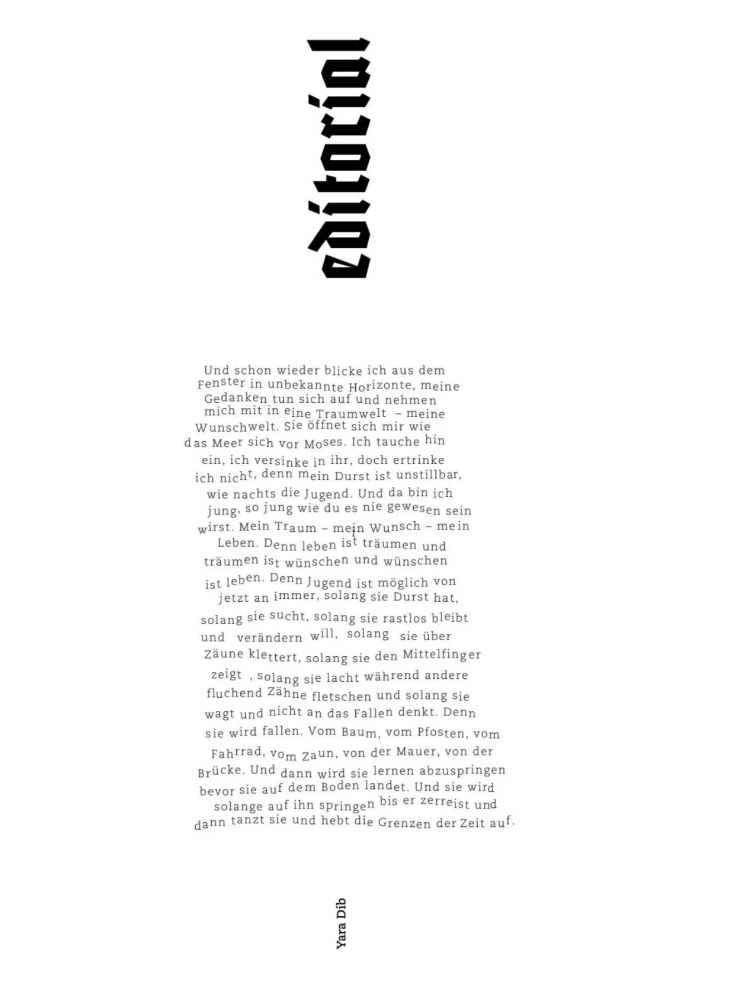

# proud magazine Berlin — Editorial #23

Und schon wieder blicke ich aus dem Fenster in unbekannte Horizonte, meine Gedanken tun sich auf und nehmen mich mit in eine Traumwelt — meine Wunschwelt. Sie öffnet sich mir wie das Meer sich vor Moses. Ich tauche hin ein, ich versinke in ihr, doch ertrinke ich nicht, denn mein Durst ist unstillbar, wie nachts die Jugend. Und da bin ich jung, so jung wie du es nie gewesen sein wirst. Mein Traum — mein Wunsch — mein Leben. Denn leben ist träumen und träumen ist wünschen und wünschen ist leben. Denn Jugend ist möglich von jetzt an immer, solang sie Durst hat, solang sie sucht, solang sie rastlos bleibt und verändern will, solang sie über Zäune klettert, solang sie den Mittelfinger zeigt, solang sie lacht während andere fluchend Zähne fletschen und solang sie wagt und nicht an das Fallen denkt. Denn sie wird fallen. Vom Baum, vom Pfosten, vom Fahrrad, vom Zaun, von der Mauer, von der Brücke. Und dann wird sie lernen abzuspringen bevor sie auf dem Boden landet. Und sie wird solange auf ihn springen bis er zerreist und dann tanzt sie und hebt die Grenzen der Zeit auf.

Y
a
r
a

D
i
b
