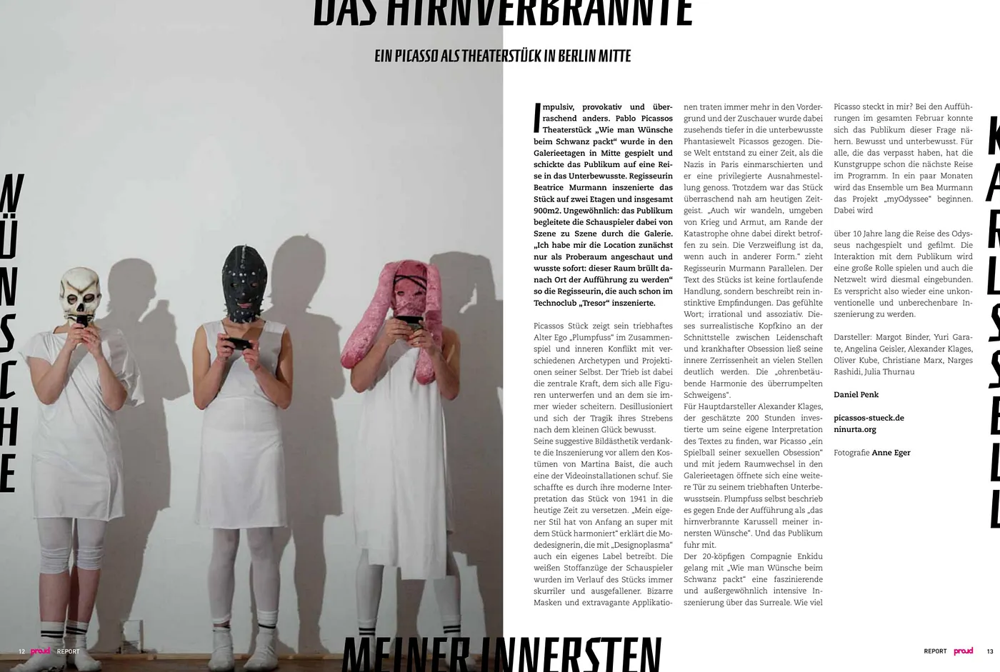

# proud magazine Berlin, Ein Picasso als Theaterstück in Berlin Mitte, by Daniel Penk

Text von Daniel Penk, erschienen im proud magazine Berlin. Fotos von Anne Eger.

Ein Text aus dem proud magazine über Picassos Theaterstück in den Galerieetagen in Mitte. Ich teile ihn hier, weil genau solche Sachen in Berlin passieren und es schade wäre, wenn das nur im Heft steht.

*DAS HIRNVERBRANNTE MEINER INNERSTEN*

## Picasso in den Galerieetagen

Impulsiv, provokativ und überraschend anders. Pablo Picassos Theaterstück „Wie man Wünsche beim Schwanz packt” wurde in den Galerieetagen in Mitte gespielt und schickte das Publikum auf eine Reise in das Unterbewusste. Regisseurin Beatrice Murmann inszenierte das Stück auf zwei Etagen und insgesamt 900m2. Ungewöhnlich: das Publikum begleitete die Schauspieler dabei von Szene zu Szene durch die Galerie. „Ich habe mir die Location zunächst nur als Proberaum angeschaut und wusste sofort: dieser Raum brüllt danach Ort der Aufführung zu werden” so die Regisseurin, die auch schon im Technoclub „Tresor” inszenierte.

## Plumpfuss, Kostüme und der Trieb

Picassos Stück zeigt sein triebhaftes Alter Ego „Plumpfuss” im Zusammenspiel und inneren Konflikt mit verschiedenen Archetypen und Projektionen seiner Selbst. Der Trieb ist dabei die zentrale Kraft, dem sich alle Figuren unterwerfen und an dem sie immer wieder scheitern. Desillusioniert und sich der Tragik ihres Strebens nach dem kleinen Glück bewusst. Seine suggestive Bildästhetik verdankte die Inszenierung vor allem den Kostümen von Martina Baist, die auch eine der Videoinstallationen schuf. Sie schaffte es durch ihre moderne Interpretation das Stück von 1941 in die heutige Zeit zu versetzen. „Mein eigener Stil hat von Anfang an super mit dem Stück harmoniert” erklärt die Modedesignerin, die mit „Designoplasma” auch ein eigenes Label betreibt. Die weißen Stoffanzüge der Schauspieler wurden im Verlauf des Stücks immer skurriler und ausgefallener. Bizarre Masken und extravagante Applikationen traten immer mehr in den Vordergrund und der Zuschauer wurde dabei zusehends tiefer in die unterbewusste Phantasiewelt Picassos gezogen. Diese Welt entstand zu einer Zeit, als die Nazis in Paris einmarschierten und er eine privilegierte Ausnahmestellung genoss. Trotzdem war das Stück überraschend nah am heutigen Zeitgeist. „Auch wir wandeln, umgeben von Krieg und Armut, am Rande der Katastrophe ohne dabei direkt betroffen zu sein. Die Verzweiflung ist da, wenn auch in anderer Form.” zieht Regisseurin Murmann Parallelen. Der Text des Stücks ist keine fortlaufende Handlung, sondern beschreibt rein instinktive Empfindungen. Das gefühlte Wort; irrational und assoziativ. Dieses surrealistische Kopfkino an der Schnittstelle zwischen Leidenschaft und krankhafter Obsession ließ seine innere Zerrissenheit an vielen Stellen deutlich werden. Die „ohrenbetäubende Harmonie des überrumpelten Schweigens”.

## Die Darsteller und was als Nächstes kommt

Für Hauptdarsteller Alexander Klages, der geschätzte 200 Stunden investierte um seine eigene Interpretation des Textes zu finden, war Picasso „ein Spielball seiner sexuellen Obsession” und mit jedem Raumwechsel in den Galerieetagen öffnete sich eine weitere Tür zu seinem triebhaften Unterbewusstsein. Plumpfuss selbst beschrieb es gegen Ende der Aufführung als „das hirnverbrannte Karussell meiner innersten Wünsche”. Und das Publikum fuhr mit.

Der 20-köpfigen Compagnie Enkidu gelang mit „Wie man Wünsche beim Schwanz packt” eine faszinierende und außergewöhnlich intensive Inszenierung über das Surreale. Wie viel Picasso steckt in mir? Bei den Aufführungen im gesamten Februar konnte sich das Publikum dieser Frage nähern. Bewusst und unterbewusst. Für alle, die das verpasst haben, hat die Kunstgruppe schon die nächste Reise im Programm. In ein paar Monaten wird das Ensemble um Bea Murmann das Projekt „myOdyssee” beginnen. Dabei wird über 10 Jahre lang die Reise des Odysseus nachgespielt und gefilmt. Die Interaktion mit dem Publikum wird eine große Rolle spielen und auch die Netzwelt wird diesmal eingebunden. Es verspricht also wieder eine unkonventionelle und unberechenbare Inszenierung zu werden.

Darsteller: Margot Binder, Yuri Garate, Angelina Geisler, Alexander Klages, Oliver Kube, Christiane Marx, Narges Rashidi, Julia Thurnau

Text: Daniel Penk
Fotografie: Anne Eger

[picassos-stueck.de
](http://picassos-stueck.de)[ninurta.org](http://ninurta.org)
