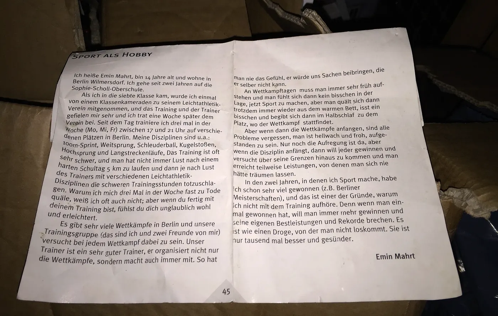

## Ich heiße Emin Mahrt, bin 14 Jahre alt und wohne in Berlin Wilmersdorf. Ich gehe seit zwei Jahren auf die Sophie-Scholl-Oberschule.

Als ich in die siebte Klasse kam, wurde ich einmal von einem Klassenkameraden zu seinem Leichtathletik-Verein mitgenommen, und das Training und der Trainer gefielen mir sehr und ich trat eine Woche später dem Verein bei. Seit dem Tage trainiere ich drei mal in der Woche (Mo, Mi, Fr) zwischen 17 und 21 Uhr auf verschiedenen Plätzen in Berlin. Meine Disziplinen sind u.a.: 100m-Sprint, Weitsprung, Schleuderball, Kugelstoßen, Hochsprung und Langstreckenläufe. Das Training ist oft sehr schwer, und man hat nicht immer Lust nach einem harten Schultag 5 km zu laufen und dann je nach Lust des Trainers mit verschiedenen Leichtathletik-Disziplinen die schweren Trainingsstunden totzuschlagen. Warum ich mich drei Mal in der Woche fast zu Tode quäle, weiß ich oft auch nicht; aber wenn du fertig mit deinem Training bist, fühlst du dich unglaublich wohl und erleichtert.

Es gibt sehr viele Wettkämpfe in Berlin und unsere Trainingsgruppe (das sind ich und zwei Freunde von mir) versucht bei jedem Wettkampf dabei zu sein. Unser Trainer ist ein sehr guter Trainer, er organisiert nicht nur die Wettkämpfe, sondern macht auch immer mit. So hat man nie das Gefühl, er würde uns Sachen beibringen, die er selber nicht kann.

An Wettkampftagen muss man immer sehr früh aufstehen und man fühlt sich dann kein bisschen in der Lage, jetzt Sport zu machen, aber man quält sich dann trotzdem immer wieder aus dem warmen Bett, isst ein bisschen und begibt sich dann im Halbschlaf zu dem Platz, wo der Wettkampf stattfindet.

Aber wenn dann die Wettkämpfe anfangen, sind alle Probleme vergessen, man ist hellwach und froh, aufgestanden zu sein. Nur noch die Aufregung ist da, aber wenn die Disziplin anfängt, dann will jeder gewinnen und versucht über seine Grenzen hinaus zu kommen und man erreicht teilweise Leistungen, von denen man sich nie hätte träumen lassen.

In den zwei Jahren, in denen ich Sport mache, habe ich schon sehr viel gewonnen (z.B. Berliner Meisterschaften), und das ist einer der Gründe, warum ich nicht mit dem Training aufhöre. Denn wenn man einmal gewonnen hat, will man immer mehr gewinnen und seine eigenen Bestleistungen und Rekorde brechen. Es ist wie eine Droge, von der man nicht loskommt. Sie ist nur tausend mal besser und gesünder.

*Emin Mahrt
Year: 2000*
