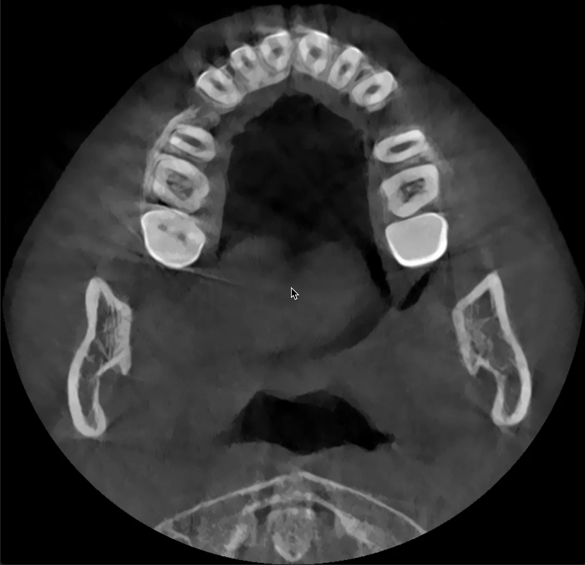

# Wie wir KI genutzt haben, um eine komplexe Zahnbehandlung in Ostafrika zu navigieren — CBCT-Analyse, Ärzte-Recherche und eine fundierte Entscheidung vor der Zahnspange

*Eine Schritt-für-Schritt-Dokumentation, wie wir mit Claude AI Dental-CBCT-Scans analysiert, Kieferorthopäden überprüft, uns auf die Beratung vorbereitet und eine informierte Behandlungsentscheidung getroffen haben — von Arusha, Tansania nach Nairobi, Kenia.*

## Der Ausgangspunkt: Zwei gescheiterte Behandlungen und kein Plan

Raha hat beidseitig verlagerte obere Eckzähne — so dachten wir zumindest — vier gezogene Prämolaren von einer abgebrochenen kieferorthopädischen Behandlung und 13 Monate unkontrollierte Zahnwanderung. Zwei Allgemeinzahnärzte in Arusha, Tansania hatten Zahnspangen versucht. Beide sind gescheitert. Die Zähne waren schlimmer als vorher. Wir hatten keinen Behandlungsplan, keinen Spezialisten und keine Ahnung, was wir tun sollten.

Wir hatten ein OPG (Panoramaröntgen) aus Berlin, einen iTero-Digitalscan und eine Invisalign-Simulation, die ein Zahnarzt vorgeschlagen hatte. Was wir nicht hatten, war jemand Qualifiziertes, der das alles interpretieren und uns die Wahrheit sagen konnte.

Also habe ich angefangen, mit Claude zu sprechen.

## Phase 1: Die Fallakte aufbauen

Das Erste, was die KI gemacht hat, war alles, was wir wussten, in ein klinisches Gesamtbild zu ordnen. Aus hochgeladenen Fotos, dem Berliner OPG und meiner Beschreibung der Behandlungsgeschichte hat sie eine strukturierte Fallzusammenfassung erstellt: den Zeitplan der Extraktionen (September/Oktober 2024), die Dauer der Zahnspange (7 Monate bei zwei verschiedenen Ärzten), die Symptome (lockere Frontzähne, Kauschmerzen an den Extraktionsstellen) und die 13-monatige Pause ohne Behandlung.

Sie hat sofort mehrere Dinge markiert, die die vorherigen Zahnärzte übersehen oder ignoriert hatten. Das Berliner OPG schien zu zeigen, dass die Eckzähne nicht in den Zahnbogen herabgestiegen waren. Falls das stimmte, bedeutete es, dass der Fall viel zu komplex für Allgemeinzahnärzte war — es würde eine chirurgische Freilegung und Einordnung mit festsitzenden Apparaturen erfordern, nicht nur Aligner oder einfache Zahnspangen.

Die KI war direkt: „Invisalign allein reicht für diesen Fall nicht aus. Ihr braucht einen CBCT-Scan, um die Eckzähne in 3D zu sehen, und einen Fachzahnarzt für Kieferorthopädie, keinen Allgemeinzahnarzt.”

## Phase 2: Den richtigen Arzt finden

Wir brauchten einen Kieferorthopäden in Ostafrika, der einen komplexen Fall mit verlagerten Eckzähnen, Lückenmanagement nach Extraktionen und einer Patientin bewältigen konnte, die sechs Busstunden entfernt lebt. Die KI suchte nach Spezialisten in Nairobi und bewertete Qualifikationen — nicht nur Google-Bewertungen.

Sie identifizierte Kenya Orthodontics und Dr. Wandia Mwangi-Evans — Fellowship vom Royal College of Surgeons of England, MSc in Kieferorthopädie von der Cardiff University mit Auszeichnung, über 8.000 Fälle und mehr als 20 Jahre Erfahrung. Das Shared-Care-Modell der Klinik (Spezialistin erstellt den Plan und sieht die Patientin alle 6–8 Wochen, lokaler Zahnarzt übernimmt Zwischenanpassungen) war speziell für Fernpatienten aus Tansania geeignet.

Die KI erstellte ein vollständiges Beratungsdokument — neun Abschnitte mit klinischer Vorgeschichte, Röntgenbefunden, Fragen an die Spezialistin und Warnzeichen, auf die man achten sollte. Sie entwarf außerdem einen professionellen Überweisungsbrief, den wir zum Termin mitbringen konnten.

## Phase 3: Den CBCT-Scan machen

Wir waren in Nairobi in der Nähe von Karen, also half die KI, die Karen Dental Clinic im Zamani Business Park zu finden — die haben ein Carestream CS 8200 3D CBCT-Gerät. Wir bestätigten die Ausstattung anhand von Fotos, die ich geschickt habe, und die KI erklärte mir, was ich verlangen muss: vollständiger Ober- und Unterkiefer-CBCT, DICOM-Dateiexport und E-Mail-Versand an uns und den Kieferorthopäden.

Der Scan ergab 651 DICOM-Schichtbilder in zwei Serien (Standardvolumen und Metallartefaktreduktion). Die Klinik sagte, wir bräuchten Spezialsoftware zum Anschauen. Die KI empfahl Falcon (früher Horos Mobile) fürs iPhone — ein kostenloser DICOM-Viewer. Ich installierte die App, importierte alle 651 Schichtbilder, und plötzlich konnte ich auf meinem Handy durch Querschnitte von Rahas Schädel scrollen.

## Phase 4: Vorläufige CBCT-Analyse mit KI

Hier wurde es interessant — und hier lag die KI falsch, was sich als genauso lehrreich herausstellte wie wenn sie richtig gelegen hätte.

Ich nahm ein Bildschirmvideo auf, während ich durch die CBCT-Schichten in Falcon scrollte, und lud es hoch. Die KI extrahierte 192 Einzelbilder und analysierte sie systematisch, wobei sie anatomische Orientierungspunkte über die axialen Schichten hinweg identifizierte.

Sie markierte, was sie für beidseitig verlagerte Eckzähne hielt, die hoch im Gaumen saßen, weit über dem Zahnbogen. Sie maß den vertikalen Abstand über die Schichten und kam zu dem Schluss, dass die Eckzähne tief verlagert waren und eine chirurgische Freilegung erfordern würden. Das stimmte mit dem überein, was das Berliner OPG nahegelegt hatte.

Aber die KI war vorsichtig mit ihrem Vorbehalt: „Ich lese komprimierte Videobilder von einer Handy-Bildschirmaufnahme. Das ist nur eine vorläufige Orientierung. Die Spezialistin mit den echten DICOM-Dateien auf professioneller Software wird zehnmal mehr Details sehen.”

Dieser Vorbehalt erwies sich als entscheidend.

## Phase 5: Die Beratung bei Kenya Orthodontics

Wir gingen zu Kenya Orthodontics mit allen unseren Unterlagen. Dr. Wandias Team — mehrere Ärzte einschließlich der Kieferorthopädin — führte eine gründliche klinische Untersuchung durch. Sie kartierten jeden Zahn, maßen die Extraktionslücken (4,5mm rechts, 5mm links), stellten die Fluorose durch Arushas Wasser fest, prüften auf Kiefergelenksprobleme, beurteilten den Biss und überprüften den CBCT auf ihrer professionellen Software.

Ihre Einschätzung: der Fall sei „ziemlich unkompliziert.” Geschätzte 18 Monate mit festsitzender Zahnspange. Keine Erwähnung von chirurgischer Freilegung oder verlagerten Eckzähnen.

Das widersprach der CBCT-Auswertung der KI. Entweder hatte das Spezialistenteam beidseitig verlagerte Eckzähne übersehen (unwahrscheinlich — sie hatten die Patientin auf dem Stuhl UND die DICOM-Dateien auf professioneller Software), oder die vorläufige Auswertung der KI aus komprimierten Videobildern war falsch.

## Phase 6: Den Widerspruch klären mit MPR-Ansichten

Anstatt einfach eine der beiden Schlussfolgerungen blind zu akzeptieren, nutzte ich die KI, um mich durch den CBCT diagnostisch sinnvoller zu führen. Mit Falcons 2D-MPR-Modus — der axiale, sagittale und koronale Schichten gleichzeitig mit verknüpften Fadenkreuzen zeigt — klickte ich direkt auf die Eckzahnpositionen im oberen Zahnbogen.

Die KI leitete mich an: „Klick auf die obere rechte Eckzahnposition in der axialen Ansicht. Screenshot. Jetzt klick auf den linken Eckzahn. Screenshot.” Jeder Klick zeigte denselben anatomischen Punkt aus drei Winkeln gleichzeitig.

Das Ergebnis war eindeutig. Beide sagittalen Ansichten zeigten Zähne mit langen Wurzeln, die in den Oberkieferknochen hineinragten — die charakteristische Form durchgebrochener Eckzähne. Kronen unten im Zahnbogen, Wurzeln nach oben. Normale Position. Nicht verlagert.

Was die KI in den komprimierten Videobildern als verlagerte Eckzahnkronen fehlidentifiziert hatte, waren tatsächlich Eckzahnwurzeln in axialer Querschnittsansicht auf höheren Schichtebenen. Eckzähne haben die längsten Wurzeln aller Zähne, deshalb erscheinen sie als dichte runde Strukturen auf axialen Schichten weit über der Kauebene. Auf komprimiertem Handyvideo sehen diese identisch aus wie verlagerte Kronen.

Die KI gab den Fehler sofort zu: „Meine frühere CBCT-Video-Auswertung war falsch. Die Spezialistin mit der Patientin auf dem Stuhl plus professioneller DICOM-Software hatte Recht.”

## Phase 7: Behandlungsentscheidung

Mit der geklärten Eckzahnfrage war der Behandlungsplan klar:

- **Behandlung:** Festsitzende Zahnspange (keine Aligner — vorhersagbarer bei diesem Komplexitätsgrad, und Fluorose macht die Bracket-Haftung schwierig, daher Bänder an den Backenzähnen)
- **Dauer:** ca. 18 Monate aktive Behandlung
- **Termine:** Alle 6–8 Wochen zur Anpassung
- **Retention:** Festsitzende Retainer + herausnehmbare Retainer, Retainer-Kontrollen für ein Jahr nach der Behandlung
- **Kosten:** ca. 483.000 KES (ca. 3.400 € / 3.700 USD), Zahlung pro Termin
- **Zeitplan:** 13. März Reinigung und Separatoren, 24. März Einsetzen der Zahnspange

Das Team erklärte sowohl Zahnspangen- als auch Invisalign-Optionen transparent, besprach die Fluorose-Auswirkungen und empfahl ausdrücklich Zahnspangen, weil die vom Kieferorthopäden kontrollierte Zahnbewegung vorhersagbarer ist als die von der Patientenmitarbeit abhängigen Aligner — besonders bei einem Fall mit dieser Vorgeschichte.

## Was ich gelernt habe: Wo KI hilft und wo nicht

**Wo KI unschätzbar wertvoll war:**

- Verstreute Krankengeschichte in ein zusammenhängendes klinisches Bild ordnen
- Erkennen, dass der Fall Spezialversorgung braucht, nicht Allgemeinzahnmedizin
- Ärzte nach tatsächlichen Qualifikationen recherchieren und prüfen, nicht nach Marketing
- Beratungsdokumente vorbereiten, damit wir informiert in den Termin gehen konnten
- Zahnmedizinische Fachbegriffe durchgehend in einfacher Sprache erklären
- Anleitung durch CBCT-Viewer-Software, die ich nie benutzt hatte
- Beibringen, wie man MPR-Ansichten nutzt, um spezifische anatomische Fragen zu überprüfen
- Einen Rahmen bieten, welche Fragen man stellen und auf welche Warnzeichen man achten soll

**Wo die KI falsch lag:**

- CBCT-Auswertung aus komprimierten Handy-Videobildern — Eckzahnwurzeln als verlagerte Kronen fehlidentifiziert
- Zu viel Zuversicht bei vorläufigen Röntgenbefunden (obwohl sie wiederholt Vorbehalte äußerte)

**Die entscheidende Lektion:** KI-Analyse von medizinischer Bildgebung aus indirekten Quellen (Bildschirmaufnahmen, komprimierte Exporte) ist nützlich zur Orientierung, aber unzuverlässig für Diagnosen. Die Spezialistin mit der Patientin auf dem Stuhl, den Händen im Mund und den DICOM-Dateien auf kalibrierter Software wird KI, die ein Handyvideo liest, immer übertreffen. Nutzt KI zur Vorbereitung, zum Lernen, um bessere Fragen zu stellen — aber lasst den qualifizierten Menschen die Diagnose stellen.

## Der praktische Leitfaden

Wenn ihr vor einer komplexen zahn- oder kieferorthopädischen Situation steht, besonders in einer Region mit eingeschränktem Zugang zu Spezialisten, hier ist, was bei uns funktioniert hat:

**1. Alles sammeln.** OPG, Fotos, digitale Scans, Behandlungsgeschichte mit Daten. Alles hochladen und die KI es ordnen lassen.

**2. Euren Fall verstehen, bevor ihr zur Beratung geht.** KI kann erklären, was verlagerte Eckzähne sind, was Prämolaren-Extraktionen für das Lückenmanagement bedeuten, warum CBCT wichtig ist und welche Fragen man stellen sollte. Ihr habt eine viel produktivere Beratung, wenn ihr informiert kommt.

**3. Die richtige Bildgebung machen lassen.** Ein 2D-OPG reicht für komplexe Fälle nicht aus. CBCT liefert dreidimensionale Informationen. Besteht auf DICOM-Dateiexport, damit ihr eure Daten besitzt.

**4. Ärzte nach Qualifikationen prüfen, nicht nach Bequemlichkeit.** Facharztausbildung, Spezialistenregistrierung, Fallvolumen. KI kann dabei helfen, das zu recherchieren. Wenn zwei Allgemeinzahnärzte am selben Fall scheitern, sollte euch das etwas sagen.

**5. Beratungsdokumente vorbereiten.** Ein strukturiertes Briefing spart Zeit und stellt sicher, dass nichts beim Termin vergessen wird. Die Spezialistin sieht Hunderte von Patienten — macht es ihr leicht, eure Vorgeschichte schnell zu verstehen.

**6. Überprüfen, nicht blind vertrauen.** Als die vorläufige Auswertung der KI der Einschätzung der Spezialistin widersprach, haben wir nicht einfach eine der beiden Antworten akzeptiert. Wir haben den MPR-Viewer benutzt, um gezielt zu prüfen. Die Spezialistin hatte Recht, aber der Prozess des Überprüfens hat uns mehr über den Fall beigebracht als jede einzelne Meinung allein.

**7. Eure Dateien besitzen.** CBCT-DICOM-Dateien, intraorale STL-Scans, OPG-Bilder — behaltet Kopien von allem. Das sind eure medizinischen Daten. Ihr braucht sie vielleicht für Zweitmeinungen, Versicherungen oder zukünftige Behandler.

## Die Zahlen

- **Zeit vom ersten KI-Gespräch bis zur Behandlungsentscheidung:** 2 Tage
- **Recherchierte Behandler:** Mehrere, einer ausgewählt basierend auf Qualifikationen
- **Analysierte CBCT-Schichten:** 651
- **Extrahierte und überprüfte Videobilder:** 192
- **MPR-Screenshots zur Verifizierung:** 6
- **Gesamtkosten CBCT + Beratung:** ca. 55 €
- **Behandlungskosten:** ca. 3.400 € über 18 Monate
- **Vorherige gescheiterte Behandlungen:** 2
- **Durch Fehlbehandlung dauerhaft verlorene Zähne:** 4 Prämolaren (gezogen und nicht ersetzbar)

## Abschließender Gedanke

Die Technologie existiert heute schon, damit jeder mit einem Smartphone eine informierte Zweitmeinung bekommen, seine eigene medizinische Bildgebung verstehen, Spezialisten über Landesgrenzen hinweg prüfen und vorbereitet in eine Beratung gehen kann. Sie wird die Hände und die Ausbildung der Kieferorthopädin nicht ersetzen. Aber sie gleicht eine Informationsasymmetrie aus, die Patienten historisch — besonders in unterversorgten Regionen — demjenigen ausgeliefert hat, der zufällig am nächsten war.

Wir sind von „Ich weiß nicht, was falsch ist, und ich weiß nicht, wem ich vertrauen soll” zu „Ich verstehe meinen Fall, ich habe die Diagnose überprüft, und ich bin zuversichtlich beim Behandlungsplan” in 48 Stunden gegangen. Das ist nicht KI, die Medizin ersetzt. Das ist KI, die Patienten zu besseren Partnern in ihrer eigenen Versorgung macht.

*Suchbegriffe: CBCT Zahnscan, kieferorthopädische Beratung, verlagerter Eckzahn, impaktierter Eckzahn, retinierter Eckzahn, Prämolaren Extraktion Kieferorthopädie, Zahnspange vs Invisalign, Kieferorthopäde Nairobi Kenia, Zahnbehandlung Tansania, Zahnbehandlung Ostafrika, DICOM Viewer iPhone, Falcon DICOM App, zahnärztliche Zweitmeinung, KI Zahnanalyse, CBCT Analyse, kieferorthopädischer Behandlungsplan, Fluorose Kieferorthopädie, festsitzende Zahnspange Erwachsene, Lückenschluss nach Extraktion, Patientenaufklärung Zahnmedizin, Zahnmedizin Afrika, grenzüberschreitende Zahnbehandlung, DVT Scan Zähne, digitale Volumentomographie, 3D Röntgen Zähne*
