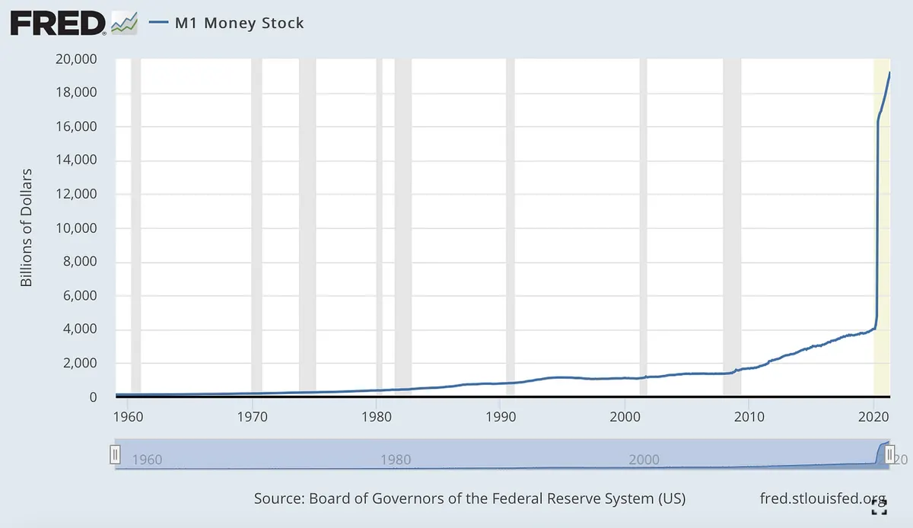

> You might ask, **why do I get this Newsletter**? In short: you and me (Emin Mahrt, [www.emin.de](http://www.emin.de)) have crossed paths in the past 10-15 years through one of my ventures. **Today I am starting a YouTube Channel about Crypto** and I wanted to share it with you. **If you don’t want to get further updates**, please **unsubscribe from this mailing list** at the bottom of this email.

What is Bitcoin? In this video I will explain Bitcoin, from a non technical perspective.

[Watch the video on YouTube](https://www.youtube.com/watch?v=IfyZReFeDNQ)

I will use easy language and examples that help you to understand everything better.

Bitcoin was introduced during the financial crisis in 2008 by a group or person under the name of Satoshi Nakamoto. In a 9 pages PDF document they describe how Bitcoin works, and what makes it special and important to all of us.

I will not cover every detail of the so-called Whitepaper, but I will try to explain Bitcoins most important features.

Bitcoin: A Peer-to-Peer Electronic Cash System.

Let us start with that. Everyone of you knows what cash is. Some of us still use it on a daily basis to purchase goods and services. We use coins and bills. Once we give our cash to someone, this cash is not in our possession anymore, and we can not give the same bills or coins to someone else. So far so good. If one person gives cash to another person, you could call it peer to peer. One peer gives cash to the other peer. Simple like that. There is no need for someone in between, a middleman, or a bank, to verify the peer to peer cash transfer from one person to another.

And Bitcoin in its core is exactly this, just electronic. You can send (or transfer) Bitcoin from one person to another, just like cash. And the best is, you don’t need a middleman, for example a bank, or a company like PayPal or Visa, in order to do so. That you can do this peer to peer, electronically, is maybe the biggest and most important feature of Bitcoin. It also makes Bitcoin resistant and resilient. You don’t have to trust anyone to store your Bitcoin or run the Bitcoin network. This is one of the reasons it is often called trust-less. As there is no central authority controlling Bitcoin, Bitcoin can’t be shut down. The only way for Bitcoin to disappear is, if everyone that is running Bitcoin needs to be convinced to stop doing this. As of today, we are talking about tens of thousands of computers and companies all over the world. Together they create the decentralized peer to peer Bitcoin network. The only way to shut down Bitcoin, is to shut down the internet. And this is very unlikely to happen, especially when we are entering a time where the internet can be accessed via satellites from every corner of the earth.

Access is also a very important topic for Bitcoin. As explained before the Bitcoin network is a decentralized peer to peer network without a central authority or middlemen. Everything is public at any time, every transaction, every address (often called a wallet or identity) that is used to send or receive Bitcoin. Even more important is that everyone can participate in Bitcoin without asking for permission. Think about it like a public park, everyone can enter, you don’t need to ask anyone to do so. This is why Bitcoin is also called public and permission-less. Bitcoin is for everyone, the only thing you need is an internet connection and a smartphone or computer.

The easiest way to get started with Bitcoin is getting a Bitcoin wallet. It’s like your physical wallet in your pocket, just as an app, on your smartphone or computer. Once installed, you will receive an address, and a key, usually 12-24 English words. The key is like your password, only you know it, and only with the key you can access your Bitcoin. If you lose your key, you lose your Bitcoin. If someone gets to know your key, this person can access your Bitcoin. Therefore it is advised to store the key in a very safe place and never show it to anyone. Think about it like the key to your physical Tresor. So protect it well!

You can create as many addresses as you want, it is completely free, public and permission-less, for everyone in the world, no matter if your government allow it or not, Bitcoin is literally for everyone, no one is or can be excluded, like you can’t be excluded from receiving cash from someone who stands in front of you and giving you it.

If only you have the key to your wallet, you become your own bank.

You have full control and ownership of your Bitcoin and no one can ever access them without your consent, or better said, without your key. If you die and don't pass the key to someone, your Bitcoin will be lost forever. Bitcoin gives you strong control and ownership but it comes hand in hand with being self responsible. There is no way to recover your Bitcoin once your key is lost or your Bitcoin has been sent to a different address.

This sounds scary, but it is a very important feature of Bitcoin. Also the fact that Bitcoin transfers are non-reversible, you can’t get them back, or call someone, once sent (remember: there are no middlemen, Bitcoin is peer to peer). The fact that you can’t take back Bitcoin you sent so someone also ensures that you can’t send the same Bitcoin to multiple people. Again, think about cash. If you pass a bill to someone, you are not in possession of that bill anymore. You can not double spend it. Bitcoin can also not be double-spent. If you received it and if you own the key to your wallet, those Bitcoins are solely accessible and owned by you and not by anyone else.

Bitcoin is private. No one knows who owns which address. This is why addresses are often called identities. If you want, you can create a new identity for every single transaction. You can, but you don’t have to re-use an address. This makes Bitcoin very private. If ten different people want to send you Bitcoin, you can give every single person a different address. This is how you stay anonymous and private. As Bitcoin doesn’t require any registration with your real name or passport, there is no connection to you in real life. This is one of the reasons why platforms like Wikileaks accept donations in Bitcoin, or why the dark web is using it too. Bitcoin is like cash. If you give someone cash on the street, both of you don’t have to know each other and you can still make a transaction.

But of course there is much more. First of all, there are only ever 21 Million Bitcoin in existence. Every Bitcoin can be divided into one hundred million pieces, the smallest piece of one Bitcoin is called a satoshi. One satoshi is 1/100.000.000 of a Bitcoin. To compare it with USD, one USD can be divided in 100 US cents. So 1 cent is 1/100 of a USD.

But other than USD or Euro, Bitcoin can not be created out of thin air, the total amount is fixed to 21 Million.

So how can you get Bitcoin?

Bitcoin can be earned by securing and running the Bitcoin network. As this part is quite technical and difficult, I will not explain it in this video.

An easier way to own Bitcoin, is to exchange Bitcoin with another currency, or buy Bitcoin from someone, or get paid in Bitcoin for work, instead of getting paid in Euro for example. You can exchange Bitcoin for Euro or USD or any other currency, the same way you can exchange USD for GBP for example.

Why does Bitcoin have value?

To be honest, before Bitcoin I never thought about the question why money has a specific value. I had no idea where it came from (the state? The government?) and I didn’t really care. But with more and more people calling Bitcoin an alternative to traditional cash, I became interested to learn more about it.

You could say, the value of a product is defined by its importance of utility. Meaning, if a product is very useful (can be used for many things) it’s worth a lot. But that argument doesn’t hold. Life could not exist without water, but water seems to be less expensive than diamonds.

Scarcity is important too. Scarcity (how many diamonds exist and how many people want them) is an important factor. Let it be a bottle of wine or a Picassô painting. Marx once said, the value derived from the labour used to produce it. Growing a tomato is easier than growing a cow, so cow meat is more expensive than tomatoes.

But all this didn’t really explain to me the value of Bitcoin, so I looked into the USD. The name Dollar was derived from a place that produced the first silver coins, a valley that was called Joachims-thal, the coin was called Thaler, throughout the time Thaler became Dollar. So there we go. First dollars were silver coins.

With the introduction of the dollar more than 200 years ago, the dollar was basically a certificate for gold. At any time you could go to the bank (or government), give them your dollar and receive your gold. Gold was scarce back then and is scarce today. It has a high scarcity, and there is nothing more scarce than Bitcoin today (think about it, there are only ever 21 million Bitcoin!).

Back to the topic. Good money (how Austrian economics called it) can not come from thin air. Why does anyone like Pablo Picasso’s paintings? And pays a certain amount of USD or Bitcoin for it. Nobody knows and it doesn’t matter. Bitcoin can easily be money. Scarcity is important, and it’s very difficult to find anything scarcer than Bitcoin.

Today, the Dollar and the Euro and basically all government issued currencies are centrally planned and controlled. At any time, governments can create money out of thin air. And there is nothing we do about it. We need money to pay for goods and services, and when the government needs money, for example to fight a pandemic, they create money.

This leads to problems though. Money needs to be in balance. There can’t be free money, or everyone would take as much as they want and money would become totally worthless. Hyperinflation would start.

One person that received the Nobel prize in 1974 for economics is Hayek. He described the value of money in time. There are two types of people, he said, one type that has money, one type that needs money. Someone who has a very high time preference, needs money at this very moment, to buy champagne in the club or to start a business. These people usually borrow that money from someone who has a low time preference, someone who has saved money, usually through banks. The interest they ask for is the balance between these two parties. For what percentage are you willing to lend me money? This is what Hayek received the Nobel prize for. The natural rate of interest is the balance between low and high time preferences.

Today money is completely out of hand. You can borrow it for free from the bank, and there is no limit. Other than in Bitcoin, there is an unlimited number of dollars (or other fiat currencies) and this number grows at an incredible increasing speed.

We have the problem that governments create money. Nearly 80% of all USD ever created, have been created in less then one and a half year. 4000 billion (21%) in 229 years, 19.200 (100%) billion dollars, 79% in the last 16 month years (Jan2020-May2021).

Bitcoin is really difficult to imagine. Inflation too. We trust central authorities to not cause inflation. Bitcoin has no central authority and its supply is clearly limited and known in advance.

No more people, at any point in the history of the world, have thought about what money is. Or how central banks work, or how money is created.

I don’t see the existence of fiat money and central banks as unchangeable. Bitcoin was able to educate more people on economics than any book. And we are just getting started.

Bitcoin is good money. Accessible through a public and permission-less peer-to-peer network for every single person in the world. Become a Bitcoiner, continue to educate yourself, speak to others and ask questions. I promise you that you won’t regret it.

Resources

- <https://fred.stlouisfed.org/series/M1SL>
- <https://blog.trezor.io/austrian-economics-and-bitcoin-a-virtuous-cycle-9bf89ca6a7cc>
- <https://bitcoin.org/bitcoin.pdf>
