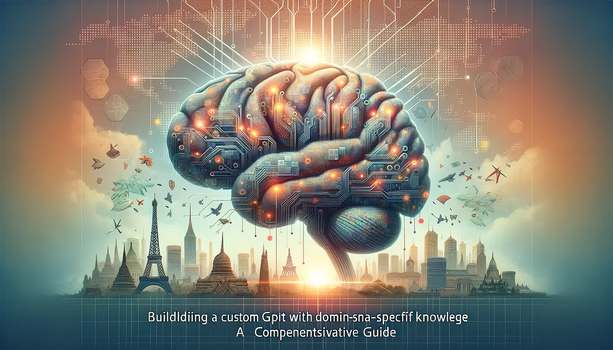

A summary of a video about building a custom GPT for Zanzibar.

<https://www.youtube.com/watch?v=DNkyL4Uw_dk>

The video is about GPT-4 and how you can use it for your own knowledge domain, in this case tourism in Zanzibar. AI changes how we find and use information, and it can help with decisions and give special insights in business and in all kinds of knowledge areas.

GPT-4 gives you access to a huge amount of the world's knowledge, and it's very fast. It doesn't just search a database like a classic search engine. It puts the information together from many different sources and gives you a more detailed answer. The video shows this with a question every tourist asks, what is the best Mediterranean restaurant in Zanzibar, and the model gives different answers based on all the data it has.

## Making it local

Domain-specific knowledge is what makes this personal. The presenter knows Zanzibar well, the way a tour guide does, and changes GPT-4 so it only focuses on questions about Zanzibar. Special knowledge makes the answers more relevant and more accurate for one use case, and you go from general global data to local knowledge from someone who really knows the place.

Then comes the Zanzibar Insider GPT. The presenter first sets up the basic framework and tests it with general questions. The answers are correct, but they don't have the depth of a local. So the next step is to fine-tune it and feed it specific, detailed knowledge about Zanzibar, for example that the better choice for a Mediterranean restaurant is the Glow restaurant in Paget.

After that you can upload more data, like PDF files and maybe voice recordings, and keep adding local knowledge. Every time the GPT gets a bit more precise and more local, and that is a big step from the broad data set it started with.

## The result

The result is a Zanzibar Insider GPT that understands the local context. It finds the best places to eat and to go out at night, and it can combine several questions into one clear and detailed answer. A generic AI model became a special tool for one domain.

At the end the video invites everyone to try their own AI projects and build models for the thing they know best. That makes AI useful in everyday life and opens it up to a lot more people. And the more AI grows, the more it can fit what each of us needs and knows.
