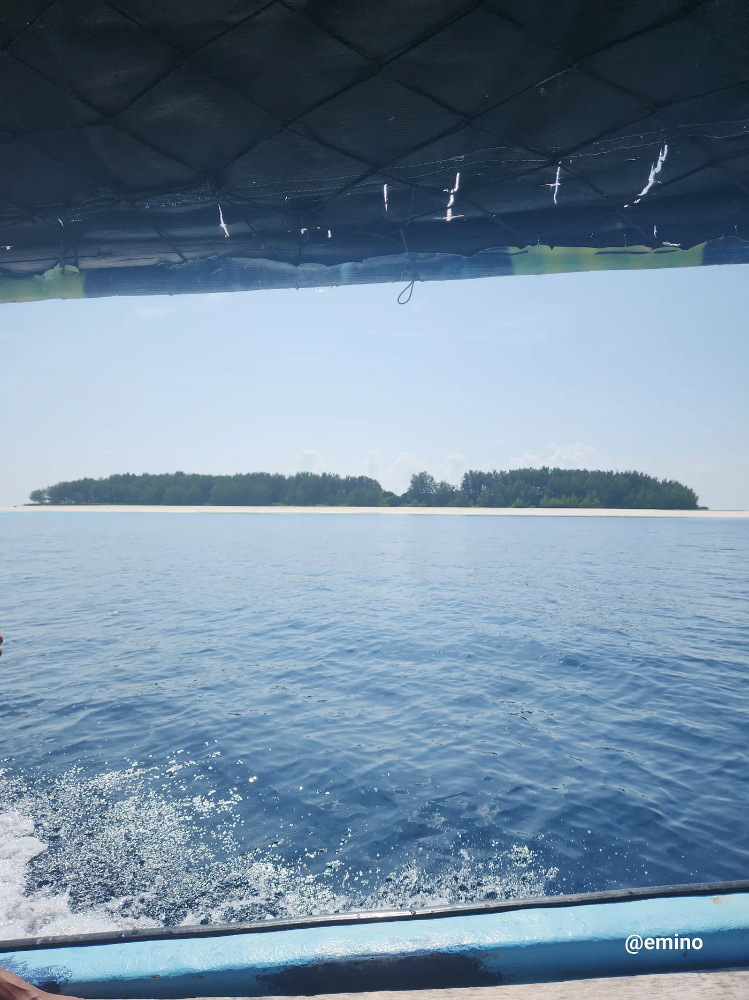

Everywhere you find traditional fishermen using fishing nets that they repair on the beaches. Here we see a traditional crew. One of them is in a dhow boat, which is a traditional sailing vessel used in these fishing communities.

This is the private island owned by Bill Gates, who acquired it a long time ago. Visitors are not allowed to approach the island closer than 500 meters.

The crystal-clear blue water surrounding the island serves as the hunting grounds for dolphins. When you visit, you can see the ocean floor up to a depth of around 10 meters. As the water recedes, it forms a sandbank. This area is a prime spot to spot dolphins and provides ample fishing grounds for them.

Zanzibar is off the coast of Tanzania, and the dolphin watching happens right next to the Gates island. The water goes back only at certain times, and then the sandbank comes out. The area with the sandbank and the fishing grounds is called Kati.
