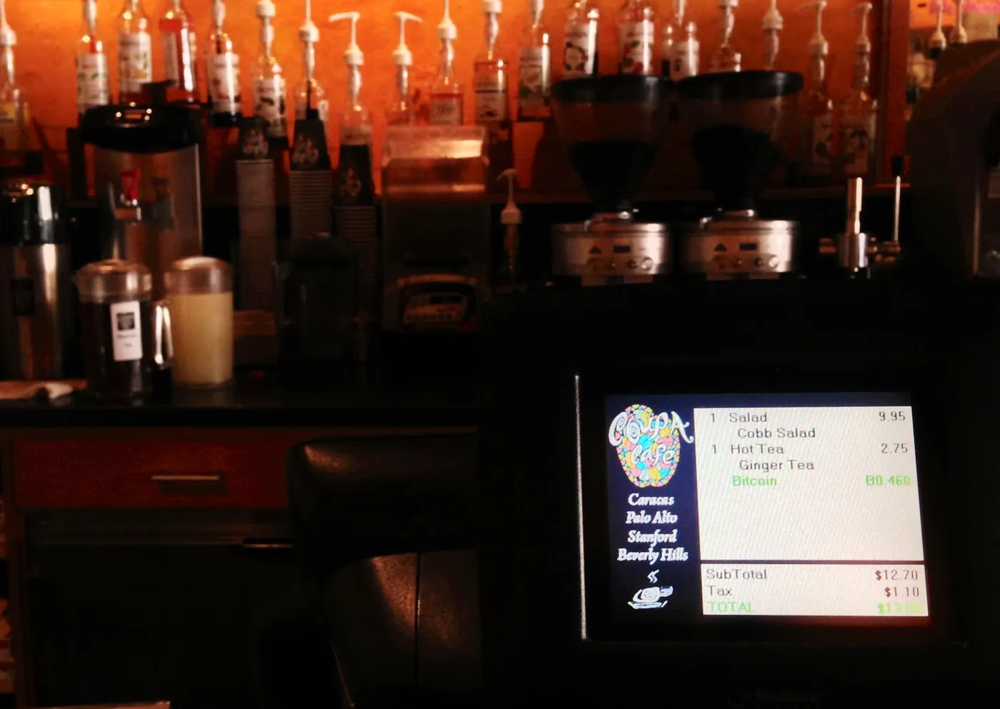

## Introduction

In 2012, I, Emin Mahrt, had an eye-opening conversation with a friend named Julian about the emerging world of Bitcoin and the financial markets. That year also marked my first Bitcoin purchase at Room77 in Berlin, where I exchanged 1 Bitcoin for a burger. At that time, Bitcoin was still a relatively new phenomenon, and the conversation touched on various aspects, from the technicalities of trading to the philosophical questions about entrepreneurship versus market trading. As I reflect on that conversation today, it’s fascinating to see how much has changed and how much has stayed the same.

## The Early Days of Digital Currency Exchanges

Back in 2012, Julian introduced me to the concept of internet exchanges that dealt with digital currencies like Bitcoin. These platforms often provided JavaScript APIs for automated trading, a feature that was quite advanced for its time. Fast forward to 2023, and the landscape of digital currency exchanges has evolved dramatically. Today’s platforms offer a plethora of advanced features, including futures trading and staking options. Regulatory oversight has also become a significant factor, providing a layer of security that was largely absent in the early days.

## The Allure and Pitfalls of Arbitrage Trading

Julian had some experience with arbitrage trading between different Bitcoin exchanges. He explained that this strategy involved buying and selling on different markets to take advantage of differing prices for the same asset. The catch was that this was effective only until more people discovered it. In 2023, the arbitrage opportunities still exist but are far less frequent and more competitive. Algorithmic trading and faster information flow have made it a high-stakes game that requires sophisticated tools and strategies.

## Risks, Rewards, and Fears

One of the most striking parts of our 2012 conversation was the discussion about the risks involved in Bitcoin trading. I remember questioning the legality of such activities, to which Julian clarified that it wasn’t illegal but could be risky. In 2023, the regulatory landscape for Bitcoin has become clearer, but the risks have not entirely disappeared. Market volatility remains a significant concern, with Bitcoin having experienced several dramatic price fluctuations over the years. In December 2017, for instance, Bitcoin reached an all-time high of nearly $20,000.

## My Bitcoin Purchases: A Price Perspective

My second Bitcoin purchase was also at Room77, where I bought a salad and a hot tea for 0.46 Bitcoin. To put these purchases in perspective, the all-time high price for Bitcoin that I’m aware of is nearly $20,000. That means my first burger cost me what could have been $20,000, and my salad and hot tea could have been worth around $9,200 at that peak price. These purchases serve as a vivid reminder of Bitcoin’s incredible volatility and potential for both gain and loss.

## Entrepreneurship vs Trading: A Personal Dilemma

Towards the end of our conversation, I pondered whether it made more sense to focus on understanding the Bitcoin markets or to channel my energies into starting a business. Julian believed that trading could be difficult to make profitable, especially without a substantial investment. In 2023, the rise of blockchain startups and the mainstream adoption of cryptocurrencies suggest that both avenues can be lucrative but come with their own sets of challenges and risks.

## Conclusion

Looking back, that 2012 conversation with Julian served as a snapshot of the Bitcoin landscape at the time. It offered insights into trading strategies like arbitrage and highlighted the risks and uncertainties that came with this new digital asset. Fast forward to 2023, and many of those early questions have been answered, but new challenges and opportunities have arisen. Whether it’s trading or entrepreneurship, the key to success in this ever-changing landscape is adaptability and a keen understanding of the market dynamics.
