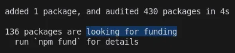
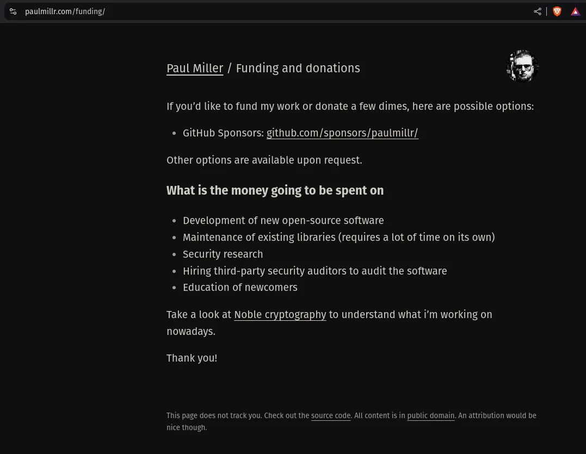
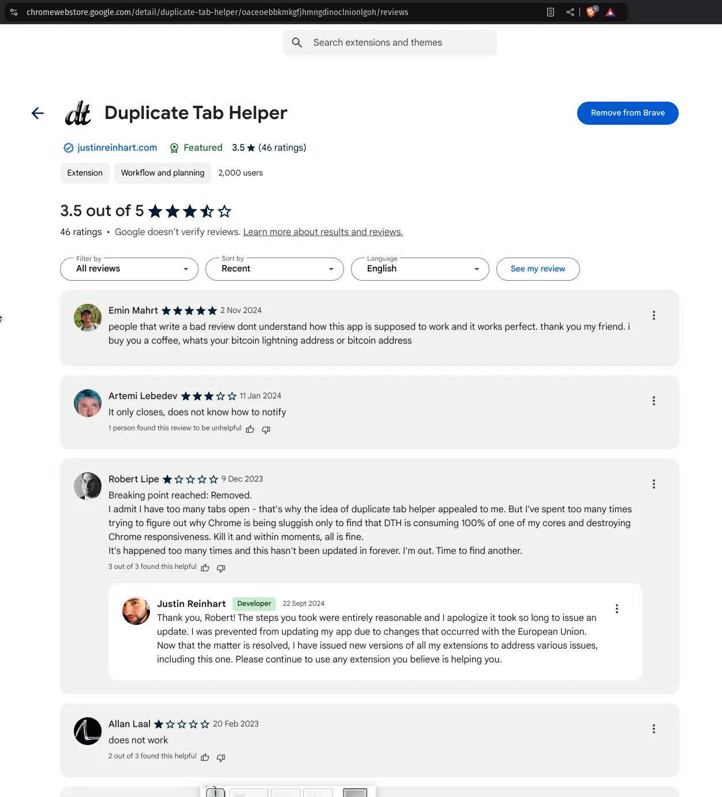

# 21 npm packages are looking for funding, run `npm fund` for details

npm.fund is the pump.fun for funding npm packages.

NPM Fund makes an automatic, continuous token market for open source packages. The idea comes from three things. Curation markets, where tokens show the value of content and projects. Bonding curves, which find the price automatically and always have liquidity. And the way pump.fun launches tokens, which is fair and hard for bots to game. The new part is to put these together with what npm already has for funding, `npm fund`, so open source maintainers get money that keeps coming forever.

## How it works

Every package has its own token, and unlike a normal token launch or a DEX market, the token can always be minted or burned. There is no maximum supply, the system never stops offering tokens, you can always buy and sell, you don't need outside market makers, and the price is found all the time. It's an endless curve. Anyone can mint new tokens at any time, anyone can burn tokens for the underlying asset at any time, the price changes by itself with the supply, and the liquidity is guaranteed by math.

A traditional token launch has a fixed supply and a small first distribution, it needs liquidity on a DEX, it's easy to manipulate and people can front-run it. The NPM Fund market has no limit on supply, it's always available, the liquidity is built in, it's hard to manipulate and the price is predictable.

Three economic things make it work. The first is value capture. Maintainers get 21% of all token interactions, the fees are paid out automatically and all the time, and nobody has to write grant applications or look for sponsors. The second is price discovery. The price goes up with the supply, so early supporters get better prices, and how the market feels about a package shows up directly in the price. The third is guaranteed liquidity. The bonding curve always holds collateral, you can always exit, and you don't depend on outside market makers.

## Who gets what

Maintainers get a revenue stream that doesn't stop, they don't need to do any token engineering, the fees are paid out automatically, and the token mechanics put the community on the same side. Contributors can buy tokens before they contribute, then help improve the package, and the token may be worth more when the package does well. They can exit through the curve at any time. Investors get entry and exit prices they can calculate, guaranteed liquidity, an advantage when they come early, and direct exposure to how well a package does.

What moves the token value is how many people use the package, how active the contributors are, how much demand there is for the token, and how the whole ecosystem grows. The price forms continuously and automatically from the current supply, it shows what happens in the market and it doesn't jump. Liquidity is always there, it balances itself, it depends on nothing outside and it's guaranteed by math.

## The system

The data flows in 4 steps. The funding data comes from `npm fund`, the maintainer is verified through GitHub, a continuous token market is created, and the fees are paid out automatically. For users it's simple. You mint tokens by sending collateral, the price changes with the new supply, the maintainer gets a percentage of every interaction, and you can burn your tokens at any time.

Phase 1 is the core, with support for a single maintainer, basic token mechanics, GitHub verification and weekly data updates. Phase 2 makes it better, with support for more maintainers, more advanced fee distribution, better analytics and real-time package data. Phase 3 is the ecosystem, with governance, incentives across packages, contribution tracking and tools for market analysis.

What's new here comes down to three things. Markets that never end, where tokens are always available, there is no maximum supply, it's always liquid and the price is found inside the system. Incentives that line up, so contributors want to join early, maintainers get funding all the time, users can support packages directly, and the value you capture matches the value you create. And an efficient market, with no token lockups, no outside market makers, no liquidity mining and no yield farming.

NPM Fund is a new way to fund open source. It takes mechanisms from Web3 that already work and puts them into the npm ecosystem that already exists, so package maintainers get funding that lasts.

Developing idea:

this is a developing story, come back here the next days to see more about it. In short: the npm package installer pushes awareness to packages that are looking for funding, i want to make it rewarding and easy to fund those projects by creating a pump.fun meme coin that people can buy and trade for the package so that the developer gets paid, and he/she/it/or AI in the future will receive fees or just an fair launch allocation and they receive more when the package is more hyped and celebrated and less, when no one wants to play the game or accociate herself with it.

*a developer who is asking for help for free software via npm fund terminal*

*a free software developer that apologize to an angry user who is not happy with a free software he paid nothing fore but still takes the time to complain and kick his balls. FUCK YOU.*
