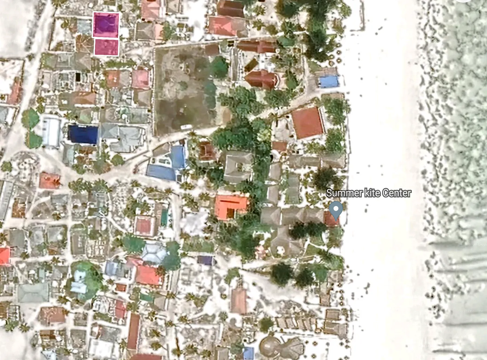

Get advise via WhatsApp: [+255775585555](https://api.whatsapp.com/send/?phone=255775585555&text=&type=phone_number&app_absent=0) or book a free call via [cal.com/em](https://cal.com/em)

## Zanzibar is a semi-autonomous region of Tanzania, consisting of two main islands: Unguja and Pemba.

It has a population of about 1.3 million people and a rich and diverse culture and history. Zanzibar is famous for its white sandy beaches, turquoise waters, coral reefs, spice farms, and historic Stone Town.

Zanzibar has its own land tenure system, which is different from mainland Tanzania. According to the Land Tenure Act 1992, all land in Zanzibar is public land administered by the Minister responsible for land affairs on behalf of the President. The land within the Free Economic Zones is administered by the Zanzibar Investment Promotion Authority (ZIPA).

The Land Tenure Act 1992 also recognizes three types of land rights: Right of Occupancy, Customary Right of Occupancy, and Derivative Right. A Right of Occupancy is the right to own an interest in land, which can be granted by the President for a period of up to 99 years. A Customary Right of Occupancy is the right to use and occupy land according to customary law and practice, which can be inherited or transferred. A Derivative Right is the right to use land for a specific purpose, such as farming, grazing, or mining, which can be granted by the Minister or ZIPA for a period of up to 5 years.

Foreigners who want to buy land in Zanzibar cannot obtain a Right of Occupancy directly from the government. However, they can buy land or property from a Zanzibari who has a Right of Occupancy or a legal ownership of the land through inheritance or purchase. This blog post provides a guide to the steps and procedures for buying land in Zanzibar as a foreigner. It also provides some tips and tricks for selling the land in the future, if desired.

## Steps for Buying Land from a Zanzibari Seller

The following are the steps and procedures for buying land from a Zanzibari seller:

## Step 1: Verify the seller’s ownership and Right of Occupancy

The first and most important step is to verify the seller's ownership and Right of Occupancy of the land. This can be done by checking the land registry or the local Sheha, who is the village leader and the custodian of land records. The Sheha will provide a written confirmation of the seller's ownership, including the names and IDs of the four neighboring landowners. This confirmation is required for the next steps.

## Step 2: Create a sale/purchase contract for the land

The next step is to create a sale/purchase contract for the land, which is a legal document that outlines the terms and conditions of the deal. The contract should include the following information:

- The names and IDs of the buyer and the seller
- The location and size of the land
- The purchase price and the payment method
- The date and place of the contract signing
- The names and IDs of the four neighboring landowners
- The signatures of the buyer, the seller, and two witnesses

The contract should also comply with the legal requirements of the Land Tenure Act 1992 and the Land Transfer Tax Act 1995. A lawyer or a land agent can help with drafting and reviewing the contract.

## Step 3: Submit the contract to the government authorities

The third step is to submit the contract to the government authorities for approval and registration. The following documents are needed to submit the contract to the relevant offices:

- The original and two copies of the contract
- The confirmation letter from the Sheha
- The land title or certificate of the seller
- The passport or residence permit of the buyer
- The tax clearance certificate of the seller
- The receipt of the stamp duty payment

The stamp duty is a tax that the buyer has to pay to the government when buying land in Zanzibar. The stamp duty rate is 10% of the purchase price of the land. The stamp duty can be paid at any bank or post office and a receipt can be obtained.

The offices that the documents have to be submitted to are:

- The District Commissioner's Office, which will verify and endorse the contract
- The Valuation and Taxation Office, which will assess and collect the land transfer tax
- The Land Registry Office, which will register the contract and issue a registration number

The land transfer tax is another tax that the buyer has to pay to the government when buying land in Zanzibar. The land transfer tax rate is 1% of the purchase price of the land. The land transfer tax can be paid at the Valuation and Taxation Office and a receipt can be obtained.

## Step 4: Government officials will visit the land to verify and re-measure it

The fourth step is to wait for the government officials to visit the land to verify and re-measure it. This is a mandatory procedure that aims to ensure the accuracy and validity of the land information and prevent any disputes or conflicts. The officials who will visit the land are:

- The District Land Officer, who will verify the land boundaries and the neighboring owners
- The Surveyor, who will re-measure the land and update the land map
- The Land Registrar, who will record the land details and issue a new land title or certificate

The verification and re-measurement process may take several weeks or months, depending on the availability and efficiency of the officials. The buyer should keep in touch with the officials and follow up on the progress of the process.

## Step 5: The government initiates the official land transfer process

The fifth step is to wait for the government to initiate the official land transfer process. This is the final and most crucial step that completes the land purchase and grants the buyer the right to use and occupy the land. The government will initiate the land transfer process after the verification and re-measurement process is done and the new land title or certificate is issued. The land transfer process involves the following steps:

- The government will publish a notice in the official gazette and the local newspapers, announcing the intention to transfer the land to the buyer and inviting any objections or claims from the public
- The government will wait for 30 days for any objections or claims to be submitted and resolved
- The government will issue a lease agreement to the buyer, granting the right to use and occupy the land for 99 years, renewable before expiry
- The government will register the buyer as the new landowner in the land registry and update the land records

The lease agreement is a legal document that defines the terms and conditions of the land right. The lease agreement should include the following information:

- The names and IDs of the lessee and the lessor
- The location and size of the land
- The lease period and the renewal options
- The lease fee and the payment method
- The rights and obligations of the lessee and the lessor
- The signatures of the lessee, the lessor, and two witnesses

The lease fee is a yearly payment that the buyer has to pay to the government for using and occupying the land. The lease fee rate is determined by the government based on the location, size, and value of the land. The lease fee can be paid at any bank or post office and a receipt can be obtained.

## Tips for Selling the Land as a Foreigner

Foreigners who own land in Zanzibar and want to sell it may face some restrictions and challenges. According to the Land Tenure Act 1992, no foreigner can sell land directly to another foreigner, unless the land is within the Free Economic Zones. Moreover, no foreigner can sell land to a Zanzibari without the approval of the President, who may impose certain conditions or limitations.

Therefore, foreigners who want to sell their land in Zanzibar may want to consider registering a company and transferring the land ownership to the company. This way, they can sell the company rather than the land, which is easier and faster. This option has some advantages and disadvantages, as follows:

**Advantages**
 - The restrictions and complications of selling land directly can be avoided
 - The company can be sold to anyone, regardless of their nationality or location
 - The verification and re-measurement process, the land transfer tax, and the lease agreement can be avoided, saving time and money

**Disadvantages**
 - The costs and fees of registering and maintaining a company, such as the registration fee, the annual fee, the audit fee, and the corporate tax, have to be paid
 - The legal and regulatory requirements of running a company, such as the accounting and reporting standards, the labor and environmental laws, and the anti-money laundering rules, have to be complied with
 - The financial and operational information of the company have to be disclosed to the potential buyers, which may affect the valuation and negotiation of the deal

If this option is chosen, the following steps have to be followed:

- Register a company with the Business Registration and Licensing Authority (BRELA), which is the agency responsible for registering and regulating businesses in Tanzania
- Transfer the land ownership from the individual name to the company name by following the steps for buying land from a Zanzibari seller, except that the individual will be the seller and the company will be the buyer
- Sell the company to the interested buyer by following the steps for selling a company in Tanzania, which include:
 - Finding a buyer and agreeing on the price and terms of the deal
 - Preparing and signing a sale/purchase contract for the company
 - Obtaining a tax clearance certificate from the Tanzania Revenue Authority (TRA)
 - Submitting the contract and the tax clearance certificate to BRELA for approval and registration
- Transferring the company shares and assets to the buyer
 - Notifying the relevant authorities and stakeholders of the change of ownership.

This is the end of the blog post. It provides a guide to the steps and procedures for buying and selling land in Zanzibar as a foreigner. It also provides some sources of information and references for further guidance and assistance.

The sources are:

: Land Tenure Act 1992, available at: [https://landportal.org/library/resources/land-tenure-act-1992](https://landportal.org/library/resources/land-tenure-act-1992)
- : Buying Property in Zanzibar, available at: [https://www.zanzibar.net/buying-property-in-zanzibar/](https://www.zanzibar.net/buying-property-in-zanzibar/)
- : How to Buy Land in Zanzibar, available at: [https://www.zanzibarproperty.com/how-to-buy-land-in-zanzibar/](https://www.zanzibarproperty.com/how-to-buy-land-in-zanzibar/)
- : Selling Property in Zanzibar, available at: [https://www.zanzibar.net/selling-property-in-zanzibar/](https://www.zanzibar.net/selling-property-in-zanzibar/)

The references are:

- BRELA, Business Registration and Licensing Authority, available at: [https://www.brela.go.tz/](https://www.brela.go.tz/)
- TRA, Tanzania Revenue Authority, available at: [https://www.tra.go.tz/](https://www.tra.go.tz/)
- ZIPA, Zanzibar Investment Promotion Authority, available at: [https://zipa.go.tz/](https://zipa.go.tz/)

## Written on a basis of this TLDR by Emin Mahrt and Copilot:

To buy land from someone in Zanzibar as a foreigner, follow these steps:

1) Verify the seller's ownership by visiting the local Sheha, who will provide written confirmation including the names and IDs of the four neighboring landowners.
2) Create a sale/purchase contract for the land, including the names of the neighboring owners.
3) Submit the contract to the government authorities.
4) Government officials will visit the land to verify and re-measure it.
5) The government initiates the official land transfer process.
6) The government issues a title to the buyer as the new landowner and registers them in the land registry.
7) As the new owner, the buyer is usually required to pay a yearly land lease tax to the government for 99 years.

If the buyer, as a foreigner, intends to sell the land, it is advisable to first register a company and transfer the land ownership to the company. This makes it easier to sell the company rather than directly selling the land, as there are certain restrictions for foreigners to prevent speculation.

## Fact-check with GPT-4 AI:

Hello, this is Bing. I can help you with fact-checking the information you provided about buying land in Zanzibar as a foreigner. Here is what I found from my web search:

- According to the Land Tenure Act 1992, all land in Zanzibar is public land administered by the Minister responsible for land affairs on behalf of the President¹. The land within the Free Economic Zones is administered by the Zanzibar Investment Promotion Authority (ZIPA)¹.
- No foreigner can be granted a Right of Occupancy, which is the right to own an interest in land, by way of acquisition or purchase¹². However, a foreigner can buy land or property from a Zanzibari who has a Right of Occupancy or a legal ownership of the land through inheritance or purchase²³.
- The steps you listed for buying land from someone in Zanzibar as a foreigner are mostly correct, except for the following points:
 - Step 1: You also need to verify the seller's Right of Occupancy or legal ownership of the land by checking the land registry or the local Sheha².
 - Step 6: The government does not issue a title to the buyer as the new landowner, but rather a lease agreement for 99 years, which can be renewed before expiry²³.
 - Step 7: The buyer is not only required to pay a yearly land lease tax, but also a stamp duty of 10% of the purchase price and a registration fee of 1% of the purchase price²³.
- The advice you gave for selling the land as a foreigner is also correct. It is easier to register a company and transfer the land ownership to the company, as there are restrictions for foreigners to sell land directly²⁴.

## Source: Conversation with Bing, 17/01/2024

(1) Guide to Buying Land and Property in Zanzibar - TanzaniaInvest. https://www.tanzaniainvest.com/construction/realestate/acquiring-land-in-zanzibar.
(2) Land Purchase in Zanzibar - Eden Law Chambers. https://www.edenlawchambers.co.tz/2022/04/12/land-purchase-in-zanzibar/.
(3) Can Foreigners Buy Zanzibar Land For Sale. https://www.africaluxproperties.com/post/can-foreigners-buy-zanzibar-land-for-sale.
(4) A Guide to Owning Property in Zanzibar for Foreigners. https://www.thetradeadviser.com/post/a-guide-to-owning-property-in-zanzibar-for-foreigners.
