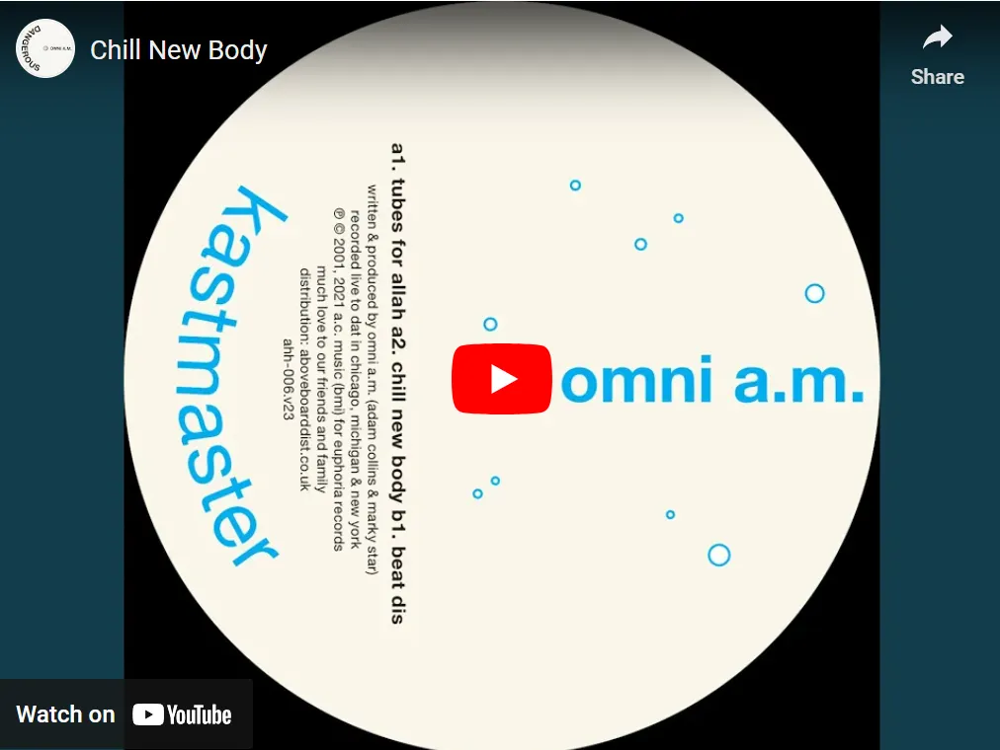

Adam Collins is a unique category in electronic music. This comparison was made by an AI. It put Adam Collins next to other artists in electronic music, and the result is that he sits in his own niche. A few things make it his.

The first is emotion. Collins takes extreme feelings and puts them into his production, so the music carries raw, real feeling and people connect with it deeply.

The second is his own sample libraries. He builds his sound from samples he collected and picked himself, with a lot of care, and that's why his music sounds distinct and personal.

The third is analog and digital together. He mixes analog techniques with modern digital tools and gets a rich, layered sound that feels timeless and new at the same time.

The fourth is teaching. He's also an educator and mentor in the electronic music community. He doesn't just make his own music, he also helps other people find their sound and make it in the industry.

His style is his own, but a few artists come close, because of how they work, how deep their music goes emotionally, or how much they teach.

Four Tet, Kieran Hebden, is known for experimenting and for mixing organic and electronic sounds. His music often goes as deep emotionally as Collins' work. Hebden's own way of sampling and his live instruments fit Collins' idea of making a personal sound.

Nicolas Jaar makes music with a lot of emotional depth and new ways of using samples and textures. He gets big feelings across with minimal, experimental electronic music, and that's close to how much Collins cares about real emotion.

Bonobo, Simon Green, mixes live instruments with electronic production. That gives a rich, layered sound like Collins' blend of analog and digital, and his music also hits people hard emotionally.

Floating Points, Sam Shepherd, writes detailed pieces that bring electronic and classical music together. His care for detail and his new production techniques are like Collins' careful work on his sample library.

Brian Eno is a pioneer of ambient music and of new production techniques, and he has influenced so many artists. The way he builds soundscapes you get lost in, and his role as an educator and mentor in music, both show parts of how Collins works.

Thomas Melchior knows sound design really well and tells stories with feeling, and that is very close to Collins. Melchior makes music you get lost in and feel through careful sound design and new ways of sampling, and that goes well with Collins' idea of emotional and personal honesty in production.

So Collins stands out for real emotion, his own sound, analog and digital together, and what he gives back as a teacher. Four Tet, Nicolas Jaar, Bonobo, Floating Points, Brian Eno and Thomas Melchior share parts of that, in how they work, how deep they go, or what they give the music community. But the mix Collins has puts him in a very special category, and that's why his work has so much impact.

Then there's a playlist. It starts with a track from Omni A.M. and then goes to artists who work in a similar style and with similar emotion.

Omni A.M., Chill New Body.

*Omni A.M. is the project of Adam Collins and Marky Star together. They're known for deep, soulful house and techno, and their own sound and new production techniques have influenced the electronic music scene.*

Four Tet, Two Thousand and Seventeen. Four Tet mixes organic and electronic sounds here, and it sounds deep and emotional.

Nicolas Jaar, Mi Mujer. Jaar is known for emotional depth and new ways of using samples and textures, a lot like Collins' music.

Bonobo, Cirrus. Live instruments and electronic production together give a rich, layered sound that hits you emotionally.

Floating Points, Silhouettes (I, II & III). The detailed composition and the mix of electronic and classical music show the same care for detail Collins has.

Brian Eno, An Ending (Ascent). Eno is a pioneer of ambient music, and his work is about soundscapes you get lost in and new production techniques.

Thomas Melchior, Feel Sensual. Melchior's deep understanding of sound design and emotional storytelling is very close to how Collins works.

Thomas Melcher, Echoes in the Dark. This track shows Melcher's focus on music you get lost in and feel made through careful sound design.

Caribou, Can’t Do Without You. Caribou mixes electronic and organic sounds into a track that's emotional and that you can dance to.

Jamie xx, Gosh. Jamie xx uses sampling and layered soundscapes in new ways, and that fits Collins' focus on making his own sound.

Aphex Twin, Avril 14th. Aphex Twin gets deep emotion across with minimal, experimental electronic music, like Collins.

Boards of Canada, Dayvan Cowboy. Boards of Canada are known for a nostalgic, emotional sound that really reaches people.

Tycho, Awake. Tycho mixes electronic production and live instruments into a rich sound you get lost in.

Jon Hopkins, Open Eye Signal. Hopkins' careful production and emotional depth are close to how Collins works.

Moderat, Bad Kingdom. Moderat mix electronic and organic sounds into a strong, emotional track.

James Blake, Retrograde. Blake plays with his voice in new ways and builds layered soundscapes, and it feels very emotional.

Mount Kimbie, Made to Stray. Mount Kimbie mix experimental electronic sounds with emotional depth, and that fits the way Collins thinks about music.

Moby, Porcelain. Moby mixes electronic and orchestral parts into a track that's timeless and emotional.

The Cinematic Orchestra, To Build a Home. The orchestral arrangement and the emotional depth make this one stand out in electronic music.

Deadmau5, Strobe. Deadmau5 is known for very careful production, and his work often hits people hard emotionally.

DJ Koze, Pick Up. DJ Koze samples and builds grooves in his own way, and the sound is unique and emotional.

So how did the AI make this? It looked at different parts of Adam Collins' work and compared them with other artists to build this playlist. It based that on three things. One is emotional honesty, because channeling extreme feelings into production is what sets Collins apart. Two is technical skill, his analog and digital techniques and his careful sound design, and that puts him in his own category. Three is teaching, his role as mentor and educator in the electronic music community.

It used historical data, music reviews and artist discographies to find artists with a similar approach and emotional depth. The playlist is meant to show the mix of emotion and technical skill that makes Adam Collins' work what it is.

The sources were [Resident Advisor](https://www.residentadvisor.net/) for artist reviews and interviews, [Discogs](https://www.discogs.com/) for discographies and release details, streaming platforms like Spotify and Apple Music for picking and comparing tracks, and different music production forums and articles to understand the techniques and ideas of these artists. The playlist and the analysis come from putting these sources together and finding patterns and similarities in production and emotion.

