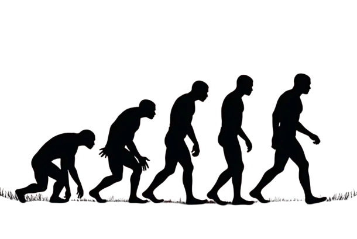

AI content is growing very fast, and that is becoming a real problem for the future of AI itself. AI gets better and better at making text, images and videos that look like they come from a human, so we have to look closely at what this means.

There is so much AI material now that we have to ask what the quality and the variety of the data will be that we use to train the next models. And the problems that can come out of this look a lot like things we know from human genetics.

The first thing is just the volume. AI content is flooding the internet, and experts predict that AI could make up to 90% of all online information in the near future. With that much of it, it gets harder and harder to tell real human content from machine output.

So the overall quality goes down. AI systems may start to put out repetitive, low quality or even wrong information, and that misleads people and makes the stuff you find online worth less.

An example. When an AI writes an article, it can struggle to stay coherent, and you get paragraphs that don't connect in a logical way. That is a big problem in longer texts, where you need one theme all the way through. AI content has this problem a lot, because these systems often don't get the fine details that human writers get.

It gets worse when you look at how a lot of AI systems are trained. They learn from online data, and that data already has a lot of AI content in it. So there is a feedback loop where AI learns from AI content and then makes more AI content.

The risk is that future models depend too much on their own output, and not on varied, high quality data made by humans. Some people call this model collapse. It's close to the Dead Internet Theory, the idea that a big part of what you see online is made by AI and not by humans.

Research has shown that over half of the sentences on the internet have been translated many times by AI, and that made the content worse. When AI keeps making and remaking content, the original variety and richness can get lost. It's just like genetic diversity that shrinks in a population that only reproduces inside a closed gene pool. And when that variety is gone, AI gets worse at making new and interesting things.

The comparison with human DNA fits really well. Inbreeding in humans can lead to genetic problems, like getting sick more easily and adapting worse when the environment changes. AI without diverse training data can run into the same kind of problems.

When models mostly learn from repetitive data, they get worse at coming up with really new ideas or solutions, and that can slow down AI development a lot. Genetic diversity keeps living populations healthy and able to adapt. Diversity in training data does the same for AI, it keeps it strong and creative. Without a wide range of good information, AI can't adapt and invent, and the AI content of the future will have no depth and no originality.

So if we want a better future for AI, the quality and the variety of training data have to come first. I see five things we can do.

First, we protect original, high quality data. Real datasets must be kept safe from getting mixed with AI content, so future models still get information that is reliable and accurate.

Second, we bring more human content into training data. That makes the information richer and more diverse for AI, and human input helps to keep it interesting, relevant and meaningful.

Third, quality comes before quantity. If you focus on good data and not just on more data, you get better results. And data that is picked for being informative and interesting helps AI to give more reliable answers.

Fourth, we use a lot of different sources, also voices you don't hear so often. That makes training data richer and the output more inventive, and it helps AI to understand different points of view and write with more nuance.

Fifth, we need strong ways to check content. There must be systems that trace where content comes from and check if it's real. That keeps information online honest, it helps to fight misinformation, and it makes sure AI content is accurate and can be trusted.

The rise of AI content brings big problems, and they have many sides. Diversity in training data is for AI what genetic diversity is for living things.

If we put good and diverse data first, and keep humans involved in making content, we can prepare AI much better for the future and keep the information we all use rich and varied. That protects AI, and it also gives it more potential to really give something back to society. In the end we get a stronger and smarter AI.
