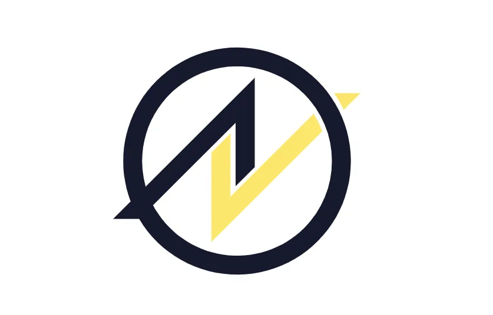

# The Amoveo Community on Futarchy, Decentralization and Real-World Use

This is a summary of discussions in the Amoveo community and of the work of its lead developer, so the ideas here are theirs and not mine.

The Amoveo community is a small group of people who go deep into the technical side of blockchains. The lead developer drives most of it, and the talks are about how to make blockchains easier to use and useful for real things in the real world.

## What Amoveo is

Amoveo is a blockchain made for financial derivatives. It puts scalability, security and decentralization first. The oracle system is built into the consensus mechanism, and that makes it cheaper and more secure. The Amoveo DEX lets you swap across chains, also privacy coins, and it costs less than the normal bridges.

The smart contract system is built to scale and to stay cheap, so there is no shared mutable state. Amoveo is the only stateless blockchain, and that means blocks can be verified fast, the network can be more decentralized and blocks can even be verified in reverse. That is also why Verkle trees fit it so well. The transaction types are not Turing complete, but they can be combined, and they give you infinite flash loans in all currencies, so you can do a complex thing inside one single transaction. And unlike on Ethereum, a failed transaction of this kind in Amoveo doesn't cost any gas.

The team works on a few things at the same time. They want to bring in the Verkle tree for better scaling and smaller transactions. They want a DEX with a better interface and more liquidity providers. They moved away from futarchy as the main way to govern because of its limits. They look at a decentralized land registry with Harberger taxes, and the community keeps talking about the technical side, use cases and how to grow.

## Futarchy

Futarchy is a way to govern where decisions follow the results of prediction markets. It was a big topic in Amoveo for a long time. At first the idea was to use it for a lot of things, like the block reward and protocol upgrades. But the community did the math and modeled it, and they found cases where futarchy can be manipulated or just doesn't work. So they moved away from it as the main way to decide things, and the focus went to making the oracle system better and looking at other ways to govern.

Futarchy may not fit the Harberger tax directly, but it could still help around it. Markets could show what the community thinks of a new tax rate, or what different tax models would do to how land gets used and to the economy around it. The community also sees other places where it could work in Amoveo. People could use markets to show which features and improvements they want most, so the development priorities follow that. Markets could predict which marketing campaign brings more users and growth. And before a big protocol change, markets could estimate what it does to network security, to fees and to how it feels for users. But all of this only makes sense where futarchy is cryptoeconomically secure and hard to manipulate.

The discussion over the past twelve months went like this. On the 5th of November 2023 the lead developer came back to futarchy, because people noticed that Amoveo had moved away from Robin Hanson's original proposal, and he wanted to look at it again for Amoveo's governance. On the 6th of November 2023 he said his earlier analysis may have had a mistake and that he was hopeful again. On the 7th of November 2023 he announced a write-up about a new type of futarchy that seemed to work. On the 18th of November 2023 he shared a blog post about why this new form works and started to build it for the next hard update. On the 20th of November 2023 the community talked about how to do it on chain, with order books and LMSR markets. On the 1st of December 2023 Jehan Tremback asked why nobody runs futarchy experiments on Ethereum, and the answer was that Amoveo is the better platform for these experiments.

On the 25th of February 2024 there was a long debate about Harberger taxes for land ownership and what they mean economically, and the lead developer said he might use futarchy to set the Harberger tax rate. On the 1st of March 2024 the community talked about the limits of the MetaDAO futarchy and how it could be manipulated, and he said he wanted to look at the MetaDAO design more closely. On the 5th of July 2024 the community came back to futarchy again, accepted its limits but was still hopeful to make it work in some specific cases. And on the 15th of July 2024 Eric Arsenault asked how futarchy was going and if it could work for governance, and he pointed to the problems Ethereum had with its own governance model.

So the community is still working out what futarchy can do for decentralized governance. It may end with better versions of what they have or with new mechanisms, but the goal stays the same, to find a way to make decisions and to share resources inside Amoveo.

## Verkle trees

A Verkle tree is a data structure to store a lot of information and to verify it fast. It's an improvement over the classic Merkle tree, because proofs are faster to make and to check, and that matters more the bigger the data gets.

Amoveo uses Verkle trees to store its consensus state, so the record of all accounts, balances and smart contracts on the chain. This fits how Amoveo is designed, scalability and efficiency first. With Verkle trees Amoveo can run stateless full nodes. A node can verify blocks without storing the whole history of the chain, so it needs a lot less storage and syncs faster. The proofs are also smaller than with Merkle trees, so checking them is faster and uses less bandwidth. That makes Verkle trees good for a chain with a lot of transactions, and the cryptography behind them keeps the data of the chain safe so nobody can change it. The community also looks at other ways to make it even better, like different elliptic curves and compression.

## Real-world use and what is still hard

Amoveo is not only about theory. The community works on real things like a decentralized land registry and a system for employment contracts. The land registry should give safe and open records of who owns which land, mostly in places where the normal system is slow or people can't get to it. The employment contract system uses Amoveo's smart contracts so people can manage work agreements without having to trust anyone in between.

A lot is still hard. Adoption and user experience are the big ones. The community wants to make the DEX easier to use and to bring in liquidity providers, so they work on the UI and the UX. And they still need a way to pay for development over the long run, so they look at other ways to fund it.

Futarchy still has open problems, but Verkle trees already bring real gains in scaling and efficiency. Both are part of how Amoveo wants to become a decentralized and secure platform for finance.
