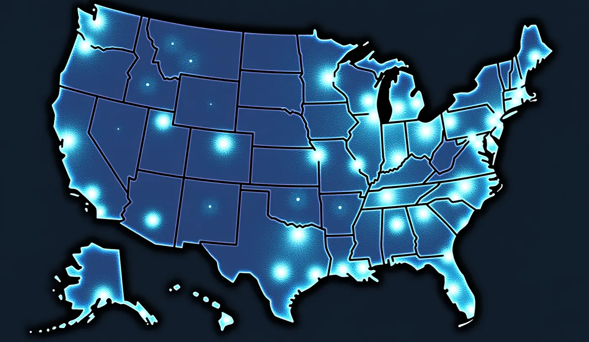

# Beyond Borders: Rethinking Statehood Amid U.S. Elections, Immigration Conflicts, and the Rise of Network States

## Emin Mahrt’s Original Thoughts

“I think towards immigration that I’m actually very pro-helping people. Therefore, when they are in need, I think states should take them in. For example, in the European Union, we do this with refugees who are coming from countries that are not safe.

But I also understand the main arguments from people like Elon Musk, who say that a state needs to operate like a company. Companies, for example, can only hire people who are beneficial for the company; otherwise, the company would go bankrupt if it has a bunch of people to pay but no one bringing in money. He actually compared it to a basketball team, saying:

***“If you are not a basketball player and you don’t know how to play, you won’t be part of the team.”***

On the other hand, I come from an immigrant family, and I think there are thousands of ways for society to benefit in ways that cannot be directly measured economically. For example, in the case of my father, while he didn’t contribute economically in a direct sense, he organized local theater for over 20 years, contributed significantly to culture, produced movies, and was an important member of the local creative and philosophical community. These contributions are very hard to measure in economic terms, but I believe that:

***“Even if his impact was net negative in terms of money, it was net positive for the state as a whole.”***

With all this said, I believe there are modern ideas, such as the network state, where a person can live wherever they want. They are not bound by physical borders but can still receive a passport. A good example of this is Liberland, where I’m also involved. In Liberland, they do have physical borders, but they accept citizens and e-residents from all over the world, and these people are not required to live within the borders to receive a passport. Citizens can contribute with taxes, vote, and access services that the country provides, such as international health insurance or company creation. These companies can then operate worldwide or within the Liberland ecosystem and network.

As citizens of a network state, like my girlfriend mentioned, they wouldn’t produce trash in the country, so there wouldn’t be a need for the government to collect or recycle trash. They wouldn’t use the electricity, healthcare system, roads, and so on. This approach takes the pressure off the state to provide these services, which is one of the fears that Republicans in the United States have — that they cannot provide for people entering the country who do not contribute to its system.

So, I embrace different and new systems. For instance, I was a resident in Liechtenstein for more than four years. Within the borders of Liechtenstein, which is a monarchy, everything functions perfectly. There isn’t a single broken road, everybody pays taxes, and 0% of people are unemployed. The state has everything under control, and the principle that the royal family adheres to is that:

***“A state must behave like a service company, constantly listening to its citizens and providing a perfectly functioning infrastructure.”***

The state must regulate healthcare services, maintain a functioning fire department, repair the roads, and generally act like a service company. People should have the freedom to choose, as the royal family emphasizes.

This concept is particularly special within Liechtenstein, as the country is divided into smaller regions. At any time, these regions can vote on leaving Liechtenstein and becoming independent, much like if the state of New York could vote to leave the United States and become its own state. However, if a region chooses to leave, it would no longer receive services from Liechtenstein, meaning it would need its own healthcare system, fire department, road maintenance, airport, and so on. This reality makes them think twice before deciding to become independent, ensuring the state remains efficient and responsive to its citizens.

It’s an interesting and somewhat radical approach, especially coming from a monarchy, but one worth considering. And that’s my story.”

As the U.S. elections approach, the debate over immigration and the responsibilities of states is reignited, reflecting broader questions of how statehood, citizenship, and governance should evolve. This article explores the conflicting perspectives on immigration, the emergence of innovative governance models like the network state, and the lessons from unique examples such as Liberland and Liechtenstein. Emin Mahrt, a diplomat from Liberland and an advocate for network states, shares his thoughts on these evolving ideas in an increasingly interconnected world.

## The Humanitarian Responsibility vs. Corporate Efficiency Debate

One of the most polarizing discussions in the United States today is centered around immigration. While some voices emphasize the humanitarian obligation to accept people in need, others argue that states should operate with a more business-oriented approach. The European Parliament, in a report addressing humanitarian crises, highlights:

***“The willingness to take in refugees is not just a legal obligation but a reflection of our shared humanity.”***

This principle forms the basis of the European Union’s approach, focusing on compassion rather than calculation.

Emin Mahrt echoes this sentiment, stating:

***“I believe that when people are in need, states should take them in. For example, in the European Union, we accept refugees who come from unsafe countries, and that principle should guide other states as well.”***

Mahrt, a staunch advocate for pro-immigration policies, believes that humanitarian considerations must remain central to state policy.

On the other hand, influential figures like Elon Musk propose that states should be managed with the same principles as a corporation. In a recent statement, Musk contended:

***“A state must operate with the same efficiency and goals as a corporation. You wouldn’t hire someone in your company who can’t contribute meaningfully — why would you admit them into your country?”***

Musk further likened the issue to a sports team:

***“If you’re not skilled in basketball, you’re not going to make the team.”***

Mahrt acknowledges the logic in this argument, stating:

***“I understand the main arguments from people like Elon Musk, who compare a state to a company. If a state can only operate sustainably by admitting those who can contribute, that approach makes sense in a business context.”***

However, he emphasizes that the evaluation of an individual’s worth should not be solely based on their direct economic contributions.

## The Unseen Contributions of Immigrants

The economic dimension of immigration is undeniably important, but it is far from the only metric of value. Alejandro Portes, a leading sociologist, has argued:

***“The impact of immigrants on society cannot be measured solely in economic terms; it’s about the social and cultural fabric they weave.”***

He emphasizes the significance of “cultural capital,” which immigrants contribute in ways that can enrich a society beyond its economy.

Emin Mahrt shares a personal story that aligns with this broader understanding:

***“I come from an immigrant family myself. My father organized local theater for over twenty years, contributing a lot to the local culture, producing movies, and engaging with the community in ways that are hard to measure economically. Even if his contribution was net negative in monetary terms, I believe it was net positive for the state as a whole.”***

Cultural historian John Higham expands on this idea in *Strangers in the Land*, asserting:

***“Immigrants are the lifeblood of cultural evolution in any society, contributing not just labor, but ideas, traditions, and social vibrancy.”***

These contributions, while difficult to quantify, play a vital role in shaping the social and philosophical makeup of a society.

## The Concept of Network States and the Liberland Example

As traditional statehood models face challenges, new concepts like the “network state” are gaining traction. A network state allows individuals to affiliate with a virtual state without being physically bound by its borders. Balaji Srinivasan, a prominent proponent of this idea, describes network states as:

***“Digital-first, geographically-light communities”***

that offer an alternative to the rigid, territory-bound notions of the nation-state. In *The Network State: How to Start a New Country*, Srinivasan envisions a future where:

***“A state is no longer a geographically-defined monopoly of violence, but a service provider with opt-in citizens.”***

Emin Mahrt, a diplomat from Liberland, supports this vision, drawing on his engagement with Liberland:

***“Liberland is a good example of a modern idea. It has physical borders but accepts citizens and e-residents from all over the world without requiring them to live within those borders. In return for taxes or fees, citizens can vote, create companies, and access services such as international healthcare. Unlike traditional states, there’s no pressure on Liberland to maintain physical infrastructure or provide services like waste collection or local electricity.”***

Liberland represents a new way of thinking about statehood, emphasizing freedom, voluntary association, and global citizenship. Its model offers a glimpse of how digital governance and physical statehood can intersect in a world that is becoming increasingly decentralized.

## The Liechtenstein Model: A Radical but Efficient Approach

Another example of innovative statecraft is found in Liechtenstein, a small but efficient principality in Central Europe. Liechtenstein functions under a governance system that closely resembles the operational model of a private company. Prince Hans-Adam II articulates this concept by stating:

***“A state must operate like a service company, constantly improving and responding to the needs of its citizens.”***

Mahrt, who lived in Liechtenstein for four years, admires this approach:

***“Within the borders of Liechtenstein, everything works perfectly. There isn’t a single broken road, everyone pays taxes, and unemployment is non-existent. The idea is simple: the state must behave like a service company and prioritize quality infrastructure and services.”***

A unique feature of Liechtenstein’s governance is its built-in mechanism for autonomy. Regions within the principality can declare independence if they are dissatisfied with the services provided. Hans-Adam II famously stated:

***“If a region feels the state no longer serves them, they should be free to go their own way — but they must then bear the full responsibility of self-governance.”***

Mahrt finds this perspective compelling, noting that:

***“It’s like giving regions the freedom to choose, but also the responsibility to manage their own resources if they opt out. It’s a radical but interesting approach.”***

## Towards a Balanced Future: Embracing New Models of Statehood

As the U.S. elections approach, immigration and the responsibilities of states are once again at the forefront of political debate. This moment invites a broader reconsideration of what a state should be and how it should engage with its citizens. With network states offering digital citizenship and traditional microstates like Liechtenstein showing that a state can act as a service provider, the possibilities for future governance models are expanding.

Parag Khanna, a global strategist, addressed this evolving landscape in his TED Talk, suggesting:

***“In an increasingly interconnected world, borders are not just physical, but ideological and functional. We need governance models that embrace this complexity rather than resist it.”***

Mahrt echoes this sentiment, concluding:

***“I embrace new systems and different approaches. If the traditional state struggles with the pressures of providing for everyone, models like network states or Liechtenstein’s service-oriented governance could offer viable alternatives.”***

## Conclusion

The current conflicts over immigration in the United States, coupled with the emergence of new models like Liberland and Liechtenstein, highlight the shifting nature of statehood and citizenship. On one hand, humanitarian considerations demand that states remain open to those in need. On the other hand, economic realities dictate the need for sustainable and efficient governance models. Perhaps the answer lies in embracing new forms of citizenship and governance that blend compassion with pragmatism.

As Emin Mahrt and others emphasize, the future of governance lies not in clinging to traditional models, but in adapting and exploring new ways of defining statehood and citizenship. The rise of network states like Liberland, combined with the efficiency of service-oriented states like Liechtenstein, offers potential solutions to the pressing challenges of our time. With the U.S. elections on the horizon, the world watches closely as these conversations continue to shape the next era of governance.
