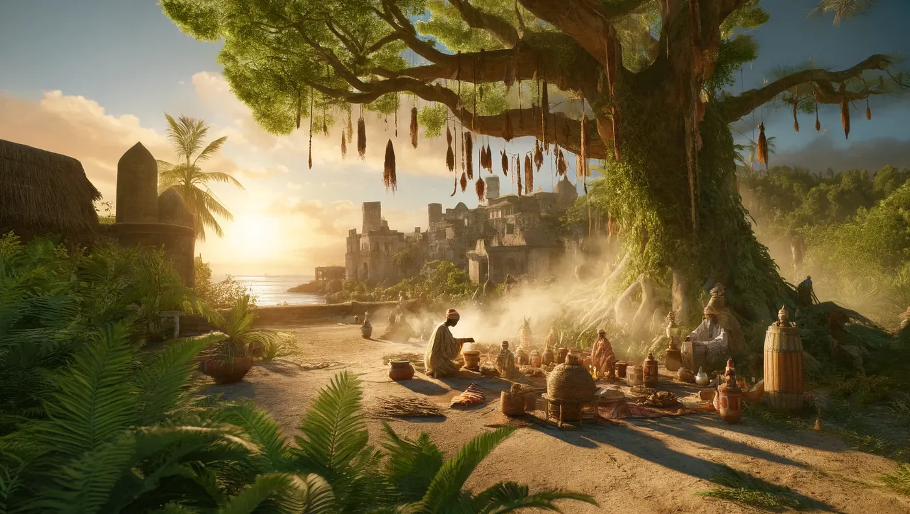

Zanzibar and Pemba have a long history with black magic and old spiritual practices. Part of the culture on both islands is the belief in supernatural beings and the use of traditional medicine.

## Shetani and the Great Lord

Shetani are spirits or demons, and people in Zanzibar and Pemba believe they influence what happens to humans. The Mwinyi Mkuu, the Great Lord, used to hold his power by controlling these spirits and seeing the future.

People say the ruins of the Mwinyi Mkuu’s palace in Dunga are haunted by these spirits at night, as [Siyabona](https://www.siyabona.com/shetani-zanzibar.html) writes.

## Popobawa

Popobawa is a spirit with a really bad name. It terrorized the people of Pemba first and later Zanzibar.

People say it paralyzes and violates its victims, and every time there's a rumor that it's back, there's mass hysteria. That's also from [Siyabona](https://www.siyabona.com/shetani-zanzibar.html).

## The waganga healers

The waganga, the traditional healers, are the ones people go to when shetani and other spirits cause trouble. They use herbal remedies and spiritual rituals together, to treat illness and to drive bad spirits away.

This is deep in the local culture and often passed down from one generation to the next. More on that at [Siyabona](https://www.siyabona.com/shetani-zanzibar.html) and [Voices of Africa](https://voicesofafrica.co.za/believe-it-or-not-witchcraft-in-kenya/).

## Jinn and Islamic tradition

Because of Islamic traditions, a lot of people also believe in genies, the jinn. People think jinn can fulfill wishes and protect you, if you summon and control them the right way.

This kind of magic uses rituals that often mix Islamic prayers with traditional practices. And it's normal for people to go to a mganga to deal with jinn and other supernatural beings, says [Voices of Africa](https://voicesofafrica.co.za/believe-it-or-not-witchcraft-in-kenya/).

## A mix of many cultures

The culture of Zanzibar and Pemba is a mix of African, Arab, Persian and Indian influences. Out of this mix came spiritual practices where black magic and traditional healing live next to the Islamic faith.

Protective charms, rituals and calling on spirits are everywhere, and that shows how much the islands mix different beliefs. You can read more at [Indigo Safaris](https://www.indigosafaris.com/pemba_island_history_and_culture.html) and [Tanzania Odyssey](https://www.tanzaniaodyssey.com/blog/cadogan-guide-to-tanzania-the-indian-ocean-islands-pemba/).

All of this is a big part of local life. It brings believers who look for help and also researchers who are interested in traditional African spirituality.

And because the islands are remote and less developed, these traditions stayed more or less the same for centuries.

*This article was written together by Emin Mahrt, emino.ai, Bane and ChatGPT.*
