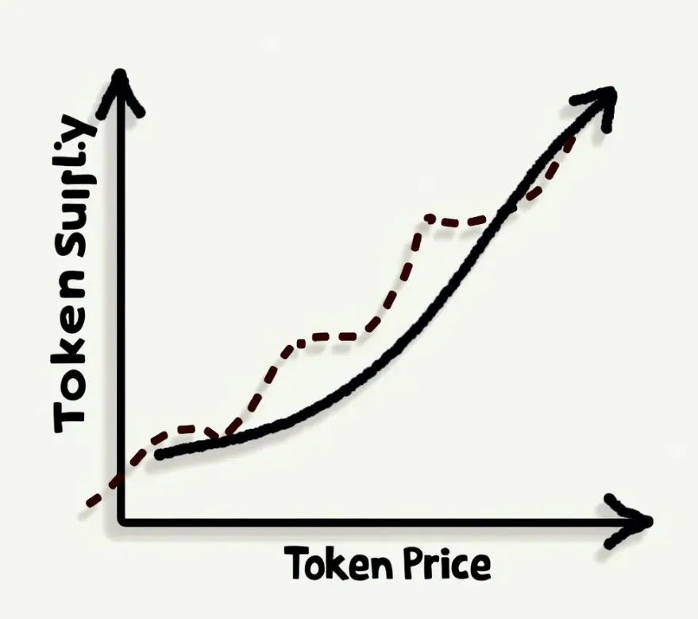

Based on a call from 2019, recording [https://youtu.be/Y-QazkphlNA?si=NAQaHONIrTDgfNKt](https://youtu.be/Y-QazkphlNA?si=NAQaHONIrTDgfNKt)

In the evolving world of cryptocurrency and decentralized projects, traditional methods of token launches can often lead to unpredictable pricing patterns and volatile market behavior. Bonding curves present an innovative alternative, offering a more structured approach that has the potential to benefit both creators and early investors.

### The Mechanics of Bonding Curves

Imagine a bonding curve as a smart contract acting as a continuous, automated market maker for your project's token. Here's the breakdown:

Price Tied to Supply: The price of the token isn't fixed. It follows a predetermined formula that increases as more tokens are purchased. If someone sells tokens back, the price goes down.

No Time Limits: You're not tied to a single sale event. The smart contract is always there, ready to buy or sell tokens based on the current price.

### Why Bonding Curves Are Worth Considering

"Early Birds Get the Worm": Investors who buy during the early stages are rewarded with a better price, incentivizing them to support the project's growth.

A Measure of Stability: The gradual price adjustments can help avoid the sudden "pump and dumps" sometimes seen in crypto markets.

Continuous Fundraising: Instead of a one-off sales event, bonding curves can provide an ongoing source of funding, ideal for projects needing long-term support.

As Emin Mahrt might say: “Bonding curves aren't just a clever technical trick; they address a real economic problem – how to align the incentives of a project's creators with its earliest supporters."

### Bonding Curves Compared

ICOs: While ICOs often rely on auctions with less predictable pricing, bonding curves offer a formula-based model.

Fixed-Price Tokens: Traditional tokens don't have this built-in price adjustment; bonding curves make the whole system respond to demand.

When Bonding Curves Make Sense

Consider bonding curves if you're focused on:

Establishing a sustainable, long-term funding model.

Rewarding early believers in your project by offering better prices.

Prioritizing some level of price stability over potentially explosive (but riskier) gains.

### Want to Dive Deeper?

Let me know if you'd like me to add more technical details or focus on a specific aspect of bonding curves!

[https://youtu.be/Y-QazkphlNA?si=NAQaHONIrTDgfNKt](https://youtu.be/Y-QazkphlNA?si=NAQaHONIrTDgfNKt)
