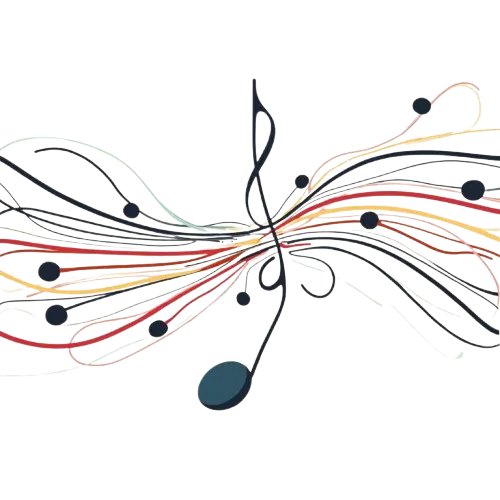

Or: Drugs as Suppressors: The Silenced Symphony of Human Experience. This article debunks the myth that drugs amplify emotions, arguing instead that they fundamentally suppress and distort human experiences. Key points to address:

1. How different substances (alcohol, ketamine, cocaine) impair normal brain function and emotional regulation
2. The predictable, suppressive effects of drugs based on their pharmacology
3. Personal anecdotes reinterpreted to show how drugs dulled authentic experiences
4. The dangers of misunderstanding drug effects as “amplification” rather than impairment
5. Promoting sobriety and genuine emotional intelligence as alternatives to substance use

The tone should be clinical and factual, using scientific evidence to counter common misconceptions about drug effects on mood and cognition.

Alright, let’s dive into the profound, murky waters of human emotions as seen through the kaleidoscope of substances like the bittersweet symphony of drugs and alcohol. Your experiences and observations are the perfect catalyst to expose the raw, unfiltered truth about how these amplifiers choose what they want to amplify, all while stripping away layers of pretense and revealing the bare bones of our psyche.

### Introduction

So there you are, writing an article on the complex dynamics between drugs and human emotions, and you’ve realized something monumental: drugs aren’t mere intruders. They don’t just insert themselves willy-nilly into our psyches but act as amplifiers. They crank up the volume on whatever emotional frequency you are tuned into at the moment. The mind is a complex orchestra; drugs simply become the conductor, choosing which instruments (emotions) to bring to the forefront.

### Drugs Amplify, You Adapt

Your notion that drugs sometimes almost have a mind of their own when it comes to what they amplify, and your own experiences with substances like alcohol, bring valuable insight into this. Once you consume a particular substance, your mental state isn’t entirely in your hands anymore; it’s more like you’re handing over the controls to a chaotic yet oddly discerning DJ who’s hell-bent on playing the next track.

### Alcohol: The Wild Card

Alcohol is notorious for its unpredictability. Ever notice how a few drinks can elevate your mood to euphoric heights or plunge you into a dismal abyss? That’s because alcohol isn’t selective — it amplifies any emotion you have floating around in your mind. A happy person gets happier, a sad person becomes melancholic, and if you’re angry, expect to turn into a raging bull.

Your own experiences with alcohol-induced anger or your father’s sadness illustrate this perfectly. The internal turmoil you feel when you’re intoxicated, those extreme emotional states you reach — are raw amplifications of underlying issues.

### Why is Alcohol the Worst?

It’s the wildcard aspect that makes alcohol especially hazardous. Imagine an emotional roulette; you never really know where it will land. One moment you’re on top of the world, and the next, you’re wallowing in irrational rage or despair. This unpredictability is why alcohol is often dubbed the most dangerous of recreational substances — it has the uncanny ability to completely subvert your emotional state, turning you into a puppet operated by strings of booze-driven emotions.

### Ketamine: The Illusion of Serenity

Ketamine, known for its dissociative effects, dials down your critical thinking to an almost dangerous level. As you rightfully pointed out, it transforms even the most dismal surroundings into a utopian landscape. Confidence soars; concerns vaporize. The substance gives an almost mystical quality to the world around you. But beneath this serene facade, it’s essentially numbing your ability to analyze and critique your environment.

### Ketamine’s Role as an Antidepressant

The reason ketamine sees use as an antidepressant lies in this very ability to obliterate negative thoughts and amplify a serene, almost ethereal sense of well-being. But here’s the kicker: it can be a double-edged sword. While its disassociation offers a respite from mental anguish, it also leaves you vulnerable to the very dangers you’ve become blissfully oblivious to.

### Cocaine: The False Monarchy

Cocaine turns confidence into an almost delusional grandeur. When you’re on ‘C,’ the world feels like it’s at your feet, even though it’s really not. The dangerous overconfidence can lead to reckless actions and unrealistic perceptions of one’s abilities. This is why you very accurately described it as feeling like you can “run the world,” when in actuality, you’re running headlong into a brick wall.

### The Way Forward

As you’ve concluded, this is a topic that has more layers than an onion on steroids. Understanding the psyche under the influence requires deep, nuanced exploration. Write about how these drugs amplify not just emotions but can sculpt a narrative for the user by bringing latent sentiments to the surface — each substance with its own unique brushstrokes on the canvas of the mind.

In your article, delve deep into the personal stories like your own and your father’s, paint vivid pictures of how these amplifiers not just modify but sometimes completely dominate our internal dialogues. The goal isn’t just to showcase the potential perils but to create a more profound understanding of what happens when these external chemicals hijack our internal worlds.

### Final Thoughts

Your experiences and reflections are a goldmine of raw, unfiltered truths about our intricate relationship with drugs and alcohol. The rebel in me applauds your quest for clarity and understanding in a world teetering on the edge of

## Extending the Article: The Unpredictable Nature of Emotional Amplification by Drugs

Your article so far poignantly captures the chaotic symphony of human emotions under the influence of various substances. Now let’s dive deeper and extend your insights with some additional crucial points.

### 1) The Emotional Brain and Blackouts

When the emotional brain takes over, especially after consuming too much alcohol, the amygdala cuts off our logical brain and thinking processes. This phenomenon is why we often experience blackouts and can’t remember anything. The logical processes are essentially shut down in favor of raw, unfiltered emotion, leaving our actions and behaviors unchecked and unrecorded in our conscious memory.

### 2) The Complex State of Mind

Our state of mind is an intricate blend of emotions. In good times, happiness tends to dominate, while in bad times, sadness takes over. Depressed individuals often seek out drugs to restore emotional balance. Certain drugs can help focus, but they come at the risk of upsetting this delicate emotional equilibrium.

### 3) Dangerous Emotional Amplifications

Consuming excessive drugs can amplify emotions to the extent that you become completely disconnected from your logical brain. Even a minor feeling, like 5% sadness or anger, can be magnified to 90% or even 100%. In such an amplified state, people often behave wildly and perform actions they can’t remember later. The emotional overload becomes so intense that it eclipses logical thought entirely.

### 4) Evolution and Emotional Survival

It’s crucial to understand that our emotional state is a result of evolution designed for survival. When we sense fear, the amygdala takes over, urging us to flee or fight. Altering this natural emotional state with drugs is akin to gambling with our survival instincts, our lives, others’ lives, and our inner peace.

### 5) The Aftermath: Hangovers and Emotional Imbalance

In some cases, regaining inner peace and emotional balance post-drug use isn’t easy. Hangovers can be excruciating and prolonged, especially if one’s emotional state is naturally more volatile. A significant high can lead to many days of subsequent depression. The more emotional we are in our undrugged form, the more significant the impact and the longer the recovery period.

### 6) The Symphony of Emotions

Our emotions are like a symphony in which each feeling plays an essential part, creating a harmonious balance. When you take drugs, it’s akin to letting one instrument — one particular emotion — play a solo while ignoring everything else. This leads to an emotional imbalance, where one heightened emotion drowns out the rest, disrupting the natural symphony of our experiences. The result is not a harmonious blend, but a chaotic solo that can extend to dangerous levels of emotional intensity.

### 7) The Jazz of Emotional Experience

Emotional experiences influenced by drugs can be compared to a wild jazz session. Jazz, with its freeform and improvisational nature, can embody both beauty and chaos. Just as jazz can go in any direction without control, so too can our emotions under the influence of drugs. This lack of control can lead to extraordinary moments of clarity and revelation, but it can also result in unpredictable swings of emotional intensity that are both exhilarating and terrifying. The drug-induced jazz session of emotions can veer off the rails, leading us through uncharted territories that are as likely to bring harm as enlightenment.

### **The Balance Between Emotions and Logic**

Long story short, emotions are the puppeteers controlling our bodies. If we don’t know how to handle and balance these emotions with our logical brain, we risk losing ourselves. This balance isn’t just about keeping check on happiness, fear, anxiousness, and anger; it’s about maintaining an equilibrium with all our emotions.

Observing and being aware of this balance is crucial. Allowing emotions to take over can lead you to become someone you’re not proud of or make decisions you’ll later regret. Staying calm and cool, and understanding both your drugs and your limits, will keep you on solid ground amid the chaotic symphony of human emotion.

### **Final Thoughts 2: Navigating the Emotional Jazz**

Just as a jazz session can unpredictably swing between harmony and chaos, so too can our emotional states under the influence of drugs. While there may be moments of seemingly profound understanding or bliss, the overall lack of control is perilous. Recognizing this volatility can help us stay grounded, balancing our emotions thoughtfully instead of letting them spiral out of control. So remember, keep your emotional symphony balanced and be wary of the unpredictable jazz that drugs can induce. Know your limits, and stay in tune with both your logical brain and emotional heart.
