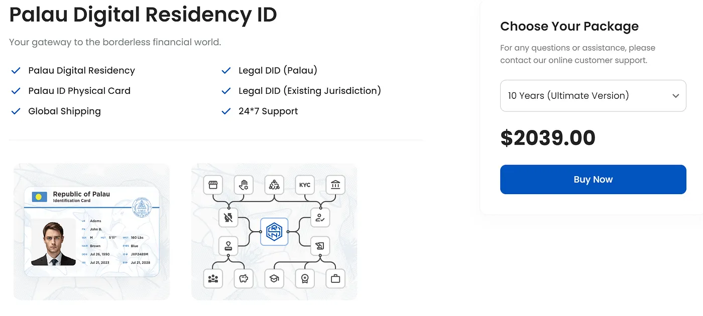

*[https://rns.id/app/palauidinfo](https://rns.id/app/palauidinfo)*

## What the Palau ID is

The Palau ID is officially called the Sovereignty-Backed ID. It's a program by the government of Palau that gives you a legal form of identification you can use for a lot of things. It's a digital residency, so it's not only for people from Palau. People from many other countries can get a recognized ID without living in Palau at all.

The Palau ID is a government-issued ID card for any situation where you need legal proof of who you are. It's part of a bigger move to bring government services online and make international business easier. A lot of businesses and government offices accept it for KYC (Know Your Customer). It lets you open bank accounts in places like California and Nevada. And you can use it to check in at hotels around the world, often with a discount for holders.

## What people use it for

The ID comes with a digital residency, and people from 138 countries can apply without living in Palau. Digital nomads like it a lot, and also people who just want another ID. You can pick a validity of one year, 5 years or 10 years, and after that you renew it. People say they used it to open bank accounts, to pass KYC on crypto exchanges, to buy alcohol and for other things in shops, and to book places to stay and show who they are at airports. It's recognized in many places, so it helps when you travel and do business abroad. And compared to getting a similar ID from another country, applying is simple and cheap. It costs about $248.

You can open accounts with places like Wise and use them to send money abroad and manage your finances. In Palau itself the ID lets you stay up to 180 days per entry, so it's interesting for travelers. And it's a blockchain-based identity, so you can use it for secure online transactions and with a lot of digital platforms.

## Where it doesn't work yet

Acceptance depends on the place and the institution. So it's good to test it in different situations to find out where it counts as a real ID. People are doing field research and write down where using the ID worked and where it didn't, and that slowly gives a better picture of what it's good for.

The Palau ID is a new way to do identity, and more and more of life is digital. It's a legal ID that doesn't care where you live, and that gives people a lot more freedom in their private and work life. The more people try it, the more places it opens up, and it can become a big part of digital identity in the future.

## Is Palau a real country?

Palau is a small island nation in the western Pacific Ocean, in the Micronesia region. It has about 340 islands and around 18,000 people. Palau is a sovereign state and became a full member of the United Nations (UN) in 1994. So it's an independent nation with its own government and its own legal system.

The Palau ID is also called the Sovereignty-Backed Web3 ID. It's a government-issued ID card that came with a digital residency program launched in 2022. It's legal proof of identity for things like online transactions and identity checks at financial services. It's especially useful for digital nomads and remote workers, because it gives them a recognized ID that helps them use services in other countries. And it's meant to make identity checks simpler, mostly in crypto and online banking.

## Can you open bank accounts with it?

The Palau ID is a legal identity, but banks treat it very differently. Reports about opening bank accounts with it are mixed. Some people used it to verify themselves on certain platforms and others had problems. One report says a Chase Bank branch didn't accept it as enough ID, and only U.S. state-issued IDs or passports were good enough there [1].

For KYC it's different. People report that it works on several crypto exchanges and some financial platforms. So even if traditional banks don't take it everywhere, it can still get you into some financial services online [2][4].

If you want to open a bank account with it, first look for banks that say clearly that they accept the Palau ID. Have other documents ready in case they ask for more. And go to a branch or call customer service to check if they take it before you rely on it.

The UN recognizes Palau as an independent nation, and Palau does new things like the Palau ID to make it easier to move around the world and use services. The ID helps a lot with digital transactions and some online banking, but traditional banks may not take it. So if you want to use it for banking, do your research first and expect some trouble with identity checks.

Citations for the first part: [1] [https://docs.rns.id/support/faqs](https://docs.rns.id/support/faqs) [2] [https://www.biometricupdate.com/202407/rns-id-provides-decentralized-id-protocol-for-palau-on-solana](https://www.biometricupdate.com/202407/rns-id-provides-decentralized-id-protocol-for-palau-on-solana) [3] [https://www.reddit.com/r/PassportPorn/comments/1b1t38n/palau_digital_residency_id/](https://www.reddit.com/r/PassportPorn/comments/1b1t38n/palau_digital_residency_id/) [4] [https://www.malakoutilaw.com/what-can-you-do-with-palau-s-digital-residency-id](https://www.malakoutilaw.com/what-can-you-do-with-palau-s-digital-residency-id) [5] [https://rns.id/app/palauidinfo](https://rns.id/app/palauidinfo) [6] [https://www.justanswer.com/computer-programming/nqsxy-valid-palau-digital-id-digital-residency.html](https://www.justanswer.com/computer-programming/nqsxy-valid-palau-digital-id-digital-residency.html) [7] [https://www.binance.com/en/square/post/11925337932130](https://www.binance.com/en/square/post/11925337932130)

Citations for the second part: [1] [https://www.malakoutilaw.com/palau-digital-residency-id-to-verify-identity-at-chase-bank-branch-field-report-14](https://www.malakoutilaw.com/palau-digital-residency-id-to-verify-identity-at-chase-bank-branch-field-report-14) [2] [https://baselynk.com/palau-id-everything-you-need-to-know/](https://baselynk.com/palau-id-everything-you-need-to-know/) [3] [https://www.escapeartist.com/blog/palau-digital-residency-a-crypto-kyc-workaround/](https://www.escapeartist.com/blog/palau-digital-residency-a-crypto-kyc-workaround/) [4] [https://docs.rns.id/support/faqs](https://docs.rns.id/support/faqs) [5] [https://etradeforall.org/news/e-%E2%81%A0residency-of-estonia-vs-palau-digital-residency/](https://etradeforall.org/news/e-%E2%81%A0residency-of-estonia-vs-palau-digital-residency/) [6] [https://www.biometricupdate.com/202407/rns-id-provides-decentralized-id-protocol-for-palau-on-solana](https://www.biometricupdate.com/202407/rns-id-provides-decentralized-id-protocol-for-palau-on-solana) [7] [https://www.reddit.com/r/PassportPorn/comments/1b1t38n/palau_digital_residency_id/](https://www.reddit.com/r/PassportPorn/comments/1b1t38n/palau_digital_residency_id/) [8] [https://www.malakoutilaw.com/what-can-you-do-with-palau-s-digital-residency-id](https://www.malakoutilaw.com/what-can-you-do-with-palau-s-digital-residency-id)
