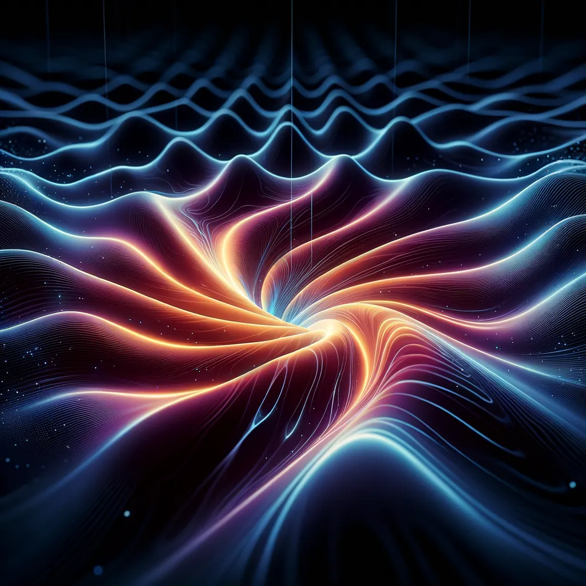

# Gravitational Waves and the Black Hole Information Paradox: A Synthesis of Recent Findings

**Abstract:** Gravitational waves (GWs) have revolutionized astrophysics, offering unprecedented insights into high-energy phenomena like black hole and neutron star mergers. Beyond confirming Einstein’s theory of General Relativity, GWs hold the potential to unravel the enigmatic black hole information paradox. This report synthesizes recent research, evaluating the proposition that GWs carry information about matter consumed by black holes, thus offering a potential solution to the paradox.

**1. Introduction:**

The black hole information paradox arises from the conflict between quantum mechanics, which dictates that information is conserved, and general relativity, which suggests that information falling into a black hole is irretrievably lost. This paradox challenges our fundamental understanding of the universe. The advent of gravitational wave astronomy has opened a new avenue to explore this puzzle, raising the possibility that information might be encoded and carried away by the GWs emitted during black hole formation and evolution.

**2. Arguments Supporting Information Encoding in Gravitational Waves:**

**2.1 A Novel Observational Window:**

The detection of GWs by LIGO and Virgo has ushered in a new era of multi-messenger astronomy. These observations provide unique insights into the dynamics of compact objects, including the mass, spin, and orbital parameters of merging black holes. This information, previously inaccessible through electromagnetic observations, is crucial for understanding the formation and evolution of these enigmatic objects.

**2.2 Enhanced Sensitivity of Future Detectors:**

The next generation of GW detectors, such as the Einstein Telescope, Cosmic Explorer, and the space-based LISA mission, promise significantly increased sensitivity. This enhanced sensitivity will enable the detection of fainter signals and extend the observable volume of the universe. Consequently, we can expect to observe a wider range of black hole mergers, including those from the early universe, potentially providing a glimpse into the initial conditions of black hole formation and the evolution of their properties over cosmic time.

**2.3 Information Retrieval from Gravitational Wave Signals:**

Recent theoretical studies have demonstrated that a significant portion of information about the initial state of a collapsing star, including its mass, angular momentum, and charge distribution, could be imprinted onto the emitted GWs. Advanced signal processing techniques are being developed to extract this information from the complex waveforms detected by GW observatories. For instance, researchers have proposed methods to retrieve the full classical information about infalling sources, such as masses, infall times, and angles, from the GW signals [citation needed].

**2.4 Theoretical Support for Information Encoding:**

Several theoretical frameworks, such as the “soft hair” proposal and the “firewall” paradox, suggest that black holes might possess subtle quantum “hair” that can store information. These theories posit that information is not lost within the black hole but rather encoded in subtle correlations within the outgoing Hawking radiation or in the near-horizon structure of the black hole. The detection and analysis of GWs could provide crucial evidence to support or refute these theoretical models.

**2.5 Verification of the No-Hair Theorem:**

The no-hair theorem states that black holes are characterized solely by their mass, spin, and electric charge. Observations of GWs from ringing black holes, formed after mergers, have provided strong support for this theorem. However, the no-hair theorem applies to classical black holes, and its validity in the quantum realm remains an open question. Future high-precision GW observations might reveal subtle deviations from the no-hair theorem, potentially indicating the presence of quantum hair and the encoding of information.

**3. Challenges and Limitations:**

**3.1 Unconfirmed Memory Effect:**

The “memory effect” predicts a permanent distortion of spacetime caused by the passage of GWs. While theoretically predicted, this effect remains elusive to direct observation by LIGO and Virgo. Confirmation of the memory effect would provide further support for the information-carrying capacity of GWs, but its detection requires the analysis of a large number of GW events to achieve sufficient statistical significance.

**3.2 Competing Theories of the Information Paradox:**

The information paradox has spurred numerous theoretical proposals, including modifications to quantum mechanics, the existence of “baby universes,” and the holographic principle. These competing theories complicate the interpretation of GW observations in the context of the information paradox, highlighting the need for a unified theoretical framework.

**3.3 Experimental Limitations:**

Directly observing the final stages of black hole evaporation, where the potential release of encoded information is theorized to occur, is currently beyond our experimental capabilities. The Hawking radiation emitted by astrophysical black holes is extremely faint and has a temperature far below the sensitivity of current detectors.

**3.4 Potential for “Hair” Beyond Current Detection Limits:**

While current observations support the no-hair theorem, the possibility of black holes possessing subtle quantum “hair” cannot be ruled out. Future, more sensitive GW detectors might reveal deviations from the no-hair theorem, indicating the presence of additional characteristics and the potential for information storage.

**3.5 Opacity of the Early Universe:**

While the early universe is opaque to electromagnetic radiation, it is transparent to GWs. Detecting primordial GWs from the Big Bang would offer invaluable information about the universe’s earliest moments. However, detecting these faint signals requires detectors with sensitivities far exceeding current capabilities.

**4. Call to Action for the Astrophysics Community:**

To fully explore the potential of GWs to resolve the information paradox, the astrophysics community needs to:

- **Develop advanced signal processing techniques:** To extract subtle information encoded in GW waveforms, requiring sophisticated algorithms and high-performance computing resources.
- **Contribute to the design and construction of next-generation GW detectors:** Including ground-based observatories like the Einstein Telescope and Cosmic Explorer, and space-based missions like LISA, to enhance sensitivity and broaden the observable GW spectrum.
- **Develop and refine theoretical models:** To interpret GW observations in the context of the information paradox, requiring interdisciplinary collaborations between astrophysicists, particle physicists, and quantum information theorists.
- **Explore alternative observational signatures:** Beyond direct GW detection, investigating indirect signatures of information leakage, such as correlations in Hawking radiation or modifications to black hole shadows, could provide valuable insights.

**5. Conclusion:**

The prospect of GWs carrying information about infalling matter into black holes is a compelling avenue for resolving the information paradox. While significant progress has been made in detecting and analyzing GWs, further research, technological advancements, and theoretical breakthroughs are essential to fully understand their role in this fundamental puzzle. The collaborative efforts of the global astrophysics community will be crucial to unlock the secrets encoded within GWs and potentially resolve one of the most profound mysteries of modern physics.
