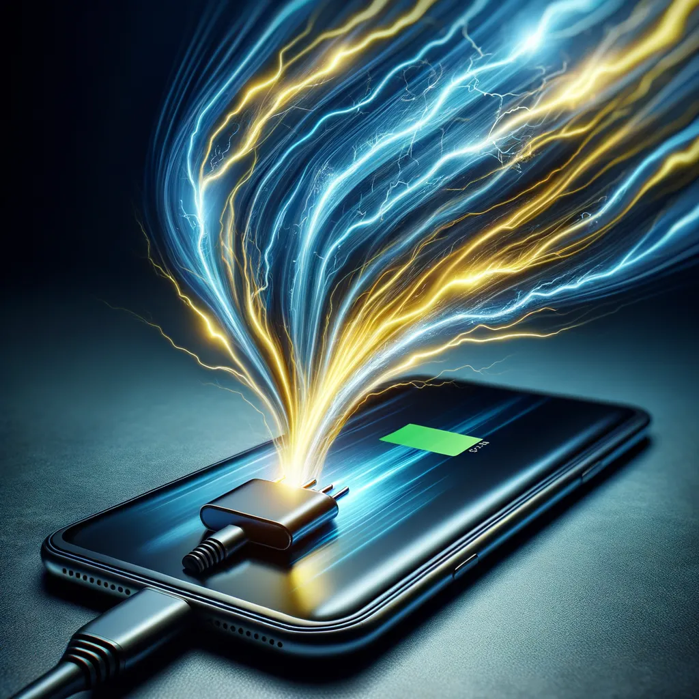

# How to fully charge your smartphone in 15 minutes. The importance of good cavers good charger and phones that support high wattage charging.

## **Fastest Charging Phones of 2024**

**Table of Contents**

- Introduction
- Understanding Type-C Charging
- What is Type-C Charging?
- Variations in Type-C Cable Power
- Importance of Charger Wattage

Fastest Charging Phones of 2024

- Xiaomi 13 Pro
- OnePlus 10T
- Realme GT Neo 3
- Oppo Find X5 Pro

Combining the Right Charger, Cable, and Phone

- How to Maximize Charging Speed
- Examples of Optimal Charging Setups
- Price Comparison
- Conclusion

## Introduction

With the ever-increasing demand for faster charging solutions, modern smartphones have significantly advanced their charging capabilities. However, achieving the fastest charging speed requires not only a high-wattage charger but also a compatible Type-C cable and a phone that supports such speeds. In this article, we will explore the fastest charging phones of 2024, the importance of using the right cables and chargers, and how to ensure you are getting the best charging performance.

## Understanding Type-C Charging

## What is Type-C Charging?

Type-C charging refers to the USB-C port that is becoming the standard for many electronic devices due to its versatility and capability to deliver higher power levels compared to older USB standards.

## Variations in Type-C Cable Power

Not all Type-C cables are created equal. Some cables are designed to handle higher wattage and can support fast charging, while others are limited in their power delivery. Using a high-quality Type-C cable that can handle your charger’s output is crucial for achieving optimal charging speeds.

## Importance of Charger Wattage

The charger itself plays a significant role in how fast your device charges. Chargers come in various wattages, and a higher wattage charger can deliver more power, reducing the time it takes to charge your device. However, it’s important to ensure that both your phone and cable can handle the wattage output of your charger.

## Fastest Charging Phones of 2024

## Xiaomi 13 Pro

- Charging Speed: Supports up to 120W fast charging
- Key Features: Flagship performance, top-tier camera system
- Price: Approximately $999

## OnePlus 10T

- Charging Speed: Supports up to 150W fast charging
- Key Features: High-performance chipset, large display
- Price: Approximately $749

## Realme GT Neo 3

- Charging Speed: Supports up to 150W fast charging
- Key Features: Affordable high-speed charging, gaming performance
- Price: Approximately $499

## Oppo Find X5 Pro

- Charging Speed: Supports up to 80W fast charging
- Key Features: Premium design, excellent camera capabilities
- Price: Approximately $1,199

## Combining the Right Charger, Cable, and Phone

## How to Maximize Charging Speed

To achieve the fastest charging speeds, ensure you are using:

- A high-wattage charger that matches or exceeds your phone’s charging capacity.
- A Type-C cable capable of handling the charger’s wattage output.
- A smartphone that supports high-wattage charging.

## Examples of Optimal Charging Setups

- **Xiaomi 13 Pro Setup:** 120W Xiaomi charger, high-speed Type-C cable rated for 120W. Result: Full charge in approximately 17 minutes.
- **OnePlus 10T Setup:** 150W OnePlus charger, high-speed Type-C cable rated for 150W. Result: Full charge in approximately 15 minutes.
- **Realme GT Neo 3 Setup:** 150W Realme charger, high-speed Type-C cable rated for 150W. Result: Full charge in approximately 16 minutes.
- **Oppo Find X5 Pro Setup:** 80W Oppo charger, high-speed Type-C cable rated for 80W. Result: Full charge in approximately 31 minutes.

## Price Comparison

Xiaomi 13 Pro — 120W charger — 120W-rated Type-C cable — $999

OnePlus 10T — 150W charger — 150W-rated Type-C cable — $749

Realme GT Neo 3–150W charger — 150W-rated Type-C cable — $499

Oppo Find X5 Pro — 80W charger — 80W-rated Type-C cable — $1,199

## Conclusion

Fast charging technology has made significant strides, allowing users to quickly power up their devices and minimize downtime. By understanding the importance of using the right combination of a high-wattage charger, compatible Type-C cable, and a supporting smartphone, you can make the most of this technology. Whether you choose the Xiaomi 13 Pro, OnePlus 10T, Realme GT Neo 3, or Oppo Find X5 Pro, ensure you have the right accessories to experience the fastest charging speeds available in 2024.

By following these guidelines, you can ensure that your device charges at its maximum potential, keeping you connected and powered up throughout your day.
