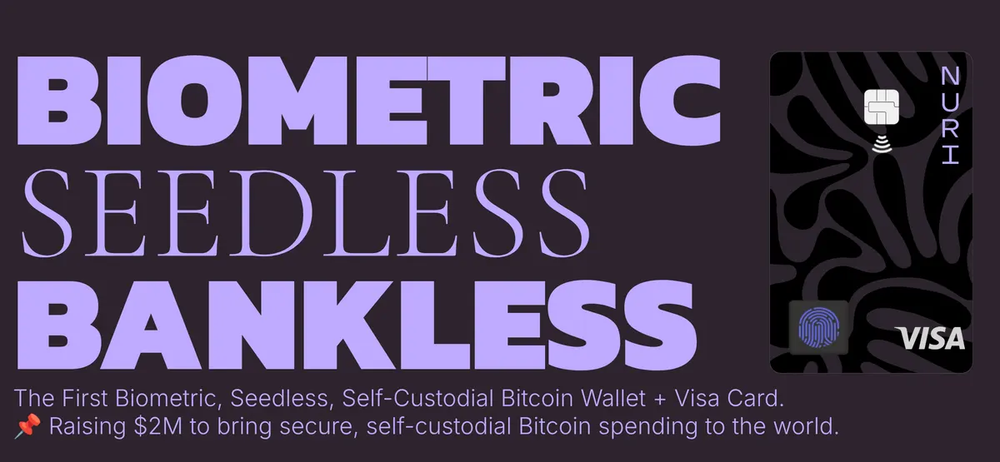

**UPDATE: the NEW Nuri Card is much more simple and secure, without battery, without display.**

Check the prototype video (old card, how I got the idea):

[Watch the video on YouTube](https://www.youtube.com/watch?v=HsgYToy-1eI)

It’s been a long time. I’m writing this post in a bit of self-interest as I’m going to launch a Cryptocurrency (Bitcoin and Ethereum first) hardware wallet in the format of a credit card, that is also a VISA card.

In short: you can protect your Bitcoin (or other Crypto) with a secure device, that connects via NFC and Chip to your Computer or Smartphone.

The same card can be used in any place that accept Credit Cards.

Nuri.com (www.nuri.fund if you want to invest) is the first Hardware Wallet in Credit Card Format that is protected by your Fingerpring (Biometric Protection).

## How to Protect Your Bitcoin (and Everything Else) from Hackers

We’ve come a long way since the early days of Bitcoin. Back then, protecting your crypto meant writing down a seed phrase on paper and hoping it wouldn’t get lost. Today, we have more advanced tools, but with progress comes complexity—and new risks.

From stolen passwords to phishing attacks, the threats are evolving, and so must our approach to security. This is why I’ve spent the last years developing **NURI**, a biometric smart-card designed to simplify and secure your digital life.

---

## A Problem That Needed Solving

Owning cryptocurrency gives you financial independence, but with it comes responsibility. If you’ve ever:

- Lost access to your wallet because you misplaced your seed phrase,
- Worried about hackers stealing your private keys, or
- Wanted an easier way to spend your Bitcoin,

then you understand the challenges that come with using crypto.

Even beyond cryptocurrency, passwords have become a constant source of frustration. They’re insecure, easy to forget, and too often become the weak link in an otherwise solid security system.

This is where NURI comes in.

---

## What Is NURI?

NURI is a **biometric smart-card** that combines:

1. **A secure crypto wallet** for storing your Bitcoin and other digital assets.
2. **A VISA debit card** for spending crypto anywhere in the world.
3. **Password-free authentication** for your online accounts, like Gmail and your laptop.

At its core, NURI is designed to make your life simpler and more secure. It ensures that your cryptocurrency is safe, your accounts are protected, and you can easily use your funds whenever you need them.

---

## How NURI Works

NURI uses cutting-edge **Multi-Party Computation (MPC)** technology. Without getting too technical, here’s what that means for you:

- **No Seed Phrases:** Your private keys are stored securely across multiple locations, so there’s no single point of failure.
- **Biometric Protection:** Only your fingerprint can unlock the card, making it nearly impossible for anyone else to access your funds.
- **Password-Free Access:** Log into your accounts and devices with FIDO passkey authentication—no passwords required.

And because it’s also a VISA debit card, you can spend your crypto as easily as swiping a regular card at the grocery store.

---

## Why NURI Matters

I built NURI to solve the biggest pain points of owning and using cryptocurrency.

- **Protect Your Bitcoin:** With unhackable storage and no seed phrases to lose, your crypto is safer than ever.
- **Spend Anywhere:** NURI combines the best of both worlds—a secure crypto wallet and a classic debit card.
- **Replace Passwords:** Forget about weak, hackable passwords. Your fingerprint becomes your key to everything.

It’s not just about security; it’s about making crypto and digital life more user-friendly for everyone.

---

## A Name with Purpose

The name NURI holds personal meaning for me—it’s my father’s name. Using it for this card felt right because, like my father, this card represents strength, reliability, and trust. My mission is to ensure that anyone who buys Bitcoin or other cryptocurrencies has the tools to keep their funds safe and easily accessible.

---

## Who Is NURI For?

Whether you’re a crypto enthusiast or just starting out, NURI is built for:

- **Bitcoin Holders:** Keep your funds secure without worrying about losing access.
- **Everyday Users:** Make crypto as easy to use as a regular debit card.
- **Digital Nomads:** Simplify your life with one tool for payments and passwords.

---

## Why Now?

Cryptocurrency adoption is growing rapidly, but so are the risks. Hackers are getting smarter, and traditional wallets and password systems just aren’t enough anymore.

With NURI, you’re not just protecting your crypto—you’re protecting your entire digital life. And you’re doing it in a way that’s simple, secure, and convenient.

---

## What’s Next?

I’m incredibly excited about the potential of NURI to change how we think about security. My hope is that it will empower people to take control of their finances and their digital lives without fear of loss or theft.

If you’ve ever felt overwhelmed by the complexity of crypto or worried about the safety of your funds, NURI is here to help.

---

## Let’s Build a Safer Future

NURI is more than a product—it’s a tool for empowerment. It’s about giving you the confidence to navigate the digital world without fear.

Please reach out to me if you want via +13103408213 via Signal or answer to this email / emin@nuri.com
