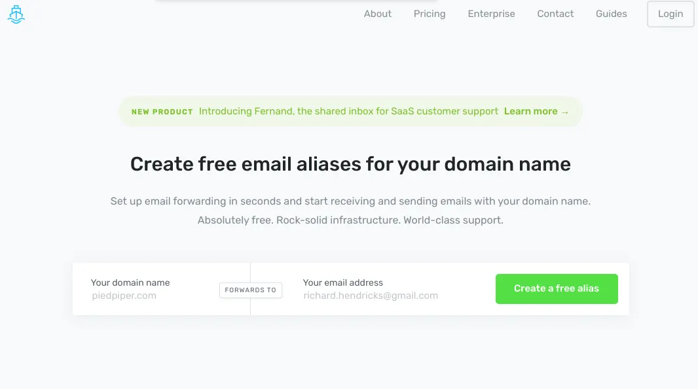

## Set Up Email Forwarding in Seconds and Start Receiving and Sending Emails with Your Domain Name. Absolutely Free. Rock-Solid Infrastructure. World-Class Support.

and its true what they say. I’ll explain in the upcomming article how you can register your domain via GoDaddy.com (oldschool, i know) and then have ImprovMX handle your Email forwarding so you just get all your mail in gmail!

tbc

