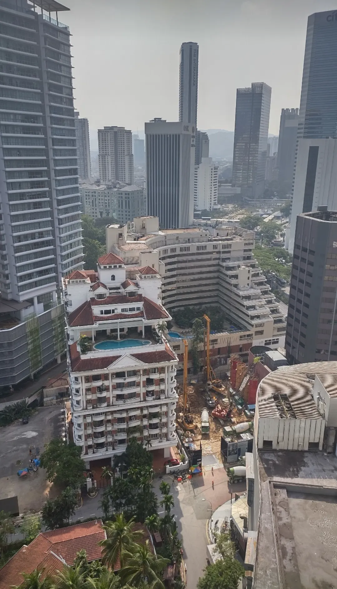

This is a Kuala Lumpur photo, interpreted by AI lyrically and musically. I gave an AI this picture from Kuala Lumpur and nothing else, no additional context. Both the text and the music were created by the AI, just based on the picture. This was my prompt.

*What do you see here, describe it as beautiful as you can and really check if you notice something special and know what and where the things are, for a few pages in my travel book.*

## What the AI wrote

And this is what the AI wrote, unchanged except for the formatting.

> From the vantage point of a high-rise building in Kuala Lumpur, this photograph captures a stunning blend of modern architecture and historical charm, set against a backdrop of urban vitality.
>
> A Symphony of Structures. The image beautifully juxtaposes the sleek lines of contemporary skyscrapers with the ornate elegance of a classic building adorned with red-tiled roofs and arching balconies. The contrast is striking, illustrating the harmonious coexistence of Kuala Lumpur's rich historical heritage and its rapid modernization.
>
> The Heart of Kuala Lumpur. Prominent in the frame, the building with the red roofs and multiple swimming pools exudes a sense of luxury and old-world charm. This could be a historic hotel or a residential complex, offering a serene oasis amidst the bustling city. Just behind it, towering giants like the OSK Tower and other modern office buildings stretch towards the sky, symbols of the city’s economic prowess.
>
> Urban Pulse. The construction site at the lower right corner of the image signifies ongoing development, a testament to the city’s constant evolution. Cranes and machinery are hard at work, hinting at the future additions to this dynamic skyline.
>
> Lush Greenery Amidst Concrete. Despite the concrete jungle, pockets of greenery peek through, with trees and small parks offering a breath of fresh air. These green spaces are vital, providing a balance to the urban environment and enhancing the city's livability.
>
> Special Highlights.
>
> Iconic Towers. In the distance, you can catch glimpses of more iconic structures, possibly including the famous Petronas Twin Towers, though they are not clearly visible in this shot.
>
> Cultural Blend. The variety of architectural styles represents Kuala Lumpur’s cultural diversity, reflecting influences from Malay, Chinese, Indian, and Western design principles.
>
> Vibrant Atmosphere. The overall scene pulsates with life and energy, a characteristic feature of Kuala Lumpur’s ever-vibrant cityscape.
>
> Kuala Lumpur’s skyline is a tapestry woven with threads of history and modernity. From the luxurious havens nestled among towering skyscrapers to the ongoing construction projects that promise even greater heights, the city is a living, breathing entity. This view encapsulates the essence of Kuala Lumpur, a city that respects its past while relentlessly forging its future. Here, every building tells a story, every corner hums with the promise of new beginnings. Whether you are admiring the majestic towers that touch the sky or finding solace in the tranquil green patches amidst the urban expanse, Kuala Lumpur invites you to experience a unique blend of tradition and innovation.
