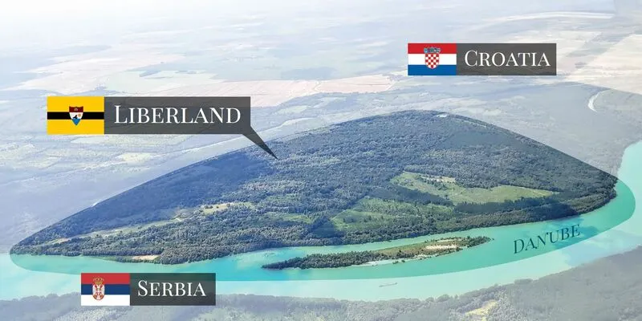
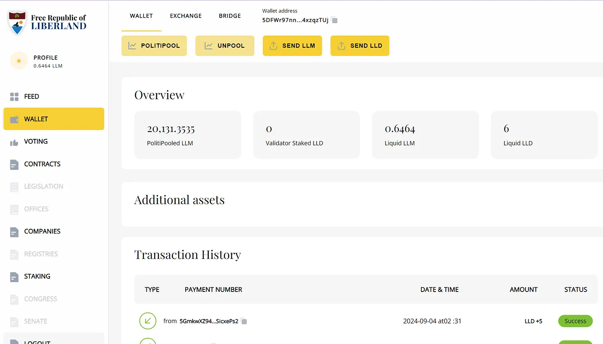
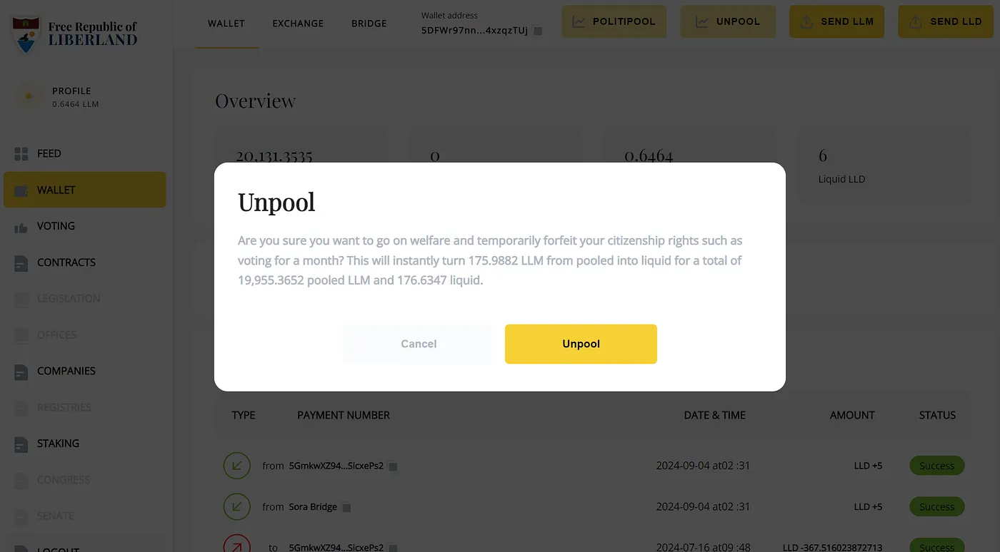
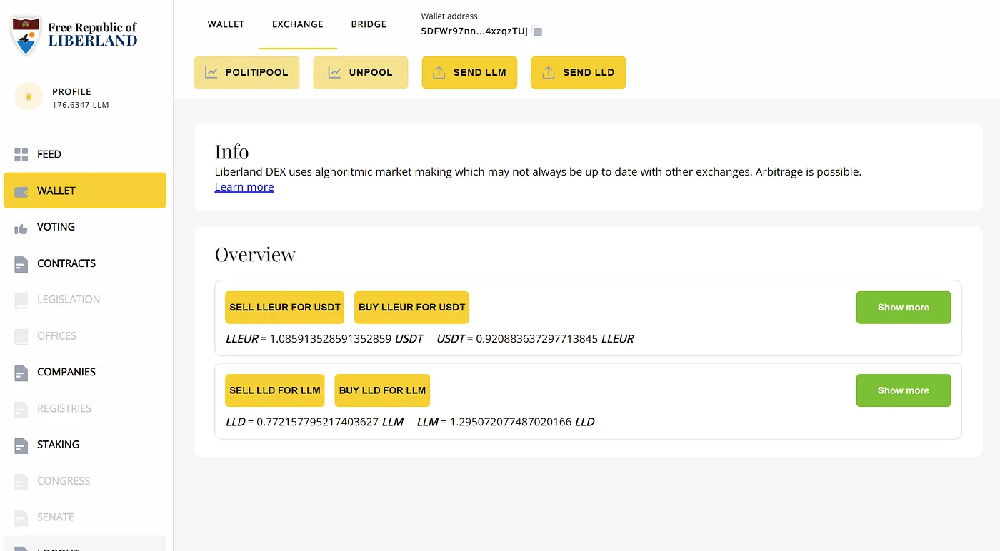
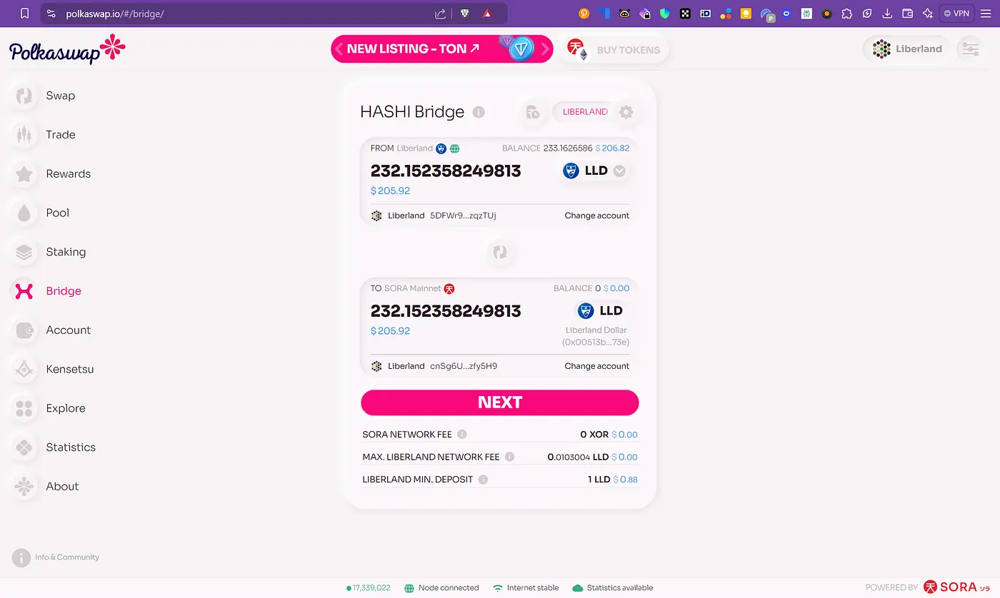
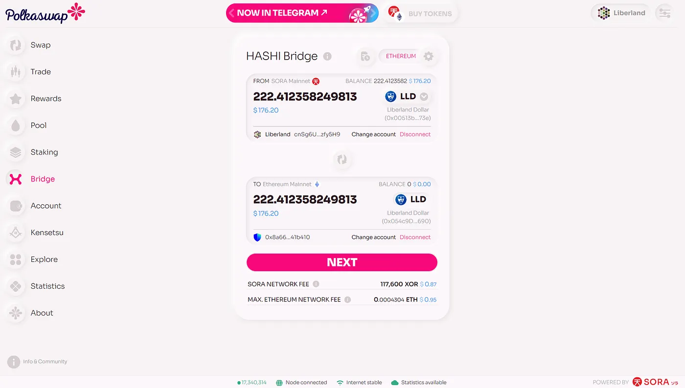
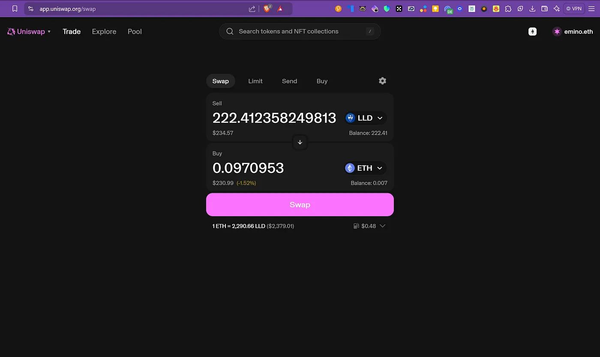
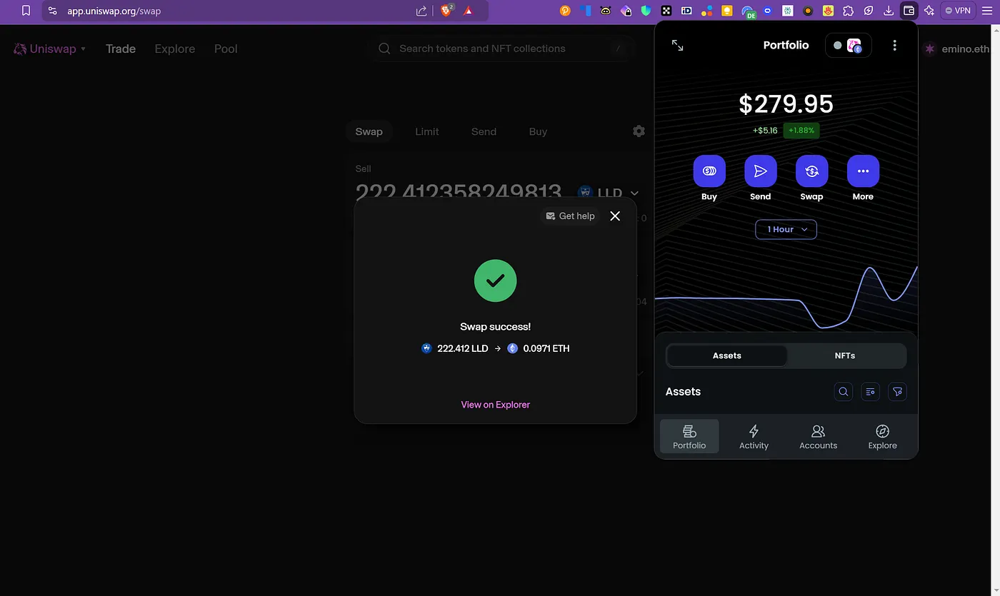

The Liberland Blockchain is a public blockchain made for the governance and the economy of the micronation of Liberland. It's built on the Substrate framework, which the Polkadot blockchain also uses.

## The tokens

There are two tokens. The Liberland Dollar (LLD) is the native currency of the Liberland Blockchain. You use it for transactions, to pay fees and to secure the network. It's not a stablecoin, so the market decides its price. The initial supply was 3 million LLD and it went to Liberland citizens and LLM holders.

The Liberland Merit (LLM) is the governance token and stands for ownership in Liberland. If you hold it you can take part in decisions. It has a maximum supply of 70 million tokens and it's deflationary.

For governance there is PolitiPooling. You have to stake LLM to take part in governance, and only 10% of staked LLM can be unvested each year, so people stay in for the long term. Staking LLD is a different thing. You need it to run validator nodes and secure the network, and validators earn rewards in LLD.

## Staking LLD

You have two options to stake LLD on the Liberland Blockchain. The first is to run a validator node. You need at least 200 LLD to start. Validators produce new block candidates and finalize blocks, and they must be Liberland citizens. The system picks validators every epoch based on the size of their stake, and validators that misbehave can get "slashed".

The second option is to nominate a validator that already exists. Anyone can do that by staking some LLD. Nominators don't run a node themselves, they stake LLD into the node of a validator. That gives the validator a better chance to get picked, and nominators get a share of the rewards the validator earns.

When you stake LLD you get Liquid LLD (LLLD) tokens back. LLLD is a proportional claim on the pool of LLD staked with one validator. LLLD tokens are fully liquid and you can trade them right away without unstaking the LLD behind them, so you can get in and out of staked positions fast if you need to. To unstake the actual LLD you send your LLLD tokens back to the validator component and wait for a cooldown of about 7 days.

Staking rewards come from inflation, which is coded at 10% per year at most, and governance can lower it. The inflation goes to validators, nominators and the government. It's there to give people a reason to stake and to keep the validator nodes running. As more people use the chain, transaction fees should at some point pay for the validators, and then inflation can go down to 0% and burning makes LLD slightly deflationary. So you stake LLD by running a validator node or by nominating one, the rewards come from inflation and pay you for securing the network, and LLLD keeps your staked position flexible.

If you want to read more, there is the [White Paper](https://liberland-1.gitbook.io/wiki/v/public-documents/blockchain/white-paper) in the Liberland Wiki.

## Bridging from Liberland to SORA to Ethereum with Polkaswap

There are two cases.

1. You own LLM and LLD and want to bridge LLD to the Ethereum Blockchain and exchange it on [Uniswap](http://uniswap.org)
1. You don't own LLD and want to buy LLD on Ethereum and bridge it to the Liberland Blockchain

Let's start with the first one, it's the simpler process. You change LLD on Liberland into LLD on Ethereum.

If you didn't do it yet, unpool your LLM to liquid LLM. You need liquid LLD in your wallet for this. If you have no liquid LLD, scroll down and I explain how to get LLD with ETH and [bridge it with Polkaswap](https://polkaswap.io/#/bridge/) to Liberland.

Log in to your Liberland account at [https://blockchain.liberland.org/](https://blockchain.liberland.org/) and go to Wallet.

Click on PolitiPooled LLM and then on Unpool in the pop-up.

When that's done, go to the Exchange tab and choose Buy LLD for LLM.

*Exchange -> Buy LLD for LLM*

Then go to Polkaswap and open Bridge. Connect the Liberland Blockchain and bridge the LLD on the Liberland Blockchain to LLD on SORA Mainnet. You need XOR for that to pay the fees.

Once your LLD is on SORA you can bridge from SORA to Ethereum mainnet. You need ETH for that to pay the fees.

When the bridge is done (you pay XOR first and then ETH to finish it) you can go to Uniswap and swap the LLD for ETH.

You pay fees in ETH again to finish the swap, because it runs the smart contract on the Ethereum blockchain, and then you should see your ETH coming in and your LLD going away.

After that you can just send your ETH to Binance and sell it for any other currency or crypto currency or token.

It also works the other way around. You can get LLD and swap it to LLM, and if you have more than 5000 LLM you qualify for citizenship in Liberland.

If you have questions about Liberland or this tutorial, just reach out on [whatsapp.emin.de](http://whatsapp.emin.de).
