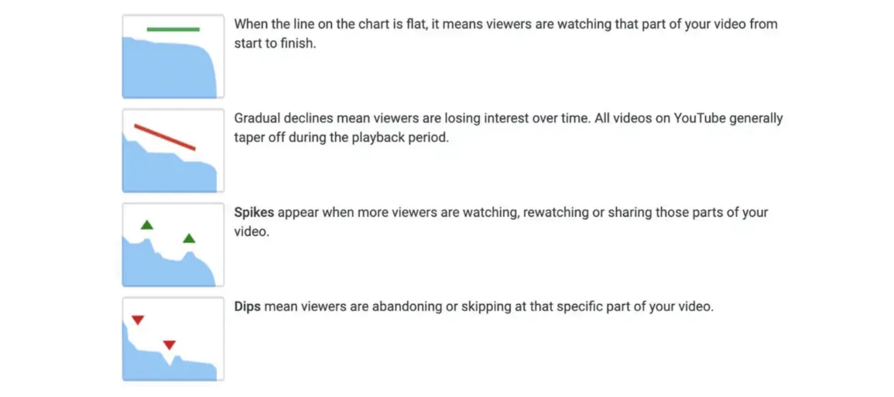

A summary of MrBeast's guide for his production team. The source is linked at the end of the summary.

The first thing he says is to make the best YOUTUBE videos. Not just videos with high quality or good production, but the best videos for YouTube.

To understand what goes viral you look at three numbers. The Click-Through Rate, or CTR, the Average View Duration, or AVD, and the Average View Percentage, or AVP. Those three decide if a video works.

Thumbnail and title are an art you have to learn. They have to make people click, and they have to show what's really in the video. Then the viewer gets what they expect and the CTR goes up.

The first minute matters most for keeping people watching. Start strong, with good lighting, content that pulls people in and a clear idea of what's coming.

Then you keep the momentum. You use minutes 1 through 3 to go from hype to actually doing the thing, and at minute 3 you pull people back in with something big and unique. He calls that the 3-minute re-engagement. The most exciting stuff goes into minutes 3 through 6. The back half is for stuff that is less important but still fun to watch.

He wants a wow factor, something no other YouTuber can copy, so the video stays in people's heads.

The rest is about how to work on the team. Film everything important in production, so the whole team knows what's going on and everyone is on the same page. Talk clearly, keep it short and come with a solution. For hard issues use higher forms of communication.

Don't make excuses. Own your mistakes, learn from them and keep getting better. Prioritize hard, focus on the tasks you got and don't let anything throw you off. Use consultants, because expert advice saves time and money.

Be creative and resourceful, and use that creativity to solve problems and save money. Always have a backup plan, with backup options for when something goes wrong. Question everything. Don't take information at face value, check it and look into it, so it's right and you avoid problems.

Be honest, respectful and supportive with your colleagues, so the place stays a good place to work. Watch the channel a lot, so you understand what the MrBeast brand stands for, its style and its audience. And keep growing. Look for ways to get better at your job and show your value to the company.

Source: [https://drive.google.com/file/d/1YaG9xpu-WQKBPUi8yQ4HaDYQLUSa7Y3J/view](https://drive.google.com/file/d/1YaG9xpu-WQKBPUi8yQ4HaDYQLUSa7Y3J/view)

I asked Gemini AI to write me a script for community funding through a fair token launch. This is the result, as Gemini wrote it.

Absolutely! Here’s a revised script, focusing on funding, early participation benefits, and a neutral presenter.

Title: Fund My App & Get Exclusive Rewards. The Earlier You Join, The More You Get!

Thumbnail: A smartphone displaying an app logo, with a rising curve graph behind it. Text “Early Funders Get MORE.”

Intro (Minute 0:00 to 1:00)

- Presenter: “Imagine being part of the next big app, not just as a user, but as a backer. Today, we’re launching a revolutionary way for YOU to fund my app development and get rewarded for your early support.”
- Explanation of tokenization: “We’re using app tokens, similar to cryptocurrency, to represent shares in the app’s success. But this isn’t just for tech-savvy investors; it’s for everyone who believes in this project.”
- Fair Bonding Curve: “Here’s the exciting part: the earlier you fund, the lower the token price. As more people join, the price rises. It’s a fair system that rewards early supporters.”

The App (Minutes 1:00 to 3:00)

- Presenter demos the app (show gameplay, features, and the problem it solves).
- Community Participants: “We have 100 people ready to fund the app right now. They see the potential, and they’re not waiting.”
- Bonding Curve Visualized: “Look at this graph. The price is climbing as people fund. This is your chance to get in early and secure a larger share of app tokens.”

Funding Frenzy (Minutes 3:00 to 6:00)

- Live dashboard: Show the funding progress and the curve rising in real-time.
- Participant Interviews: “Why are you funding this app? What excites you about it?”
- Scarcity and FOMO: “Tokens are limited. The longer you wait, the higher the price and the fewer tokens you’ll receive. Don’t miss out on maximizing your potential rewards.”

The “Wow Factor” (Minutes 6:00 to 9:00)

- Exclusive Rewards: “Early funders will receive exclusive benefits within the app: early access, bonus features, limited edition merchandise, and more. This is your chance to be part of something special.”
- Presenter’s Passion: “I’ve poured my heart into this app. With your support, we can bring it to life and revolutionize the way you (connect, game, learn, etc.).”

Success and Gratitude (Minutes 9:00 to 13:00)

- Funding Goal Reached: “We did it! Thanks to your incredible support, we’ve reached our funding goal. This app is becoming a reality.”
- Thank You: “To everyone who funded, thank you. You’re not just backers; you’re partners in this journey. We couldn’t have done it without you.”
- App Launch Hype: “Get ready for the app launch. Early funders, watch for your exclusive rewards. This is just the beginning.”

Outro (Minutes 13:00 to 13:59)

- Call to Action: “If you missed the initial funding round, don’t worry. Stay tuned for updates on future opportunities to get involved. Subscribe and be part of the app’s community.”

Additional Tips

- Clear and Concise: Explain the bonding curve and tokenization simply.
- Visuals: Use graphics, animations, and text to reinforce key points.
- Energy and Enthusiasm: The presenter’s passion should be contagious.
- Community Focus: Highlight the backers and their role in the project.
- Urgency: Emphasize the benefits of early funding and limited token supply.
