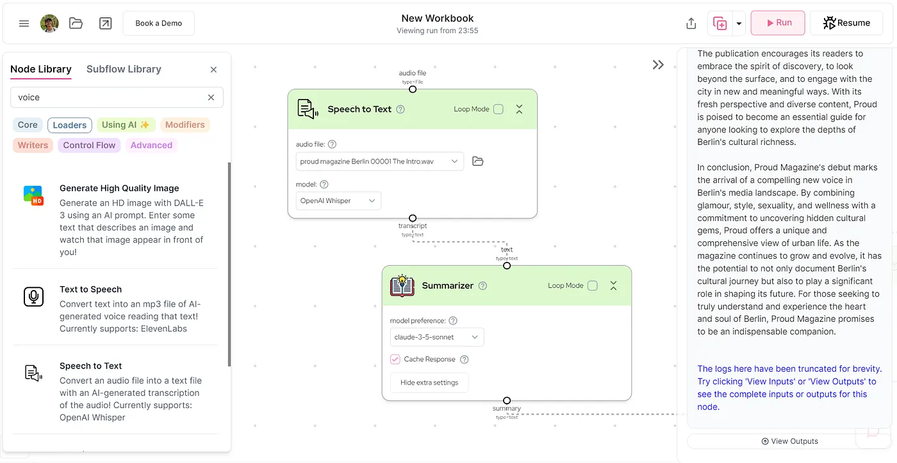

I’m experimenting with AI flows, and one of my newest findings is [gumloop.com](http://gumloop.com) making it exceptional easy to define a flow from a file, through multiple steps of data processing with AI. The following example took the first issue of proud magazine Berlin (Issue #1), interpreted and summarized it in bullet points, passed that summary to Claude Haiku, which wrote a “minimum 444 words blog post for medium.com”.

Here is the result, written by Claude Haiku and not by me.

## Proud Magazine: Unveiling Berlin’s Hidden Gems and Shaping Urban Culture

In the bustling metropolis of Berlin, a new voice has emerged to capture the essence of the city’s vibrant and ever-evolving culture. Proud Magazine, with its inaugural issue, has burst onto the scene, promising to be more than just another urban publication. This edgy newcomer aims to peel back the layers of Berlin’s multifaceted personality, revealing hidden aspects that even long-time residents might have overlooked.

At its core, Proud Magazine is a celebration of diversity and creativity. The publication has assembled a team of talented individuals from various backgrounds, each bringing their unique perspective to the table. This diversity is not just a buzzword for Proud; it’s the very foundation upon which the magazine is built. By showcasing a wide range of voices and experiences, Proud seeks to paint a more accurate and inclusive picture of Berlin’s cultural landscape.

One of the most intriguing aspects of Proud Magazine is its commitment to uncovering the lesser-known facets of Berlin’s culture. While the city is renowned for its history, art scene, and nightlife, Proud aims to dig deeper, shining a spotlight on the underground movements, emerging trends, and hidden gems that give Berlin its distinctive character. This approach sets Proud apart from other urban publications, offering readers a fresh and authentic perspective on a city they thought they knew.

The magazine’s content is a carefully curated mix of glamour, style, sexuality, and wellness. This eclectic blend reflects the diverse interests and lifestyles of Berlin’s inhabitants, acknowledging that urban dwellers are complex individuals with multifaceted lives. By addressing these various aspects, Proud creates a holistic representation of city life that resonates with its readers on multiple levels.

Proud’s focus on glamour and style taps into Berlin’s reputation as a fashion-forward city. The magazine showcases local designers, street style, and emerging trends, celebrating the unique fashion sense that sets Berliners apart. However, Proud goes beyond surface-level aesthetics, delving into the stories behind the styles and the cultural significance of fashion in the urban context.

The inclusion of sexuality as a key theme is a bold move that aligns with Berlin’s reputation for openness and progressiveness. Proud tackles this topic with sensitivity and sophistication, exploring how sexuality intersects with urban life, relationships, and personal identity. By doing so, the magazine contributes to important conversations about sexual health, diversity, and empowerment.

Wellness is another crucial component of Proud’s editorial mix. In a fast-paced urban environment, maintaining physical and mental well-being can be challenging. The magazine offers insights, tips, and stories related to health and wellness, tailored specifically for city dwellers. This focus on well-being demonstrates Proud’s commitment to nurturing not just the cultural landscape of Berlin, but also the individuals who call the city home.

Perhaps most importantly, Proud Magazine positions itself as more than just an observer of Berlin’s culture, it aspires to be an active participant in shaping the city’s future. By providing a platform for diverse voices and highlighting emerging trends, Proud aims to influence the direction of Berlin’s cultural evolution. The magazine invites its readers to join this journey, fostering a sense of community and shared purpose among its audience.

As Proud Magazine embarks on this ambitious mission, it extends an open invitation to Berliners and urban enthusiasts worldwide. The publication encourages its readers to embrace the spirit of discovery, to look beyond the surface, and to engage with the city in new and meaningful ways. With its fresh perspective and diverse content, Proud is poised to become an essential guide for anyone looking to explore the depths of Berlin’s cultural richness.

Proud Magazine’s debut marks the arrival of a compelling new voice in Berlin’s media landscape. By combining glamour, style, sexuality, and wellness with a commitment to uncovering hidden cultural gems, Proud offers a unique and comprehensive view of urban life. As the magazine continues to grow and evolve, it has the potential to not only document Berlin’s cultural journey but also to play a significant role in shaping its future. For those seeking to truly understand and experience the heart and soul of Berlin, Proud Magazine promises to be an indispensable companion.
