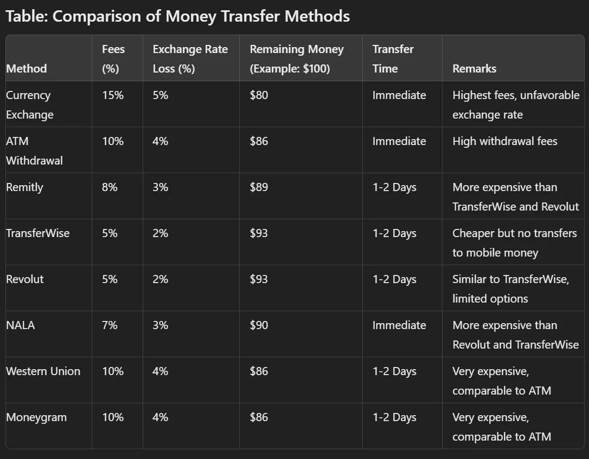

# Skip the Banks do Remittance and get the best Exchange Rate. **How to Send Money to Tanzania: Bank or Credit Card to Mobile Money (M-Pesa, Tigo Pesa, Airtel Money) and Cash Pickup in Every Village via Wakala Shops in Sub-Saharan Africa**

## Too Long to Read

- **Cryptocurrency **enables cheaper money transfers and currency exchanges compared to NALA, Revolut, Transfer Wise, Remitly, Western Union, Moneygram, and traditional banks.
- **Benefits for Remittances**: Send money directly to local bank accounts, mobile money, or have it delivered in cash.
- **Benefits for Businesses**: Significant cost savings when exchanging large amounts of foreign currency and settling invoices abroad.
- **Benefits for Foreign Investors**: Gain 10% more money when investments are made through the correct currency exchange.
- **Global Payments with No Additional Costs**: **Cryptocurrency**handles currency transfers and exchanges with no additional bank transfer or exchange fees.
- **Collaboration with Licensed Traders** and the use of cryptocurrencies to make currency exchange more efficient.
- **Savings of 15–20%** through better exchange rates and lower fees compared to traditional methods.

## Table of Contents

1. Introduction to the Foreign Currency Liquidity Crisis in Sub-Saharan Africa
1. Government Measures and Their Impact on Local Businesses
1. Example: Gas stations and the purchase of gasoline on the world market
1. Challenges in Currency Exchange
1. Poor exchange rates and losses of up to 50%
1. Speculation on the black market and price increases
1. Problems with Transferring Foreign Currencies to Africa
1. High bank fees and poor exchange rates
1. Burden on remittances
1. Solutions Offered by **Cryptocurrency**
1. Network of licensed traders
1. Use of cryptocurrencies to optimize currency exchange
1. Examples: Car dealerships, supermarkets, airlines
1. Benefits of **Cryptocurrency **for Individuals
1. Direct transfers to local bank accounts, mobile money, or in cash
1. Cheaper than NALA, Revolut, TransferWise, Remitly, Western Union, and Moneygram
1. Benefits of **Cryptocurrency **for Businesses and Global Payments
1. Efficient settlement of invoices abroad without additional costs for bank transfers or currency exchange
1. Significant savings for businesses that source goods from abroad
1. Benefits of **Cryptocurrency **for Foreign Investors
1. 10% savings on investment through optimal currency exchange
1. Reduction of transaction costs
1. Table: Comparison of Money Transfer Methods
1. Summary and Outlook

## Introduction to the Foreign Currency Liquidity Crisis in Sub-Saharan Africa

In many parts of the world, governments try to keep the prices of essential goods like gasoline low by setting a maximum price. In Tanzania, this pricing is based on the Tanzanian Shilling (TZS). However, this measure poses a significant problem: on the world market, gasoline is traded in foreign currencies like the US dollar, and outside Tanzania, there is little demand for the Tanzanian Shilling.

## Government Measures and Their Impact on Local Businesses

This situation presents a significant challenge for local businesses. For example, a gas station must buy gasoline in foreign currency but can only sell it in TZS. Due to the shortage of foreign currency in Tanzania, gas station operators are often forced to exchange TZS at unfavorable rates, resulting in a loss of up to 10%. In other Sub-Saharan countries, this loss can even reach 40% to 50%. These poor exchange rates make it nearly impossible for gas stations to remain competitive in the global market, leading to empty pumps and frustrated drivers across the region.

## Challenges in Currency Exchange

The problem extends further. In addition to the high losses from directly exchanging TZS into foreign currency, many speculate on the black market with US dollars, driving prices even higher. This leads to an even greater burden on businesses that rely on international trade, such as car dealerships, supermarkets, and airlines.

## Problems with Transferring Foreign Currencies to Africa

The situation is further exacerbated by the high costs associated with transferring foreign currencies to Africa. Banks charge high fees and often offer poor exchange rates, leading to additional financial losses. For someone sending money home from abroad, this means that a significant portion of their hard-earned money is lost to fees and poor exchange rates. This is a considerable burden on the millions of people who depend on these remittances to support their families.

## The Role of Wakala Shops in Money Transfers

In Tanzania and across Sub-Saharan Africa, the Wakala shop infrastructure plays a critical role in money transfers. These local agents are strategically placed in almost every village, enabling individuals to instantly pick up cash or receive money directly to their mobile phone through services like M-Pesa or Tigo Pesa. Unlike traditional bank transfers, which can be slow, costly, and limited in accessibility, Wakala shops provide a fast, convenient, and cost-effective alternative for money transfers. By leveraging the Wakala network, you can send money from your bank account or credit card directly to someone’s mobile wallet, or arrange for cash pickup at a nearby Wakala shop, all while avoiding the high fees and unfavorable exchange rates typically associated with banks. This infrastructure ensures that no matter where your recipient is located, they can access their funds quickly and easily, making it an essential service for millions across the region.

## Solutions Offered by **Cryptocurrency**

This is where **Cryptocurrency **comes into play. **Cryptocurrency **has launched a project aimed at normalizing exchange rates and reducing the costs of money transfers. Instead of relying on traditional banks and SWIFT transfers, **Cryptocurrency **uses a network of licensed traders and cryptocurrencies. For example, a Tanzanian car dealer can now convert TZS into cryptocurrency, send it to Japan, and exchange it for yen there. This process is not only faster but also significantly cheaper. Instead of a 15% loss, the dealer could actually make a 5% profit on the exchange.

## Benefits of **Cryptocurrency **for Individuals

**Cryptocurrency **also provides a powerful solution for individuals who want to send money to their loved ones in Africa. It is cheaper than services like NALA, Revolut, TransferWise, Remitly, Western Union, or Moneygram and offers the flexibility to send money directly to local bank accounts, mobile money, or even have it delivered in cash. This makes it a safer and more affordable option for millions of people in Sub-Saharan Africa who rely on remittances.

## Benefits of **Cryptocurrency **for Businesses and Global Payments

**Cryptocurrency **is not only a solution for remittances but also an effective tool for businesses that need to source goods from abroad. **Cryptocurrency **handles currency transfers and exchanges without additional costs for bank transfers or exchange fees. This allows businesses to make significant savings and run their operations more efficiently.

## Benefits of **Cryptocurrency **for Foreign Investors

A particularly interesting aspect of **Cryptocurrency **is the advantage it offers foreign investors. When a foreign investor comes to Tanzania, where everything is priced in TZS, they can effectively get 10% more money when they bring their funds into their investments. By using the correct currency exchange, they do not lose 5% but gain 10%. This means that they effectively receive a 10% discount on their entire investment simply because they hold foreign currency. This advantage could be a decisive factor for investments in the region.

## Table: Comparison of Money Transfer Methods

*MethodFees (%)Exchange Rate Loss (%)Remaining Money (Example: $100)Transfer TimeRemarksCurrency Exchange15%5%$80ImmediateHighest fees, unfavorable exchange rateATM Withdrawal10%4%$86ImmediateHigh withdrawal feesRemitly8%3%$891–2 DaysMore expensive than TransferWise and RevolutTransferWise5%2%$931–2 DaysCheaper but no transfers to mobile moneyRevolut5%2%$931–2 DaysSimilar to TransferWise, limited optionsNALA7%3%$90ImmediateMore expensive than Revolut and TransferWiseWestern Union10%4%$861–2 DaysVery expensive, comparable to ATMMoneygram10%4%$861–2 DaysVery expensive, comparable to ATM*

## Summary and Outlook

In summary, **Cryptocurrency **not only aims to make money transfers cheaper; it is about creating opportunities. It is about providing people and businesses in Sub-Saharan Africa with the financial tools they need to succeed, and it is about offering foreign investors a safe and profitable way to invest in the region. While the foreign currency liquidity crisis continues to cripple economies in Sub-Saharan Africa, **Cryptocurrency **stands out as a beacon of hope and a pathway to economic resilience.
