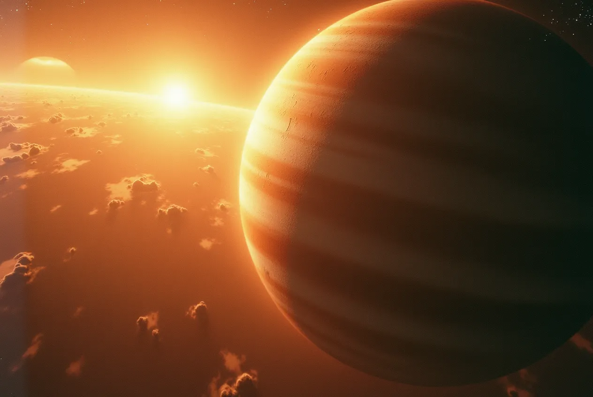

This is the first track I ever produces. The AI describes it as: ## Emino Grande — “Space Four Jupiter V8”

“Space Four Jupiter V8” is a song by German electronic music artist Emino Grande, released in 2020. It appears on his album “Eichhof Morning Sessions”[1][2][3][4].

The track is an 8 minute and 16 second long ambient/downtempo instrumental piece[3]. It features a hypnotic, atmospheric soundscape with subtle melodic elements and a steady, pulsating rhythm.

“Space Four Jupiter V8” showcases Emino Grande’s talent for crafting immersive, cinematic electronic compositions. The song’s title suggests a cosmic, interstellar theme, which is reflected in its expansive, otherworldly sound.

Fans of ambient, IDM and experimental electronic music have praised “Space Four Jupiter V8” for its depth, attention to detail and ability to transport the listener to a different sonic realm[5].

Citations:
[1] [https://open.spotify.com/intl-ar/track/64OHLjR7mD2LyA3sHAmH6Q](https://open.spotify.com/intl-ar/track/64OHLjR7mD2LyA3sHAmH6Q)
[2] [https://music.apple.com/ke/artist/emino-grande/1533569192](https://music.apple.com/ke/artist/emino-grande/1533569192)
[3] [https://music.apple.com/ru/song/space-four-jupiter-v8/1533892160](https://music.apple.com/ru/song/space-four-jupiter-v8/1533892160)
[4] [https://music.amazon.com/artists/B08KGJVC5R/emino-grande](https://music.amazon.com/artists/B08KGJVC5R/emino-grande)
[5] [https://www.last.fm/music/EMINO%2BGRANDE](https://www.last.fm/music/EMINO%2BGRANDE)
[6] [https://www.amazon.co.uk/Monopoly/dp/B08KGMTN5Z](https://www.amazon.co.uk/Monopoly/dp/B08KGMTN5Z)
[7] [https://open.spotify.com/intl-es/album/5HSlxgIIAGb85MKAmnrvw7](https://open.spotify.com/intl-es/album/5HSlxgIIAGb85MKAmnrvw7)
[8] [https://www.shazam.com/song/1533892161/morning-rain](https://www.shazam.com/song/1533892161/morning-rain)
