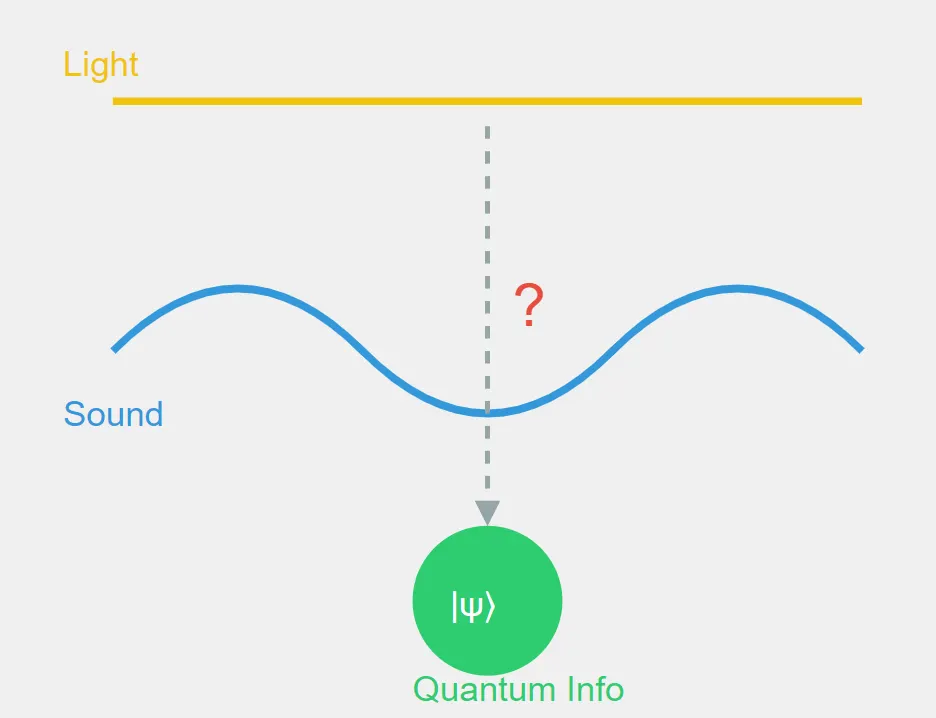

In physics, things that look like they have nothing to do with each other often turn out to be connected. So here is a question I want to think through. Could sound waves carry quantum information, or at least influence it? To get there we look at where acoustics, optics and quantum mechanics meet.

## Light, sound and the question

We start with something well known. Light can carry quantum information. In quantum optics, photons, the particles of light, can be in quantum states. These states can encode quantum bits (qubits), and that is the base of some approaches to quantum computing and quantum communication.

Now add sound. There is an effect called the acousto-optic effect, where sound waves change the properties of light that goes through certain materials. People use it in a lot of things, from telecommunications to laser technology.

And here the thought experiment starts. If light can carry quantum information, and sound can influence light, could sound waves themselves carry or influence quantum information?

## Why it is not that simple

At first it sounds nice. But like so often in physics, it's more complex than that, for four reasons.

One is classical and quantum. The acousto-optic effect is mostly a classical effect, and quantum information lives in the quantum world. Getting from one to the other isn't easy.
Two, the medium matters. Sound waves, the way we normally understand them, need a medium to travel through. That is a problem when you think about quantum systems or places like the vacuum of space.
Three is quantum sound. Sound can have quantum properties in some cases. In solids there are quantized vibrations called phonons, and they are the quantum side of sound. But they are very different from the big sound waves we hear every day.
And four is decoherence. Even if we could encode quantum information in sound waves, keeping it coherent in a big system is extremely hard, because the system keeps interacting with its environment.

## What is still worth exploring

So this thought experiment doesn't give us a direct link between sound waves and quantum information that could, say, solve the black hole information paradox. But it does show how connected physics is.

And it points to a few things worth looking into. The quantum properties of phonons and if they can be used to process quantum information. New ways to use acousto-optic interactions in quantum systems. And how other kinds of waves might interact with quantum information in extreme environments.

The way from sound waves to quantum information isn't direct, but it makes you think. In physics, thinking creatively can lead to connections you don't expect. Big everyday sound waves are probably not the key to keeping quantum information, but how different effects in physics play together is still a great field for research.

The more we learn about quantum mechanics and information theory, the more surprising connections we might find. There is still a lot in the quantum world we haven't heard yet.
