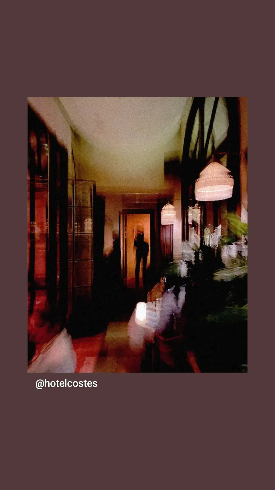

In the early 20th century something big happened in music. Picture musicians holding what looks like a normal instrument, but this time they don't just strum along. They use electricity and the sound gets louder, sharper and more expressive than anything people had heard before. That was the moment the electric guitar and the amplifier came together, and the music world went a bit crazy.

The story of the electric guitar starts in the 1930s with inventors like George Beauchamp, who built the electromagnetic pickup. It's a simple and smart thing. It catches the small vibrations of the strings so they can be amplified, and that started a new era. But catching the vibrations was not enough. You also need the amplifier, and the amp did more than make things louder. It gave musicians control over volume, tone and even distortion, and that opened the door to a lot of new ideas.

Think of being a musician back then. You know the limits of your acoustic instrument. And then someone gives you an electric guitar and an amp, and your ideas are not stuck at the natural volume and range of your instrument anymore. Now you can make sounds that scream, sounds that whisper and everything in between. It didn't take long until the whole world got it.

## The electric guitar goes global

And it was not just an American thing. Once the guitar and the amp worked together, they spread across the world, into every culture and every genre. Musicians everywhere saw that they could play their own traditional sounds again through electricity. They took it, played with it, and made something that was really their own.

Take Turkey in the 1970s. Musicians like Erkin Koray and Barış Manço mixed Turkish folk melodies and scales with the energy of electric rock. The electric guitar didn't erase the old music, it amplified it, and literally so. What came out was Anatolian rock, psychedelic and ancient at the same time, and it spoke to a generation that wanted to break with the past but also keep it close.

In Japan the electric guitar found a home in the "Group Sounds" movement of the 1960s. The bands were shaped by the rock wave from the West, and groups like The Tigers and The Spiders mixed rock riffs with Japanese pop. Over the decades Japanese musicians took the electric guitar much further and mixed it with traditional instruments and avant-garde ideas.

And then there was Africa. If the electric guitar could grow roots anywhere, it was here, where rhythm and melody are part of daily life. In Nigeria musicians like Fela Kuti mixed jazz, funk and Nigerian rhythms and made Afrobeat, and that sound doesn't work without the electric guitar pushing and opening up the groove. In the Congo soukous guitarists played bright melodies on top of rhythms you can't stop dancing to, and the electric guitar became the center of a whole genre.

Blues musicians in Mali took the instrument back into the desert and used it to tell stories that go back centuries. The power of the amp let them reach people they could never reach before, and so it became a bridge between old and new.

In Brazil the Tropicália movement of the 1960s was the perfect storm for the electric guitar. Artists like Caetano Veloso and Os Mutantes used it to mix samba, bossa nova and rock with psychedelic sounds. It was not just about making noise, it was about rebellion. The electric guitar became a symbol of resistance against political and cultural repression, and the people playing it were seen as pioneers who dared to try new things in sound and in thinking.

## Rebellion and new ideas

What made the electric guitar so hard to resist was not only the volume. You could shape it, distort it and make it into something else. When musicians in other cultures got it in their hands, they didn't just copy what happened in the West. They saw a way to reinvent their own traditions and to push back against their own societies.

For Japanese rockers, Turkish psych rockers, Nigerian bandleaders and Brazilian Tropicálistas the guitar and the amp became tools for rebellion and new ideas. They could play their traditional sounds in a new way and still make something completely new. It was not about throwing the past away, it was about plugging it in.

So the guitar and the amp together opened a new frontier of sound. It was a technical breakthrough and also a cultural one. From psychedelic Turkish rock to Japanese experimental music and from Nigerian Afrobeat to Malian desert blues, this combination pushed artists all over the world to go further, to hold on to their culture and to change it for the next generations.

It was not a trend that came and went, it was a global movement. The electric guitar gave musicians the freedom to explore and try things without limits. Every culture took this new power and wrote its own electric story, and so the guitar and the amp became more than instruments. They became symbols of creativity, rebellion and reinvention.

What started in the 1930s as a simple marriage of two inventions is now a big force in music everywhere. People mostly link the electric guitar and the amp with rock and roll, but what they left behind is much bigger. They showed that when technology and creativity meet, there is so much you can do.

So yes, when the electric guitar and the amp came together, the world went a little crazy. Musicians everywhere saw a chance to rewrite their musical DNA, to take their own heritage and plug it in. And the result was a global explosion of sound and new ideas that still inspires artists today.

With the electric guitar and the amp, musicians didn't just change music. They changed the world.

## Twenty songs to listen to

1. Erkin Koray - "Cemalim" (Turkey, Anatolian Rock)
https://www.youtube.com/watch?v=AWn8hTANV7E

2. The Tigers - "Seaside Bound" (Japan, Group Sounds)
https://www.youtube.com/watch?v=3Jp01aJ4LDc

3. Fela Kuti - "Water No Get Enemy" (Nigeria, Afrobeat)
https://www.youtube.com/watch?v=IQBC5URoF0s

4. Os Mutantes - "A Minha Menina" (Brazil, Tropicália)
https://www.youtube.com/watch?v=p8YrZlGuDKk

5. Ali Farka Touré & Ry Cooder - "Ai Du" (Mali, Desert Blues)
https://www.youtube.com/watch?v=YJpNwFBRL7M

6. Pink Floyd - "Interstellar Overdrive" (UK, Psychedelic Rock)
https://www.youtube.com/watch?v=TON2dHOzn6s

7. Los Shain's - "El Tren" (Peru, Peruvian Garage Rock)
https://www.youtube.com/watch?v=DF7Zij1p6_U

8. Santana - "Oye Como Va" (USA, Latin Rock)
https://www.youtube.com/watch?v=09D4-Z8cvL8

9. Boris - "Farewell" (Japan, Experimental Rock)
https://www.youtube.com/watch?v=tjJq-CCvLyY

10. Tinariwen - "Sastanàqqàm" (Mali, Tuareg Blues Rock)
https://www.youtube.com/watch?v=QSjkUPRFfEk

11. Barış Manço - "Dönence" (Turkey, Psychedelic Rock)
https://www.youtube.com/watch?v=TMVdrDe7F2g

12. The Spiders - "Nagasaki" (Japan, Group Sounds)
https://www.youtube.com/watch?v=dPBgKRrnZ_o

13. Khun Narin's Electric Phin Band - "Lam Phu Thai" (Thailand, Psychedelic Rock)
https://www.youtube.com/watch?v=VFTd5U7yb7A

14. Hedzoleh Soundz - "Rekpete" (Ghana, Afro-Rock)
https://www.youtube.com/watch?v=hVNUTtUz6hw

15. Victor Jara - "Plegaria a un Labrador" (Chile, Nueva Canción)
https://www.youtube.com/watch?v=71qi0b49rdM

16. Can - "Vitamin C" (Germany, Krautrock)
https://www.youtube.com/watch?v=Ffg3WwqK_vA

17. Los Saicos - "Demolición" (Peru, Proto-Punk)
https://www.youtube.com/watch?v=U3l9gREwcug

18. Los Dug Dug’s - "Smog" (Mexico, Psychedelic Rock)
https://www.youtube.com/watch?v=K8cqjx8p8W0

19. Novos Baianos - "Preta Pretinha" (Brazil, MPB & Rock)
https://www.youtube.com/watch?v=Ii7gw6Tx2Y4

20. Shin Joong Hyun & The Yup Juns - "Beautiful Rivers and Mountains" (South Korea, Psychedelic Rock)
https://www.youtube.com/watch?v=voLD4z1WVOI
