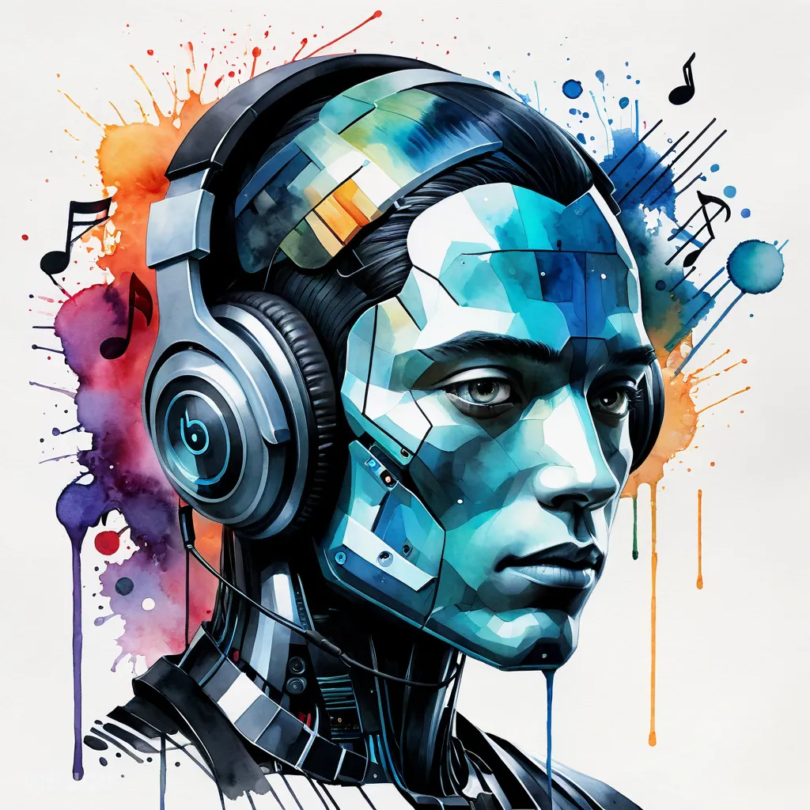

AI, blockchain and the internet are changing the music industry a lot. They challenge the big labels and the unfair advantage of people with money and fame. They make the artistic space more democratic, and artists get more independent than ever before. Everything a big label was providing, for most of the profits of the artist, can now be done from home.

*A aquarell painting of The Future of Music: How AI, Blockchain, and the Internet Are Revolutionizing the Industry made with [venice.ai](http://venice.ai)*

## Making music and videos with AI

It starts with production. With AI, artists can remix songs or create completely new ones from home, and they keep full control over the royalties. So they can surprise their fans again and again with new tracks, also during gigs, and they don't have to play songs by other artists anymore. Music videos also get simple, fast and high quality with AI. An artist can make unique videos quickly, and that is one more source of income and attention on platforms like YouTube.

## Content without the time problem

Then there is content. One of the biggest problems for artists has always been making content for online marketing and social media, because they just don't have the time for it. With AI, one simple voice message a day can be enough. It gets turned into articles, images and media content for their channels, and that keeps fans, friends and family updated about their journey, their ideas and how they develop, so the people around them stay engaged.

## Publishing without a middleman

Publishing got easy too. With platforms like SoundCloud and DistroKid, artists can release their music on their own and get 100% of their royalties. There is no middleman anymore, and the artist keeps control over the work and the money.

## Blockchain, NFTs and ad revenue

Blockchain and NFTs change how artists make money from their work. Platforms like Royal.io let artists split their tracks into NFTs and share ownership and royalties with their fans and supporters. So fans can invest into music without "owning" the artist, and the artist gets a steady income and more financial stability. On top of that, Instagram, TikTok, YouTube and Twitter started to share advertising revenue with successful publishers. If an artist's music is trending and reaching a lot of people, the artist also gets paid for it.

## A bright future for artists

Overall I see a bright future for artists, and not only musicians but digital publishers in general, to make a living with their art. With the right tools, especially AI, they can create high quality content and get visibility like never before. And I also see a chance for a new kind of agency and artist manager, who can make great artists even more visible and successful with these tools.

## Original notes

AI, Blockchain and the internet are changing and challenging the music industry, big labels, and unfair advantage of people with money and fame.

AI and digital distribution, crypto NFTs and more democratises the artistic space and makes artists more independent than ever before. Everything that a big label was providing, for most of the profits of the artist, can now be done from home.

1. Music Production with AI allows artists to remix or create fully new songs that they own the royalties for. They can surprise their fans and during gigs with ever new tracks, never running out of being creative and fully unique, instead only playing songs “from others”
1. Music Video Production becomes simple, straight forward, high quality, unique and fast, so an additional source of income and attention can be publishing music video content on YouTube and other platforms.
1. Content Production for Online Marketing and Social Media is often a big problem for artists, as they have limited time for it, but with AI a voice message per day can be enough to create articles, images, or even media content for their channels in order to update fans, friends and family about their journey, their ideas, their development and more and keep their surrounding engaged
1. Self-Publishing and Distribution of Music through platforms like Soundcloud for Artists or Distrokit [www.distrokit.com](http://www.distrokit.com) becomes straightforward and easy to use and allows artists to self publish and automatically receive 100% of their royalties.
1. Blockchain, NFTs, Royalties, and partial ownership on intellectual property like [www.royal.io](http://www.royal.io) which allows artist to fractualize their tracks into NFTs and share ownership and royalties from the tracks with their fans and supporters, you can now “invest into music” and artists without “owning the artist” and the artist can slowly but steadily make a living for live, and generate income on a continues base.
1. Platforms like Instagram, TikTok, YouTube and Twitter starting to pay out an advertising share to successful publishers, so if an artist or his music is trending and reaching people, the artists will also be rewarded for it.

Overall I see a bright future for artists (not only musicians but digital publishers in general) to make a living with their art.

I also see a chance for a new form of agency and artist managers, that can amplify the visibility and success of great artists with the help of the right tools, especially AI, to easily create high quality content around the artists and give them exposure like never before.
