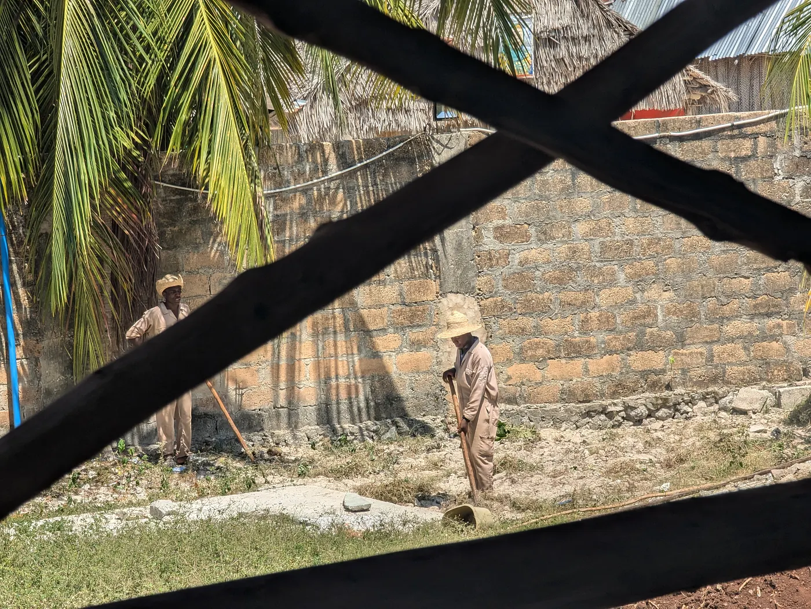

The "Made in Italy" label has stood for the best craftsmanship, quality and luxury for a long time. People pay premium prices because they trust it's Italian work, and they think what they buy is not just great craft but also made in an ethical way. But recent findings show a darker reality behind the luxury goods sold with this label. Investigations in Milan found cases of workers being exploited, and that raises serious questions about the supply chains of some of the most famous fashion brands in the world, including Armani and Dior.

Italian prosecutors started to investigate suppliers linked to the luxury giants Giorgio Armani and Christian Dior after reports came out about exploitative working conditions in their subcontracted production. These suppliers, often called "Chinese-run workshops", were found to employ immigrants from China and Pakistan, and many of them had no legal papers. The workers got low wages, worked far too many hours and had poor safety. That's very far from what the luxury brands say in public about high ethical standards and careful craftsmanship.

This gap is what the investigations are about. Armani and Dior talk a lot about artisan quality and real Italian work, and that didn't fit with the hard reality in these workshops. The authorities found that the suppliers made the goods for a small fraction of the final shop price, so there is a huge gap between how the things were made and what they sell for.

The workshops were on the outskirts of Milan, and they showed how deep these practices sat inside the supply chains of high-end fashion. Subcontractors reportedly got around the ethical standards with illegal subcontracting, hired workers without papers and paid them only a few euros to make high-end products like leather handbags and accessories. This put a spotlight on unethical practices in luxury fashion in general, and a lot of people now ask for more transparency and accountability in the industry.

Armani and Dior both denied any direct involvement in unethical practices and said they are committed to fair and legal work. Giorgio Armani SpA said in a public statement that it is confident about the outcome of the investigation. Dior, which is owned by the French luxury group LVMH, condemned the practices and promised not to place new orders with the suppliers involved. Still, the scandal led to a bigger investigation by Italy's competition watchdog, which is looking at whether the brands misled consumers about their social responsibility and ethical standards.

The public reaction raised big questions about how luxury brands check their supply chains and how real their Made in Italy claims are. Findings like these hurt the image of these fashion houses, and they also show the industry needs structural changes. Consumers want stricter checks and more transparency about whether luxury goods are made ethically.

The "Made in Italy" scandal is a reminder of how much is hidden behind luxury branding. For years brands have used the link between Italian craftsmanship and luxury, and sold products that carry an unspoken promise of quality and integrity. But what came out in Milan shows how thin that promise can be.

Armani and Dior are still under scrutiny, and the luxury fashion industry is at a crossroads. The scandal showed that it needs real commitments to fair labor and strict checks in the supply chains. Only time will tell if these brands can win back consumer trust and make the Made in Italy label mean something again.
