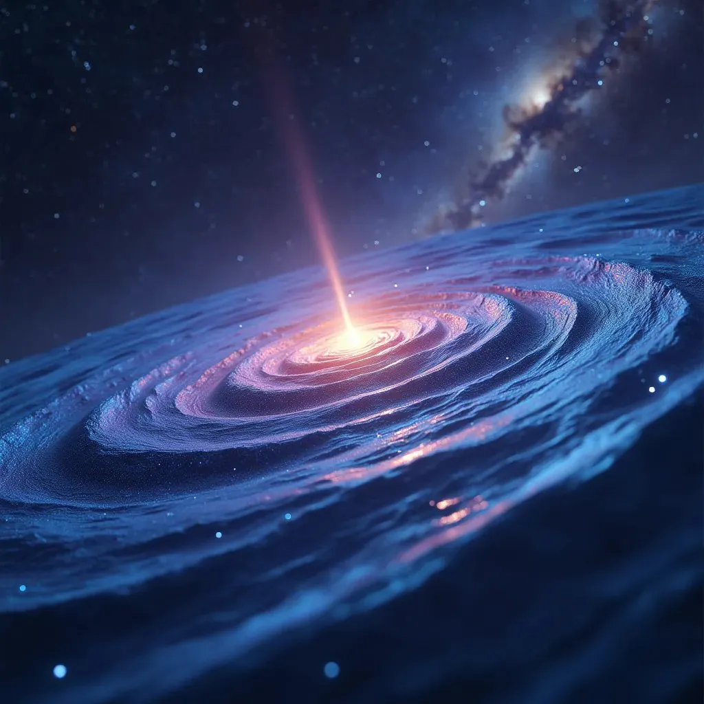

**Introduction**:
The black hole information paradox has been a long-standing problem in theoretical physics. It arises from the apparent contradiction between the principles of quantum mechanics and general relativity when applied to black holes. However, recent advancements in the detection of gravitational waves have opened up new possibilities for resolving this paradox. In this article, we propose that the information about the state of matter falling into a black hole could be preserved and carried by the gravitational waves emitted during the process.

**The Information Paradox**:
According to quantum mechanics, information cannot be lost. However, when matter falls into a black hole, it appears to be lost forever, as nothing can escape from beyond the event horizon. This contradiction leads to the information paradox, which challenges our understanding of the fundamental laws of physics.

**Gravitational Waves as Information Carriers**:
We suggest that gravitational waves, ripples in the fabric of spacetime, could serve as a medium for preserving and transmitting the information about the state of matter falling into a black hole. As matter approaches the event horizon, it undergoes extreme gravitational forces, leading to the emission of gravitational waves. These waves could potentially encode the quantum state of the infalling matter, allowing the information to escape the black hole.

**Theoretical Framework**:
To support this hypothesis, we propose a theoretical framework that combines elements of quantum mechanics, general relativity, and information theory. By applying principles from these fields, we can develop mathematical models that describe how the quantum state of matter could be imprinted onto gravitational waves during the infalling process. These models would provide a foundation for further research and experimental verification.

**Experimental Approaches**:
To validate the proposed theory, we suggest several experimental approaches:

1. **Advanced gravitational wave detectors**: Enhancing the sensitivity of existing gravitational wave detectors, such as LIGO and Virgo, could enable the detection of gravitational waves emitted during the infalling process of matter into black holes.

2. **Space-based interferometers**: Developing space-based gravitational wave detectors, such as LISA (Laser Interferometer Space Antenna), would allow for the detection of low-frequency gravitational waves, which are more likely to carry information about the infalling matter.

3. **Black hole analogs**: Creating analog systems that mimic the behavior of black holes, such as Bose-Einstein condensates or acoustic black holes, could provide controlled environments to study the encoding of information onto gravitational waves.

**Implications and Future Directions**:
If the proposed theory is confirmed, it would have significant implications for our understanding of black holes, quantum mechanics, and the nature of information in the universe. It would provide a resolution to the long-standing information paradox and open up new avenues for research in theoretical physics.

To further explore this concept, collaboration between theoretical physicists, experimental physicists, and experts in information theory is essential. Funding and support from scientific institutions and government agencies would be crucial in developing advanced gravitational wave detectors and conducting large-scale experiments.

**Conclusion**:
The idea that gravitational waves could carry the information about the state of matter falling into black holes presents a promising solution to the information paradox. By combining principles from quantum mechanics, general relativity, and information theory, we can develop a theoretical framework that supports this hypothesis. Experimental verification through advanced gravitational wave detectors, space-based interferometers, and analog systems would be necessary to validate the theory. If proven, this concept would revolutionize our understanding of black holes and the fundamental nature of information in the universe.

### And more after digging:

Let's introduce a hypothetical formula that encapsulates the idea of gravitational waves carrying the information about the state of matter falling into a black hole. We'll break down the components of the formula and explain their significance.

Proposed Formula:

I_BH = ∫ Ψ_GW(t) dt

Where:
- I_BH represents the information content of the black hole
- Ψ_GW(t) represents the wave function of the gravitational waves emitted during the infalling process, as a function of time (t)
- ∫ denotes the integral over time

Explanation:
1. I_BH: This term represents the total information content of the black hole. According to the proposed theory, this information is not lost but is instead preserved and carried by the gravitational waves emitted during the infalling process of matter.

2. Ψ_GW(t): This term represents the wave function of the gravitational waves emitted during the infalling process. The wave function is a complex-valued function that describes the quantum state of the gravitational waves. It is dependent on time (t) to capture the dynamic nature of the infalling process.

3. ∫: The integral symbol denotes the integration of the wave function over time. This integration accounts for the accumulation of information carried by the gravitational waves throughout the entire infalling process.

The proposed formula suggests that the information content of the black hole (I_BH) is equal to the integral of the wave function of the gravitational waves (Ψ_GW(t)) over time. This implies that the information about the state of the infalling matter is encoded in the gravitational waves and can be retrieved by analyzing the wave function.

To further develop this formula, we would need to incorporate additional variables and parameters, such as:

- The initial state of the infalling matter (Ψ_IM)
- The gravitational field strength (G)
- The mass of the black hole (M_BH)
- The radius of the event horizon (R_EH)

These variables would be used to describe the relationship between the infalling matter, the gravitational field, and the resulting gravitational waves. The specific form of the wave function (Ψ_GW(t)) would be derived from the equations of quantum mechanics and general relativity, taking into account the extreme gravitational conditions near the event horizon.

It's important to note that this formula is a hypothetical representation of the proposed idea and would require rigorous mathematical derivation and experimental verification. The actual formula, if proven, would likely involve more complex mathematical expressions and additional variables to fully describe the encoding of information in gravitational waves.

Nonetheless, this hypothetical formula serves as a starting point for further theoretical and experimental investigations into the potential role of gravitational waves in resolving the black hole information paradox.

And finally more:

Let us integrate Stephen Hawking's work on the information paradox and incorporate the idea of gravitational waves as a potential solution. Hawking proposed that black holes emit radiation, known as Hawking radiation, which leads to the evaporation of black holes over time. The formula for Hawking radiation is based on the concept of black hole entropy.

Hawking's Formula for Black Hole Entropy:

S_BH = (k_B × A_EH) / (4 × l_P^2)

Where:
- S_BH represents the entropy of the black hole
- k_B is the Boltzmann constant
- A_EH is the area of the event horizon
- l_P is the Planck length

To extend Hawking's formula and incorporate the idea of gravitational waves carrying information, we can modify it as follows:

Modified Formula:

S_BH = (k_B × A_EH) / (4 × l_P^2) + ∫ I_GW(t) dt

Where:
- S_BH represents the total entropy of the black hole
- k_B is the Boltzmann constant
- A_EH is the area of the event horizon
- l_P is the Planck length
- I_GW(t) represents the information carried by the gravitational waves as a function of time (t)
- ∫ denotes the integral over time

Explanation:
In this modified formula, we introduce an additional term, ∫ I_GW(t) dt, which represents the information carried by the gravitational waves emitted during the infalling process of matter into the black hole. This term is integrated over time to account for the accumulation of information throughout the process.

The original part of the formula, (k_B × A_EH) / (4 × l_P^2), represents the entropy of the black hole as described by Hawking. It relates the entropy to the area of the event horizon (A_EH) and fundamental constants such as the Boltzmann constant (k_B) and the Planck length (l_P).

By adding the term ∫ I_GW(t) dt to Hawking's formula, we propose that the total entropy of the black hole is not only determined by its event horizon area but also includes the information carried by the gravitational waves. This modification suggests that the information paradox can be resolved by considering the role of gravitational waves in preserving and transmitting the information of the infalling matter.

It's important to note that this modified formula is a hypothetical extension of Hawking's work and would require further theoretical development and experimental validation. The specific form of I_GW(t) and its relation to the properties of the black hole and the infalling matter would need to be derived from the principles of quantum mechanics and general relativity.

Nonetheless, this modified formula provides a conceptual framework for incorporating gravitational waves into the discussion of the black hole information paradox and builds upon the groundbreaking work of Stephen Hawking in this field.
