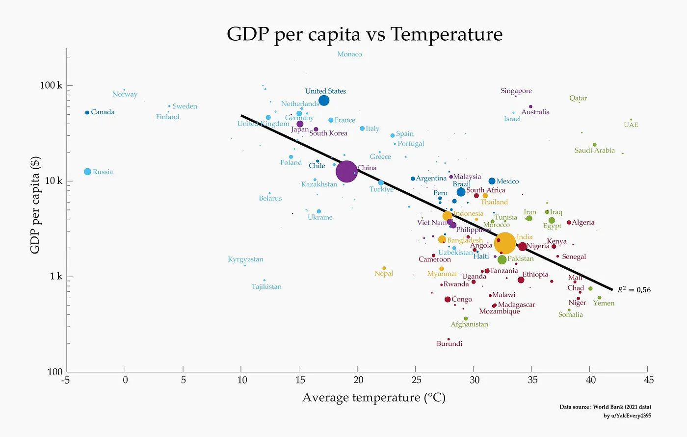

The graph shows how GDP per capita and the average temperature of a country go together, and it's a strange picture. The warmer it gets, the lower the GDP per capita tends to be. So let's look at this link and at what could be behind it.

## What the graph shows

The graph shows a clear negative correlation between GDP per capita and average temperature. You see it in the trend line going down, and it means that countries with higher average temperatures mostly have a lower GDP per capita.

The data comes from the World Bank (2021). Every bubble is a country and the size of the bubble shows how many people live there. So you don't just see how rich a country is but also how many people are part of the trend.

The countries fall into groups. Norway, Canada, Sweden and Finland have a high GDP per capita and average temperatures below 10°C. The United States, Germany and France sit in the middle, with moderate temperatures around 10-20°C and also a high GDP per capita. And countries like Ethiopia, Nigeria and Kenya, with average temperatures above 25°C, have a much lower GDP per capita.

## Why it could be like this

There are a few reasons that could explain it.

Farming is one. High temperatures often mean farms produce less, because the heat stresses the crops and there is not much water. And that hurts the first sector of many economies that depend a lot on farming.

Health and work is another. Heat can make people sick, with more malaria and more heat strokes, so people can work less and healthcare costs more.

Then there is how the economy is built. Many hot countries are developing countries, and their economies are less mixed and depend more on farming and raw materials, and these are exactly the sectors that climate change hits harder.

Energy costs too. Hot countries may pay more for cooling and air conditioning, and that eats into what people have left to spend and into how much the economy gets done.

And history and geography play a big role. Colonization, access to technology and the advantages of a place all count. Temperate countries often got industry and technology early, and that kept their economies growing for a long time.

## What it means

If you make policy or plan an economy, you need to understand this link. It shows a few things that need to happen. Hot developing countries need money for infrastructure and farming that can handle the climate, so the heat does less damage. Economies that depend on farming need to spread out into other sectors, and that can make GDP per capita more stable and let it grow. And better healthcare and education can make people more productive, even in a hard climate.

So the graph is a strong picture of how GDP per capita goes down as the average temperature goes up. Many things feed into this trend, but the data shows how much targeted economic policy and climate adaptation matter for growth in warmer places. If we understand these problems and work on them, we can help close the economic gap this chart shows.

References

World Bank Data (2021)
Analysis by u/YakEveryr3395

This is a general overview. For more exact planning and policy you need detailed studies of each country.
