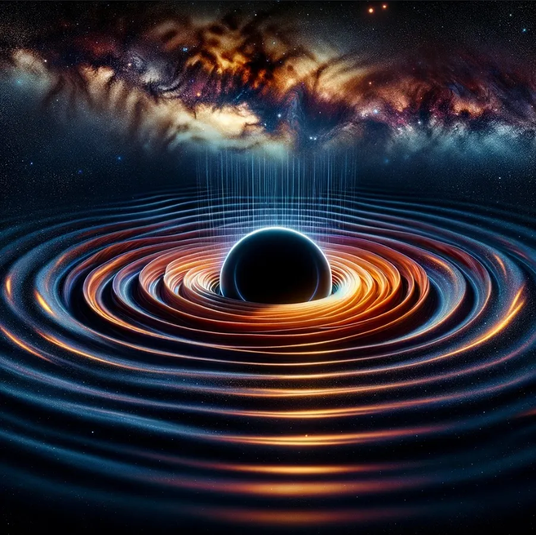

I have the high level idea that gravitational waves could contain the last information of matter before the moment it enters a black hole, solving the information paradox, by making it able to measure the missing information through sound. Can you think about this idea and give me a pro and contra list including research papers that could support that theory and a call for astrophysicists to help to come up or do experiments that can be reproduced and measured to support my claim?

That was my question. This is the answer, a bit cleaned up.

The idea touches some of the most basic questions in theoretical physics and astrophysics, so let's look at what speaks for it, what speaks against it, which papers to read and what a call to astrophysicists could look like.

Two things speak for it. The first is gravitational wave astronomy itself. Detecting gravitational waves opened a new way to look at the universe and gave direct evidence of things like black hole mergers. So the field could also tell us something about the dynamics of matter as it spirals into a black hole, and maybe encode information about the state of that matter before it crosses the event horizon. The LIGO and Virgo observations of gravitational waves from binary black hole mergers show that detecting such waves works (Abbott et al., Physical Review Letters, 2016).

The second is theory. The idea that gravitational waves carry information about matter before it enters the black hole fits with theories that say information isn't lost but stored in some form outside the black hole. Stephen Hawking and others proposed mechanisms like Hawking radiation where information might leak out of black holes, so there is a precedent for information surviving in extreme gravity (Hawking, Physical Review D, 1974).

And three things speak against it. First, encoding and later decoding the quantum information of matter that falls into a black hole into gravitational waves is complex and not well understood. Current models of gravitational waves mostly deal with big properties like mass and spin, and they may not capture the detailed quantum information you need to solve the paradox. Second, the technology. Right now we can only detect and analyze gravitational waves from big events like black hole or neutron star mergers. The sensitivity you need to pick up fine information about matter falling into a black hole may be beyond what we can do now or in the near future. Third, the theory is still open. The black hole information paradox itself is still debated and researched in theoretical physics, and any solution with gravitational waves has to deal with hard questions about quantum gravity and the nature of information, where there is no consensus yet.

To read more, start with the observations of the LIGO and Virgo collaborations for the basic research on gravitational wave detection and what it means. Then Hawking, S. W. (1974), Black hole explosions? in Nature, his key work on black hole radiation and the information paradox. And for the current thinking on the paradox and possible solutions, look for reviews and perspective pieces in good journals like the Annual Review of Nuclear and Particle Science.

So this is a call to astrophysicists, theoretical physicists and people working on quantum information to explore together if gravitational waves can be the medium that solves the black hole information paradox. It needs people from many fields, from gravitational wave astronomy, quantum information theory and black hole physics. We need proposals for experiments, theoretical models and ways to analyze data that could help detect and read the information carried by the gravitational waves that matter sends out as it falls into a black hole. If that works, it could change how we understand black holes, quantum mechanics and the nature of the universe itself.

The idea is very speculative and it faces big scientific and technological challenges. But this kind of thinking is what moves theoretical physics and astrophysics forward, and scientists from different fields working together is how we can test this and other possible solutions to the black hole information paradox.
