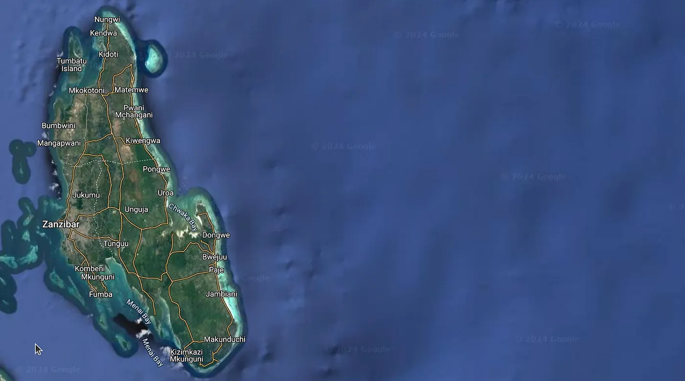

This is an updated look at how foreigners can buy land in Zanzibar. The rules have changed, and you need to know where they stand now, whether you are a private investor or a real estate developer.

There are two kinds of investors here. Private investors and real estate developers.

## Private investors

If you want land for yourself, for example to build a lodge, you have two main options.

Option 1 is a company. You set up a local company with a Zanzibari partner who holds the majority. The company buys the land in its own name and gets the title, which can later be transferred to the foreign partner. This gives you a legal frame for owning the land and makes selling it later easier.

Option 2 is buying directly. Foreigners can buy land in their own name, but they need to know the limits. You can get a title under your name. But then selling gets hard, because you can only sell to a local Zanzibari. So this option is less flexible if you want to invest more or resell.

## Step by step for private buyers

If you want to buy land to build a lodge or something similar, these are the steps.

Step 1, find the right place. Look at areas tourists like or areas that can still grow, like Jambiani, Paje or Stone Town. Look at how the market is moving and what property is worth, so you decide with real information.

Step 2, check that the land is available. Ask the Zanzibar Investment Promotion Authority (ZIPA) and the local land offices if the land can be bought. Make sure what you want to do with it, like building a lodge, fits the local zoning laws.

Step 3, set up a local company if you go that way. Register it with the Business Registration and Licensing Authority (BRELA) in Zanzibar. Write an agreement with your local partner about who owns what and who does what.

Step 4, check that the seller really owns the land. You can do that at the land registry or with the Sheha, the local village leader.

Step 5, write the sale/purchase contract. It needs the details of both sides, a description of the property with location and size, the price and how you pay, and signatures from both sides and witnesses. It has to follow the law, so a local lawyer is a good idea.

Step 6, hand in the documents for approval. To register the deal you give in the original contract and copies, the confirmation from the Sheha, the seller’s title or certificate, your identification, the seller’s tax clearance certificate, and the payment for stamp duty (10% of purchase price) and land transfer tax (1% of purchase price). The documents go to the District Commissioner’s Office, the Valuation and Taxation Office and the Land Registry Office.

Step 7, the land gets checked and measured again. Government officials look at the borders. This can take time, so keep following up.

Step 8, the transfer gets finished. A public notice is published so people can object. There is a period to sort out any objections. You get a lease agreement for up to 99 years. And you are registered as leaseholder in the land registry.

## Real estate developers

Bigger investments, like those from real estate developers, follow a more fixed process.

Developers apply for an Investment Certificate from the Zanzibar Investment Promotion Authority (ZIPA). They can own 100% of their company, and the land is leased for up to 99 years.

For real estate and hotels the minimum investment is $2.5 million. For other sectors it is much lower, $300,000.

First you hand in a concept note that describes your project, using the Investment Intention Form from ZIPA. When you hand in your detailed application you pay a fee of $200 that you do not get back. Once the project is approved you get an Investment Certificate. You renew it every year until your capital investment is fully made.

## Where the market is going

Zanzibar’s real estate market is going up, for a few reasons.

Rental yields are high. Zanzibar is 7th among cities in Africa for rental yields. More and more tourists and expats want holiday homes or long rentals.

Tourism is growing. Millions of people visit every year, so there is a steady need for holiday rentals and hospitality. That is a good chance for property investors.

The government is pushing it. There are “golden visas” (Class C11 residency). If you buy property worth at least $100,000 in a ZIPA-approved project, you and your close family can get residency permits.

A lot is being built. About 50 development projects are going on in Zanzibar right now, which shows investors believe in the market. Fumba Town and Blue Amber Resort are two of them, both aimed at luxury living.

It is cheaper than elsewhere. Prices in Zanzibar are mostly lower than in older tourist places like Dubai and Mauritius. That pulls in investors who want value and hope prices rise over time.

## What makes it hard

There are problems too.

Getting title deeds and residency permits can be slow because the bureaucracy is slow. That needs to get faster if Zanzibar wants more foreign investment.

There is competition. Mauritius and the Seychelles have the same kind of nature, but their rules are often more settled and make investing easier.

And the economy. Tanzania has grown steadily, but any swing could hurt investor confidence and move the market.

## So

Real estate in Zanzibar is a real chance for private investors and big developers. If you understand the legal frame and follow the steps, the deal goes smoother and stays within the local rules.

Zanzibar keeps building roads and services and keeps getting more attractive for tourists. Everyone involved needs to work together on better rules, so the real estate sector can grow in a way that lasts.

If you need more help with investing in Zanzibar, talk to a lawyer or contact ZIPA directly.

For free advice on moving to or investing in Zanzibar, contact Emin Mahrt.

- Phone +255775585555
- Telegram [@eminoemino](https://markdown-to-medium.surge.sh/t.me/@eminoemino)
- Email emin@emin.de

Citations: [1] [https://www.ippmedia.com/the-guardian/business/read/revolutionising-real-estate-investment-in-zanzibar-with-innovative-approach-2024-06-06-170441](https://www.ippmedia.com/the-guardian/business/read/revolutionising-real-estate-investment-in-zanzibar-with-innovative-approach-2024-06-06-170441) [2] [https://www.thecitizen.co.tz/tanzania/news/national/shock-waves-hit-zanzibar-s-nascent-real-estate-industry-3951880](https://www.thecitizen.co.tz/tanzania/news/national/shock-waves-hit-zanzibar-s-nascent-real-estate-industry-3951880) [3] [https://www.zanzibarluxproperties.com/post/the-growth-and-promise-of-zanzibar-s-real-estate-market](https://www.zanzibarluxproperties.com/post/the-growth-and-promise-of-zanzibar-s-real-estate-market) [4] [https://www.thecitizen.co.tz/tanzania/zanzibar/zipa-warns-of-illicit-foreign-land-acquisition-unregulated-bnbs-4750038](https://www.thecitizen.co.tz/tanzania/zanzibar/zipa-warns-of-illicit-foreign-land-acquisition-unregulated-bnbs-4750038) [5] [https://www.ardeanlawchambers.co.tz/2023/01/28/land-for-investment-and-doing-business-in-zanzibar/](https://www.ardeanlawchambers.co.tz/2023/01/28/land-for-investment-and-doing-business-in-zanzibar/) [6] [https://www.tanzaniainvest.com/construction/realestate/acquiring-land-in-zanzibar](https://www.tanzaniainvest.com/construction/realestate/acquiring-land-in-zanzibar) [7] [https://zanzibaba.com/blog/-can-foreigners-buy-land-in-zanzibar--a-comprehensive-guide-for-investors](https://zanzibaba.com/blog/-can-foreigners-buy-land-in-zanzibar--a-comprehensive-guide-for-investors) [8] [https://www.edenlawchambers.co.tz/2024/08/05/zanzibar-real-estate-and-property-purchase-comprehensive-guide/](https://www.edenlawchambers.co.tz/2024/08/05/zanzibar-real-estate-and-property-purchase-comprehensive-guide/)
