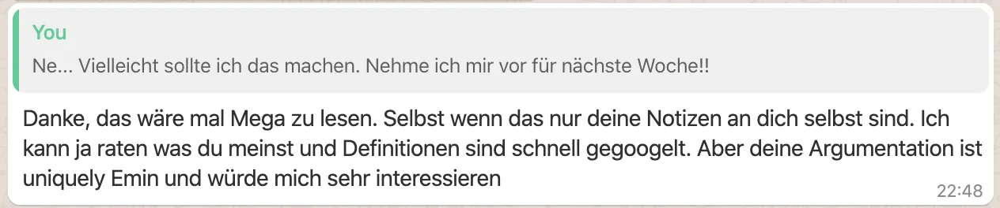
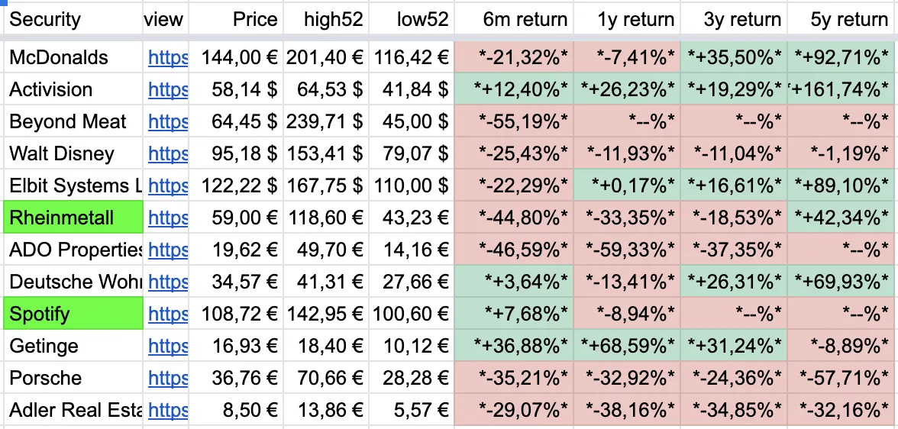
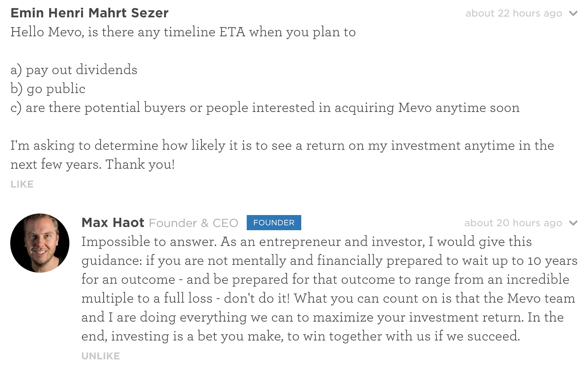
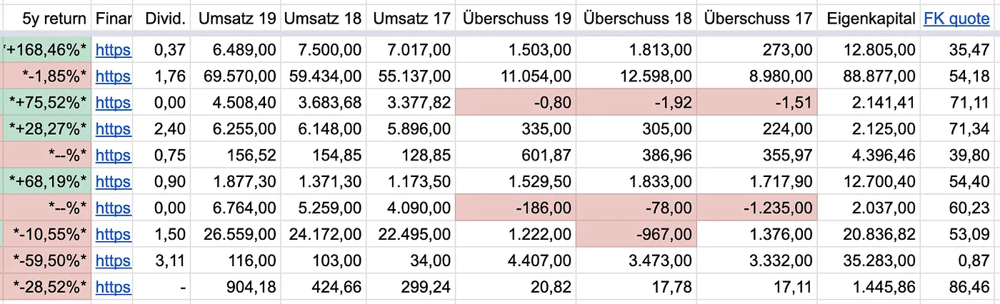

# 2020 let’s go — Investing Diary During Corona and My First Time Investing

## Intro, Monday, 30. March 2020 — Day 12

This document was created out of a short chat with my good friend Frederik Eichelbaum who suggested I write down my thoughts around investments so that I can share them with my network.

In short, he suggested that I “think out loud” and write down my thoughts into a document. I thought this is a nice idea and you are currently reading this document.

## Tuesday, 31. March 2020 — Day 13

This is the first day I’m writing about my work managing a private stock portfolio. I am not a trader, so my focus is on companies I believe in and I believe will grow in their stock value over the next 5 to 10 years. In short: they will be worth more in 10 years as they are on the day I buy them.

Today I invested in **Visa**, **Mastercard,** and **Gold**. During the weekend I decided to buy **Berkshire Hathaway** (a fund), **Lenovo** and **Getinge**.

The reasons for my selections are simple. First I look at their graph for the past 3, 5, and 10 years. If the graph goes up constantly with a few bumps, I believe that this company will also handle the current Corona crash and come back to its original price within the next few weeks. As all stocks crash more than 10–15% over the past month, the minimum return I hope to get is getting back that 10–15 % over the next few years. I also check the performance of the stock over the past 3, and 5 years (which is basically the same as looking at the graph but looking at percentage numbers). I’ve created myself a little table that helps me to view those numbers quickly, and it looks like this:

Looking at the table I have two options on how to interpret it. If a company is in deep red, it can be a chance that it will recover from its very lows and has the potential to rise. More interesting is the 3-year return and the 5-year return though. I plan to hold my stocks for at least 3 years, so every stock that performed well in a 3-year return and 5-year return looks interesting for me. Some stocks are too young, here I have to trust my feeling that they might become a big player within the next 5 years. Those companies are riskier but they also have a bigger upside.

Why did I invest in **Visa** and **Mastercard**? I believe digital payments will grow unstoppable over the next ten years — or forever. Soon everyone will pay with their smartphone or contactless with their credit card. Mastercard and Visa can be found and included everywhere, they definitely have a bright future and a strong market position as new players can not just enter the market. It is also a hedge against Bitcoin and Cryptocurrencies. Looking at their graph they have a “Corona-Bump” like every stock and their past performance is and returns are great. Both have been a very easy decision for me to buy and I might add **PayPal**, **American Express** to my portfolio as well. Unfortunately, **UnionPay** (China Cards) are not publicly listed or I would buy them too.

Why did I buy Gold? I hope that Gold is a rather stable asset with a low growth rate. My plan is to not keep Euro on my Bank account for no reason. Everything should be invested in assets that have a realistic chance to gain in value. The Euro will just lose value over time. Gold is the most commonly known asset that has been stable for decades and a constant growth in value. I plan to invest at least 10% of my Euro cash assets into Gold instead of holding Euro in my bank account. I am aware that Gold can also crash like it did 30% during the 2008 financial crisis, but in the long term Gold will always outperform Euro or any other currency except for Bitcoin.

The only reason why I bought Berkshire Hathaway is, that I really like Warren Buffet and his strategy of value investing. Looking for companies that create real value, that are undervalued and that will grow and be around in many years to come. The guy becomes 90 years old this year and I’ve read lots of interviews and videos and trust that he will manage his fund well. The performance and graph of his fund look good too and it just crashed 30% like all the other funds and stocks but this guy will have a comeback — I just trust in this. I might consider selling the shares again if he dies one day, but I don’t hope that won’t be soon!

The reason why I bought a Lenovo stock. I checked out Lenovo and their graph doesn’t look very good. Some websites say that Lenovo is highly under-valued with its current price and I believe they are right. I own a Thinkpad Laptop and a Motorola phone and both of them are great. The marketing is great too and the company is growing constantly in revenue and profits. For me, it doesn’t make sense why their stock price declines all the time. I should have done more research here but currently, I trust that they will grow over the next few years as more and more people will also be able to effort their products. Let’s hope I’m right!

Getinge was a choice because I wanted to invest in the healthcare system. It is a Swedish company (which I like) and their growth looks financially very healthy and good. They had a bad year followed by a very good one in 2019. Numbers I like to take a look at our debt vs. capital (in case of Getinge 53% debt, 47% own capital, which is a very good number). They do billions every year in revenue and they are constantly growing. Most important for my decision was a conversation with my brother though, who has been working for Getinge for more than 10 years and who told me that he’s happy and that the company is going to ramp up production because of the corona. The company produces medical equipment. I like to invest in companies where I know someone I like and trust and whom I can ask from time to time what he or she thinks about the company.

## Wednesday, 1. April 2020 — Day 14

I didn’t do much research and work today. I bought 0.1 Bitcoin (I’m buying 0.1 Bitcoin every day now for 7 days and I will continue for another 7 days or so because I believe this year could become huge for Bitcoin because of the Bitcoin halving and because of [this article](https://blog.coinbase.com/on-crypto-markets-and-bitcoins-value-proposition-2fbbca5349dd) I have read from Coinbase). As I promised myself to buy a stock every day I decided to go with something that is on my wish list for a while now, which is Amazon. Amazon is just crazy, not only in its e-commerce but also with servers and software they sell and provide. They are growing and growing and I believe they will continue to grow over the next decade. As I felt that I mainly invest in US companies, I also bought shares of the same amount from Alibaba which seems to go in a similar direction like Amazon does — just for the Chinese market.

## Thursday, 2. April 2020 — Day 15

Today I spent a couple of hours walking around and thinking about the current stock market. The reason is [an article I read](https://m.onvista.de/news/ist-die-millennial-generation-zu-optimistisch-gegenueber-dem-aktienmarkt-344084129) just after I woke up. The main message of that article was, that the young investor generation might be too optimistic with the following month (or years) or potential recession of the stock market. The author visualized (in words) in a very nice way how the crash of 2002, 2008 and 1929 must have felt where portfolios lost 30% of their value multiple times in a row. Someone who would have invested at the beginning of the 1929 crash 15000 USD would have ended up with less than half of its initial investment. In comparison, he made an example of investors that kept on investing 100 USD every month over the period of multiple years and which would have ended up with an +50% increase in their portfolio. For me, it is not clear how hard this crash will hit the world economy. The next few months will show if the market stabilizes or keeps on going down or sideways for a very long time. Nevertheless, I’m not afraid of that scenario, I rather think about how I can make more profit by hitting the lows of every stock I want to buy. Looking at Mastercard (which lost 10% today from my initial investment yesterday) I was even thinking to emotionally buy more to get an overall “better price” and profit for the future. On the other hand, I believe that the author is right and patience might be a good way to hedge the risk of not buying the bottom. This is why I initially decided to only buy one stock per day (my greediness pushed me to break this rule already a couple of times since I started). In the last 15 days, I bought 22 stocks. To keep my self set promise I will slow down and wait for a couple of days to pass before I continue to buy.

Today I also bought Pfizer. I wanted to invest in healthcare and pharma some of the best know brands and drugs are owned by Pfizer. Their track record over the past 5 years is not very good but [analysts at SimplyWallst](https://simplywall.st/stocks/de/pharmaceuticals-biotech/etr-pfe/pfizer-shares) say that the stock is highly undervalued. The company is as low in its price as it was 5 years ago and I just don’t think it will go much lower than it is today. A plus is also a high dividend yield of 4.79% which basically says that they are paying out dividends quite well compared to their earnings. In the worst case I believe, this stock will just go sideways in the next couple of years not losing much, not earning much, but the chance that they will grow due to high demand in healthcare just “makes sense” for me. Because of my choice of buying Pfizer, I’m also thinking about Bayer. Their Monsanto deal is smart, I read some stuff about Monsanto and thought for a long time what an evil and smart company that is. I also like that Bayer is German and I trust them to handle their shit in the future. Their 5 years graph looks horrible but their 10 years graph promises a big upside. Wherever I look the experts also seem to agree here and see the stock as undervalued. If they get a deal with in the US with Monsanto, they will have a lot more focus on future business and much better news around them, which will boost the stock driven by individual buyers, I believe (I think I can stop to write “I believe” but at the end of the day everything I write here is “I believe” so I will repeat myself with this).

I also spent some time brainstorming good investment ideas. I do that every day just surfing the web and thinking about brands and markets with potential. The food market is highly interesting. I tried to find some companies specializing in nuts like almonds and similar but I couldn’t find a single one buy just hitting a few keywords into Google. My thought experiment brought me to think about the big players such as Danone, Unilever, Nestle and other big food and snack producers in the world. Some of them I put on my watchlist. Overall my watchlist is still a bit chaotic. As soon as I get an idea, I just search for the stock and save it. I don’t follow up on every stock rather leave it there. If a stock comes into my mind multiple times in a row, I check it out more carefully and start looking into its numbers and news (via Google and different stock portfolio apps such as Investfolio). I also thought about Securitas again, which is a Swedish company that provides security personnel all over the world and exists since 1934 and seems to be highly undervalued like Pfizer (its price is also as low as it was 5 years ago even though the past 5 years the stock mostly went sideways). While thinking about Securitas I started thinking about Live Nation Entertainment again, a company that organizes concerts and events. The only reason I’m having that company on my list is that a friend of mine posted it as a tip on Facebook. The reason why I think this stock is interesting is, that the only reason why it crashed is Corona and if they don’t go bankrupt, they will come back and continue organizing events in the future, though their stock should get back to old strength.

While writing this text my friend Niko kicked in Airbus, a stock that is crashing and crashing since the start of the crash. It is basically partially state-owned (USA) and important for defense and obviously aviation. It is extremely unlikely that the government won’t catch Airbus if they fall — to relevant for the system — and the graph over the past 10 years just looks beautiful. Airbus is a great bet that it will come back to old strength. Just looking at the 1-year return, it is down more than 50% and this 50% is the same upside it might have in the next few years. Writing these lines wants me to grab my phone and place an order but I tell myself to wait another 5 days before I take this pick and work these days on my spreadsheets and my current portfolio.

Sidenote: the same way I felt buying Bitcoin in the early days in 2013, I feel today buying stocks and I noticed one thing: The moment you are financially invested into something, your interest rises. You start to read more news, you start to pay attention, you gain knowledge. Step by step you learn more about the companies you have invested in, you learn about their market and THE market. When you walk around outside, your brain starts thinking and the moment you meet someone with similar interest, you start talking. You will automatically stick to it, and sticking to it will make you more confident and knowledgable. Even if you lose, you will gain a tremendous amount of knowledge that you will keep for future investments and projects. You are more interested. You learn more.

Last but not least I’m thinking to invest a small amount privately into companies via crowdfunding seed investments. Three companies sparked my interest, the first one is [Xolo](http://www.xolo.io) OU, an accounting and virtual office service in Estonia. I’m using the service myself and love it. When I saw the option to buy loan notes via [funderbeam.com](http://www.funderbeam.com) I invested 2000 Euro into it. Funderbeam also offers an integrated platform to offer the shares you have for sale, even though there is limited liquidity. I really loved that and immediately considered to also invest in Funderbeam OU (the platform).

During my following research, I spotted a live camera company called [Mevo](https://mevo.com), which is also raising money via [wefunder.com](https://wefunder.com/mevo/ask) — negatively that platform doesn’t offer to put up shares you buy for sale again. This means, that your investment is a big 10-year bet which most likely ends up in a full loss of your investment if they don’t go public or sell the company. Fairly on my question, I got the following answer from their CEO

Following that answer, I might invest 1000 USD to support their venture and hope to see them go public sometime in the next 10 years. One thing I did not like is to see that Max Haot, the CEO and Founder, only works part-time for Mevo and focuses most of his time into a new venture (sending mini-rockets to space for small satellites). I bought an early version a couple of years ago of Mevo, never really used it, but when I did, I generally liked their product. Overall their dept and sales don’t look very good but if live streaming becomes a thing, this company could lift up, especially because they also own the platform and domain livestreaming.com which was also founded by Max Haot and which promotes Mevo cameras as well. Plus, if you google for “Livestream camera”, Mevo and Livestream.com both rank extremely high. They sales goals seem to be realistic but if they fail, the whole company will fail and go down most likely.

My second spot is Koawach, a company that produces drink chocolate with guarana and which sells their products on the German market (mainly). They already raised lots of money and their valuation is quite high. The platform they use is econeers.de and the model of investing is different from Wefunder and Funderbeam. They offer a yearly return of 7% on the investment. Looking at their numbers I feel that their financials are also not very good though, still, I believe that alternative food products like theirs have a good chance to succeed and grow. Due to a deal with some TV stations, their marketing is big, the brand is well known, and as far as I know, you can buy them in many different known supermarkets. The same way as Mevo, Koawach would be a 10-year bet which will most likely end up in loss. Due to the German name (wach / awake), I also think they won’t grow big outside of German-speaking regions so their growth is limited. If I invest, I will not place more than a 1000 USD bet.

Late afternoon Adobe came back into my mind. Adobe is a brand I know from the past, they produce industry leading software like Adobe Photoshop or Indesign used by millions of designers everywhere in the world. Starting 5 to 10 years ago they managed to switch their offers to a cloud and subscription based program and during my years of professionalism I noticed their positive development. Today hundreds of thousands of companies are using their software. There are tons of free learning material online and schools and universities teach their programs. Adobe has such robust standing that it is very unlikely that they will disappear within the next ten years — or ever. Thinking about such software I interviewed a friend of mine, a professional creative, and he also suggested brands like Autodesk or Avid. He also named multiple companies which are not listed but fit into the same structure such as Maxon, Ableton, Black Magic Design, Imageline, Universal Audio, The Foundry, Brainworx, Rubber Monkey and others. I also remember watching a YouTube Video with some stock experts which also mentioned that software programs which are used as an industry standard are most very interesting to them. I think I will invest into multiple companies within the next few weeks, starting with Adobe and Autodesk.

## Friday, 3. April 2020 — Day 16

I spent quite some time this morning in bed to scroll through all sorts of companies that first came into my mind. I started to put them in my Yahoo Finance watchlist, some of them in my “buy list”. Today I will not buy, first buy will be on Monday or Tuesday next week again. Overall I want to inform myself much better with additional key factors. Unfortunately none of my apps I use (SimplyWallst, ARD Boerse, Yahoo Finance, Google Finance) is giving me all the information that I need on one page. Even though I might repeat myself, I’m interested in at least 5 years past performance, revenue, growth, profit, debt, dividends. Rather simple things but none of the apps show this clear and simple on one page — this is why I need to switch back and force and also setup my own spreadsheet. The downside of setting up your own spreadsheet is — it takes time. You can get lots of data automatically but you also have to add missing bits and pieces manually. When you decide to add a new data key point, you have to update all the other entries as well, which can be tiring and time consuming (Example: I recently added **debt ratio **to each company in my list, it shows how much debt the company has in percentage to own capital). Fremdkapital/debt ratio is on the very right:

In a chat with my friend Vinzent he asked me how much shares I’m going to buy from each firm. The answer here is quite simple — right now I will invest more or less the same amount into each stock. My goal is to have approximately 50 stocks, each one representing an average of 2% of my portfolio. By time I will start to switch stocks by switching them for another stock either in my portfolio (which would put that stock up to ~4% within my porfolio) or buying a new stock from which I don’t yet have in my portfolio. At the beginning I planned to focus on high dividend stocks but I realised that some of my favorite companies rather reinvest their money instead of distributing their profits via dividends to shareholders. I don’t think this is a bad thing. Companies that keep the profits and reinvest them are more likely to grow and stay healthy long term in my eyes. I would run my own company the same way, rather keeping profits and reinvesting them into my business instead of distributing the profits to shareholders. If a company needs to go into debt to grow because all of their profits have been distributed in terms of dividends, I prefer to not get dividends and have a debt free company. Debt overall is nothing bad though. If a company gets lots of money from outside, it can also be a sign of trustworthiness. Banks and other players in this field, lending money, will also do their checks and only lend that money if they believe that they will get it back — with interest.

I was also asked why I invested into Rheinmetall, as a big part of their business is in defense. It took me some time to make that decision. I wanted to invest into an infrastructure, big player, based in Germany as my portfolio mainly holds stocks from the USA. Rheinmetall was one of the companies that showed constant growth, is based in Germany and has a history going back a hundred years. On my list are also aviation and automotive — many of them also involved into the highly profitable defense business — and I can’t just close my eyes here. I want to gain knowledge and be aware of what those companies do and I might exchange those shares at a later stage for more sustainable and better ones. My research and common sense tells me that many companies have their fingers dirty. It starts with big pharma and continues with aviation, automotive and resources. It is nearly impossible to stay out of the swamp if you start looking into high profitable businesses in nearly any sector.

***The following text is a test, it is an auto-transcript from me speaking to my Google phone:***

I’m going to try this the first time, not writing but using Google recorder. I spent a couple of hours reading through stock news again. It is way harder to speak than to write. When I write, I just write down. When I speak, I have the feeling that I have to think before I speak, this makes everything a little bit slower.

This morning. I was looking at different stocks. One of the stocks on my watch list is Beyond Meat. I like the company for several reasons. First reason is that they had their IPO just last year. They had multiple quarters with growing revenue. Since last quarter, they even make profit. The current price is the same price as on IPO date. I believe that many more people will start eating less meat. These people will search for alternatives. Beyond meat has a very good name. And people will try their product. I have tried the product and I think it is very good.

Many big outlets already started or plan to sell the product from Beyond Meat. Even McDonald’s. There are competitors though, like Impossible Foods, which are not yet public but pushing into the market as well. Another thing I noticed is, that meat replacements in supermarkets start to grow from all kinds of unknown brands (mainly based on tofu, soy, lots of E’s).

Still, distribution is a big plus. It shows that their distribution and sales are good. I’ve also read, that they try to get into the Chinese market although I think that we will soon see or already have local competitors there.

I like to look at companies that have a bright future but are highly undervalued.

They are a little bit risky but the combination of being undervalued and young but fast-growing can promise a great upside in the future. But also greater risk of loss, of course.

Looking at beyond meat, I’m also still trying to figure out the right tools to make my analysis. I start to really like to look at their financials. If they have revenue growth over the past years and growing profit or less debt, I continue to look, if not, I stop. I am interested if the company has debt and slowly I start to develop key numbers that are important for me. I’m not yet sure if I’m too influenced by the few articles I have read and the few persons I have talked to in the past three weeks.

I am also pretty sure that when I look back at my first buys in my portfolio, I might decide differently in the future. The reason why I’m still buying is, that if I wouldn’t have bought the stocks in the past two weeks, I would not spend that much time in educating myself. I have made this theory before and I still stay to it.

For today and the next three days, I would like to create a perfect watch list. Or let us call it a buy list. A list with all stocks. I will try to analyze each and every stock, and I will try to limit that list to about 25 stocks. Whenever I find a stock that is better than a stock on that buy list. I will remove one stock from the buy list and add the other better stock to the list. This way, I hope I have a natural filter of the best companies to invest in. Currently, I’m doing decisions fast. Too fast when I look at the past two weeks. I promised myself to only buy one stock per day, but I’m already way over it.

Buying stocks can quickly become an addiction. I can already see that. It is interesting to look at numbers going up and down and whenever they go up it feels good because you have made the right decision.

Although I’m connected to those stocks and numbers, I’m not that emotional. I believe that the stocks I have bought and the whole market can crash more than 30–40 or even 50% from today. Nevertheless. I follow the principle that each stock will go back in the next five to ten years. Maybe not to its all-time high but in the worst case to the price it had before the corona crash. This is my wishful thinking!

One thing I’m constantly thinking about is the origin home country of the company. Meaning where this company is based. When I look at my portfolio, most of the companies are in the USA. I really want to change that also for diversification and I really want to focus on some Chinese, maybe Korean and Japanese brands and stocks. I also like to buy stocks from Germany as I feel that I know the people, culture, and market.

This is very different in China. It is very hard to get a feeling for a company or brand that you don’t know anything about. I can only look at the industry. There is historical data that shows past performance, financial numbers, etc. I have to make a decision based on that. I think this is good training as you’re not blinded by the marketing of a brand. When I buy Starbucks, I believe that Starbucks will succeed, because I know the brand very well from the past. It can quickly lead me to a wrong decision because I might not look into their numbers and history as detailed as I would in a company that I just discovered which I didn’t know before.

Another thing that I really want to do in the future is that I write down competitors to each company that I invest in. This is very important as competitors can take away profit and revenue from a company that you have bought. I also want to exercise to write down a few pros and cons. Not only good reasons to feel better why I’m buying that company, but also a bunch of reasons why I should not buy.

This takes quite some time and a day can be gone in a second, but I think it is important. If you spend 1000 or 2000 Euro on a company, you should also invest at least a couple of hours of your time to look into them and before you buy them.

## Wednesday, 9. April 2020 — Day 22

As promised I slowed down my work and I did and still do it. Yesterday night I decided to top up my portfolio with one stock: TSMC or Taiwanese Semiconductor. A company that I discovered years ago as one of the main manufacturers of ASIC computer chips for Bitcoin mining hardware but also as the number one manufacturer for Apple’s iPhone and iPad CPUs. It was easy for me to decide that I like that company and their business but more importantly I started to look more specific on their financials and past growth as following:

1. Past development is important for me, this is also why I look at the graph 5 years and max years. If the graph looks healthy (no crazy volatility and a steady growth over the past years, I already feel very comfortable)
1. I want to see a growing revenue and if possible, profit over the years.
1. I’m also not happy with companies who only have a profit margin of 1–4%, that seems like an unstable business to me. Anything close of over 20% looks healthy (and smart) and I will follow up on such a company. This also defines that a company must be profitable. If the company is not profitable, they need to have a very special and strong future outlook for me to invest (especially young companies with crazy growth rates are often not profitable at the beginning, i know that, but the risk investing in them is also very high in my opinion).
1. Even though I’m repeating myself, debt is important. I don’t want to invest into a company with crazy debt. I understand that it sometimes makes sense to take a loan to push your business but if the debt is just up the air something is not going the way it should go
1. Dividends — I’m still not sure about this. What I like with dividends is that I can re-invest the money into new stocks without the need of selling existing ones. This is really nice and the only way of growing a portfolio next to the stock market gains of the stock itself. Companies that decide to not pay out dividends are not stupid though, they use the money to invest into themselves which I support and don’t judge.
1. I’m not interested in short term returns (even 1 year returns) at all
1. The valuation of the company is important to me and there are websites that display, based on a formula, if a company is over or undervalued. I like to buy highly undervalued companies, even though I still have problems understanding the foruma they are using to determine such a thing. One easy thing to understand is that most of the formulas are based on current or future cash flow of the company. If a company is undervalued it is because it is expected that the company will generate a better cash flow in the future and the stock price will rise.
1. Price to earnings ratio is a number that calculates the **share price** in relation to the **earning per share**. Lower ratios are better.
1. Price to earnings growth ratio is a number that indicates the **share price** in relation to the company’s **forecast earnings growth**. As lower the number, as better :)
1. Price to book value is a nice indicator. It calculates the current value of the company based on all shares (also the outstanding once) and compares it to the book value of the company (what they have in their books, all assets minus liabilities). A low value could show that the company is undervalued, a high PB ratio means that the company could be worth more on the stock market than it is within its books
1. Future growth (i know i repeat myself) in revenue and earnings is important! And the profit margin is very important too!
1. Return on equity shows if the company used the money they got from the stock sales well and if they are able (or will be able) to generate higher profits with that money
1. Financial health: debt to equity ratio should not cross 60%, good companies just have a very little or no debt in my opinion, except they do or want to do smart investments (it’s very hard to get good informations here, like Bayer buying Monsanto)

Most of the above looked good in my eyes at TSMC so I bought it.
