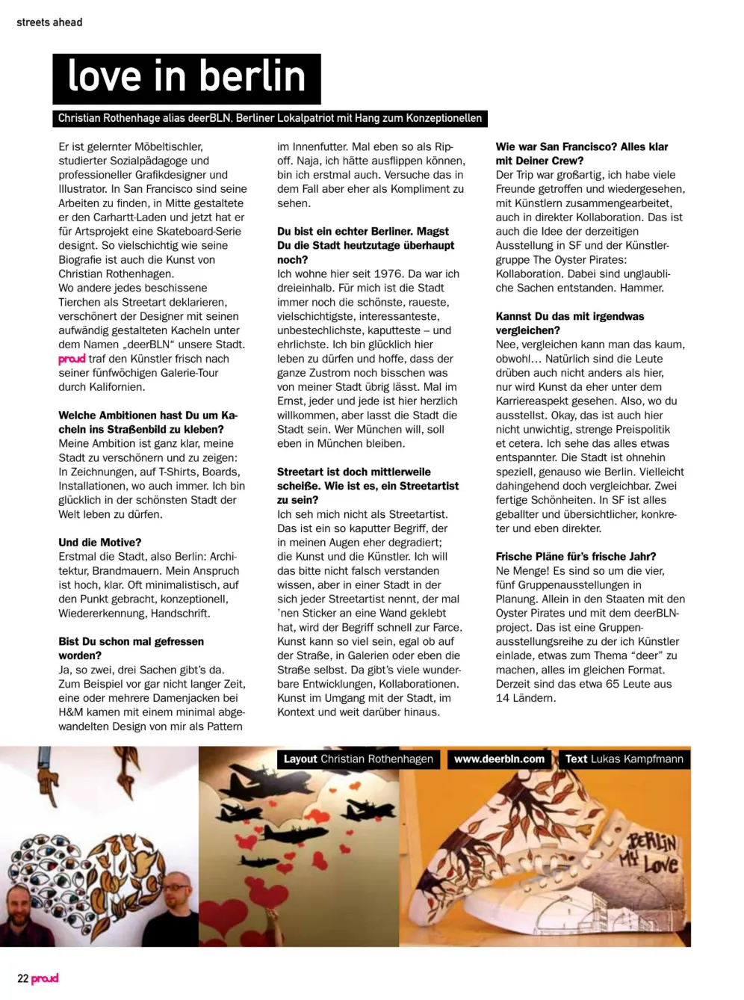
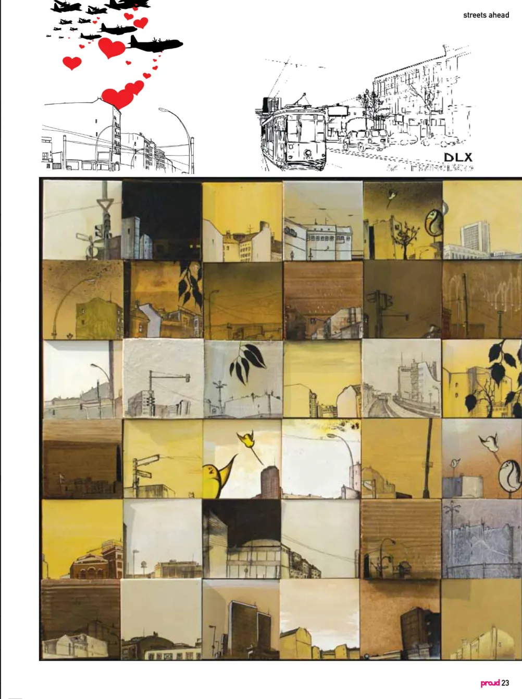

# proudA Conversation with deerBLN: Inking Love onto the Streets of Berlin

**He’s a trained cabinet maker, a qualified social pedagogue, and a professional graphic designer and illustrator. Christian Rothenhagen, also known as deerBLN, is a Berlin patriot with a conceptual flair. *proud* magazine sits down with the artist to discuss his love for the city, his creative ambitions, and what it means to be a true Berliner.**

**proud:** What is your ambition behind putting tiles on the city’s streets?

**deerBLN:** My ambition is clearly to beautify my city and to express myself: in drawings, on t-shirts, on skateboards, in installations, wherever. I am happy to live in the most beautiful city in the world. I see myself as a modern local historian. I document the city through my drawings and give something back to it through my work in public spaces. My “street art” is, for the most part, not illegal, but rather tolerated interventions in the urban landscape. It’s an expression of my love for this city.

**proud:** You are a true Berliner. Do you even like the city anymore these days?

**deerBLN:** I have lived here since 1976. For me, the city is still the most beautiful, the roughest, the most diverse, the most interesting, the most incorruptible, the most broken — and the most honest. It’s the city that doesn’t lie to you. It wears its scars openly, shows its wounds, and is as direct as a punch in the gut. But it’s also the city that will always catch you. I love Berlin — now more than ever!

**proud:** You just designed a skateboard series for Artsprojekt. Are you a skater?

**deerBLN:** I used to skate a lot, but I wasn’t particularly good. I started in the mid-80s on one of those plastic boards from the department store. When I was 15, I bought my first real board, a Santa Cruz with Independent trucks and OJ II wheels — a classic! That board was my pride and joy and my ticket to a world that has shaped me to this day: skateboarding, punk rock, and hardcore. The DIY ethic of that scene has influenced my work from the beginning. So, to design a board series now is a huge honor for me. It’s a childhood dream come true.

**proud:** What are you currently working on?

**deerBLN:** Right now, I’m developing a T-shirt series for a Berlin-based streetwear label and working on a few poster designs. I’m also preparing my next solo exhibition, which will take place in the spring of 2009 in Friedrichshain. Besides that, I’m always drawing… my city… Berlin!

