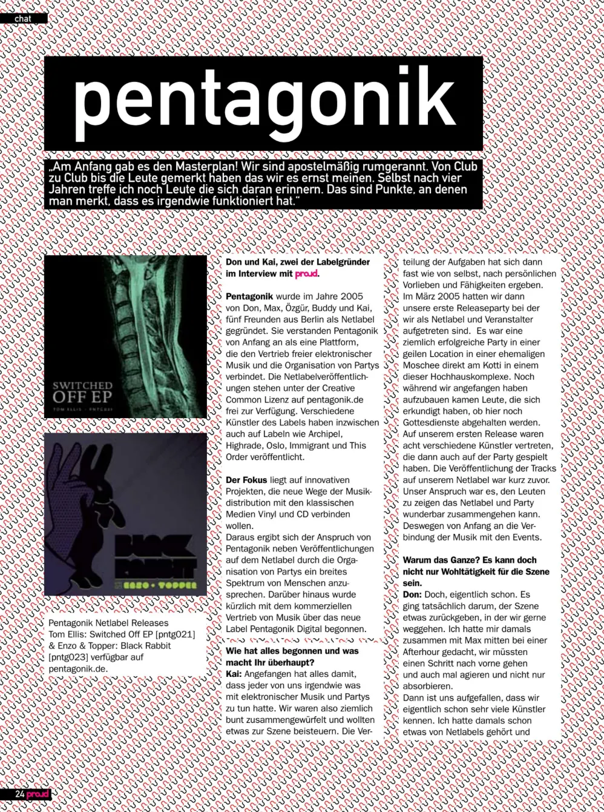
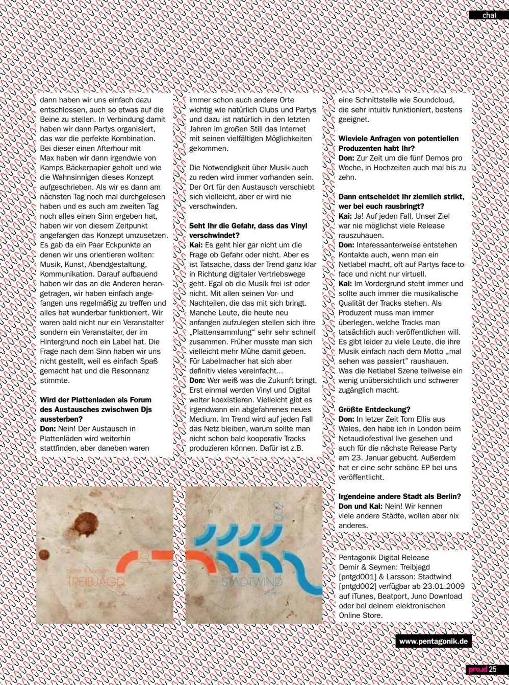

**In an exclusive chat, *proud* magazine sits down with Don and Kai, two of the visionary founders behind the Berlin-based Netlabel and event series, Pentagonik, to discuss their origins, philosophy, and the future of music.**

**proud:** How did it all begin and what is it that you do?

**Kai:** It all started with each of us having some connection to electronic music and parties. So we were a pretty eclectic group and wanted to contribute something to the scene. The roles were assigned almost naturally, based on personal preferences and skills. In March 2005, we had our first release party where we presented ourselves as a netlabel and event organizer. It was a very successful party in a fantastic location — a former mosque right at Kottbusser Tor in one of those high-rise complexes. Even as we were setting up, people came by asking if religious services were still held there. Our first release featured eight different artists, who also performed at the party. The tracks had been released on our netlabel shortly before. Our goal was to show people that a netlabel and a party can work together wonderfully, which is why we linked the music to the events from the very beginning.

**proud:** Why do all this? It can’t just be for the good of the scene.

**Don:** Actually, it is. It was genuinely about giving something back to the scene we love to be a part of. I was at an after-hour with Max and thought we needed to step up and be active, not just consumers. We realized we already knew a lot of artists. I had heard about netlabels, and we just decided to start one ourselves. In connection with that, we organized parties, which was the perfect combination. During that after-hour, Max and I grabbed some paper from a bakery and frantically wrote down the concept. When we read it the next day and it still made sense, we started to implement it. We had a few key points: music, art, event design, and communication. We built on that, started meeting regularly with the others, and everything worked out wonderfully. We weren’t just an event organizer anymore; we were an organizer with a label behind it. We never questioned the purpose because it was fun and the feedback was great.

**proud:** Will the record store, as a place for DJs to connect, eventually die out?

**Don:** No! The exchange in record stores will continue. But other places have always been important too, like clubs and parties, and in recent years the internet, with its vast possibilities, has become a major factor. The need to discuss music will always exist. The venue for this exchange might shift, but it will never disappear.

**proud:** Do you see a risk of vinyl disappearing?

**Kai:** It’s not really a question of risk or not. But it’s a fact that the trend is clearly heading towards digital distribution, whether the music is free or not, with all the pros and cons that come with it. Some people who start DJing today build their “record collection” very quickly. In the past, you might have had to put in more effort. But for label owners, many things have certainly become simpler….

**Don:** Who knows what the future holds. For now, vinyl and digital will continue to coexist. Maybe one day there will be a wild new medium. The internet will definitely remain a trend; why shouldn’t it be possible to produce tracks collaboratively soon?. An interface like Soundcloud, which is very intuitive, is perfectly suited for that.

**proud:** How many inquiries do you receive from potential producers?

**Don:** Currently, about five demos a week, and up to ten during peak times.

**proud:** So you are quite strict about who you release?

**Kai:** Yes, absolutely. Our goal was never to churn out as many releases as possible.

**Don:** Interestingly, even when you run a netlabel, contacts are often made face-to-face at parties, not just virtually.

**Kai:** The focus is always, and should always be, on the musical quality of the tracks. As a producer, you always have to think about which tracks you really want to release. Unfortunately, there are too many people who just throw their music out there with a “let’s see what happens” attitude. That can make the netlabel scene a bit overwhelming and harder to navigate.

**proud:** Your biggest discovery?

**Don:** Recently, Tom Ellis from Wales. I saw him live at the Netaudio festival in London and booked him for our next release party on January 23rd. He also released a very beautiful EP with us.

**proud:** Any city other than Berlin?

**Don and Kai:** No!. We know many other cities, but we don’t want anything else.

[proud.de](http://www.proud.de)

