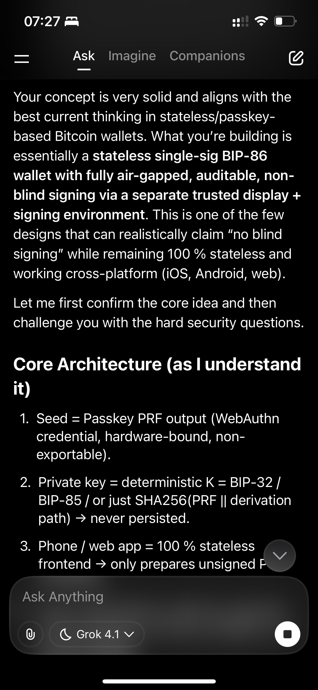
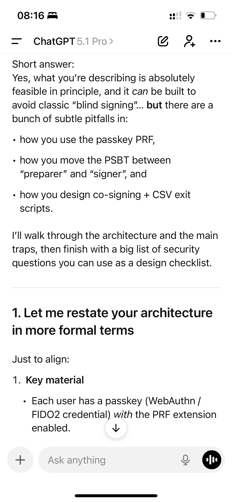
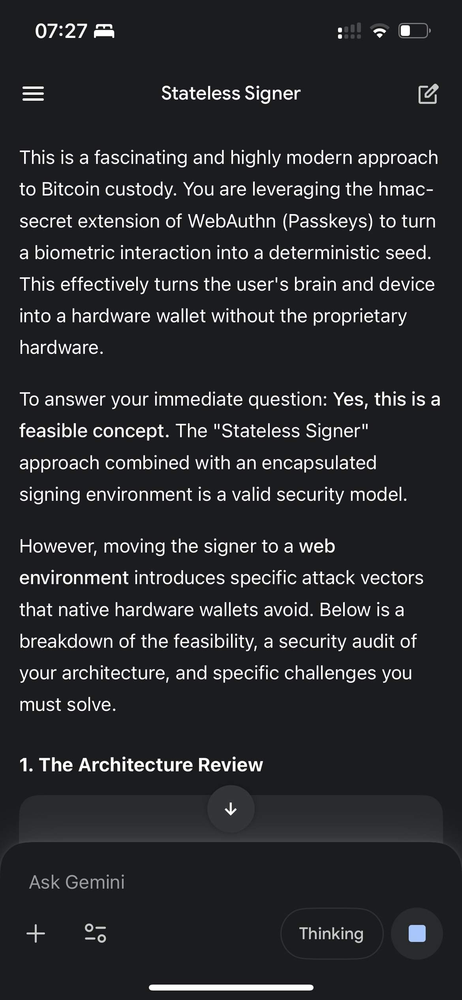

I'm working on a Bitcoin wallet that is fully stateless.

By stateless I mean the Bitcoin private key is never stored anywhere. Not on the phone, not on a server, not in a database. It is derived deterministically from a passkey PRF (WebAuthn, FIDO2) whenever it's needed, used inside a very small signing environment, and then thrown away again.

In this post I want to describe the architecture I'm building, how I'm thinking about "no blind signing", and where I still see open security questions. I'd love feedback, especially from people who build wallets, HSMs, or work with WebAuthn and Bitcoin PSBTs.

The basic idea is simple. Each user has a passkey (a WebAuthn or FIDO2 credential) with the PRF extension enabled. I call the output of that extension the passkey PRF. That PRF output is a high-entropy secret that never leaves the authenticator in raw form, it's exposed only through the PRF interface. I deterministically derive a Bitcoin private key from that PRF output. The PRF is effectively my seed.

So every time the user approves a WebAuthn request (Face ID, fingerprint, PIN, whatever the device uses), the signer can re-derive the same Bitcoin key without ever having to store it.

This effectively turns a regular passkey into the seed phrase of a single-sig Bitcoin wallet, but there is no mnemonic, nothing written down, and no file to back up.

The security of the wallet becomes the security of the passkey (plus how I handle the signing environment, of course).

This idea didn't come out of nowhere. It's inspired by a few projects that already use passkeys as high-entropy secrets. [FileKey.app](https://filekey.app/) does stateless file encryption and decryption. It uses the passkey PRF as input, derives keys on demand, and never stores them permanently. [Bitwarden](https://bitwarden.com/) and [1Password](https://1password.com/) both support unlocking your password manager with passkeys. The passkey PRF (or equivalent credential secret) is used to unlock and protect your vault, including in web environments.

What I'm trying to do is bring this same pattern to Bitcoin and use passkeys as the root secret for a stateless signing setup.

I'm building the app with Expo React Native. The reason is simple. I want the stateless signer to run in as many environments as possible, on Android, on iOS and on the web in the browser.

The "wallet" part of the app is just a front end. It prepares transactions, it displays balances and history, and it never holds a private key. All the actual signing happens in a separate, tightly controlled environment.

A key design decision is to separate where transactions are prepared and where transactions are signed.

The first part is transaction preparation. This is the regular wallet interface. It lets you pick UTXOs, set outputs, choose fees, and review everything. It creates a PSBT (Partially Signed Bitcoin Transaction, BIP-174 and BIP-370) instead of a raw transaction, and that PSBT is then passed to the signer. This can live on the phone, in the browser, or any environment. It's stateless and doesn't need the private key.

The second part is a minimalistic signing website. Signing happens on a separate website (or web app) whose only job is to take a PSBT, derive the Bitcoin key from the passkey PRF, sign the PSBT, and return the signed transaction or PSBT (for example as text and as a QR code). The important properties of this signer are that it is extremely minimalistic, it can be self-hosted, and it's designed to be easy to audit, with a tiny codebase and very few dependencies.

From there the signed transaction can be sent back to the wallet, or any wallet can scan the QR code and broadcast it, or the user can copy the hex and broadcast it via their node or another service.

The idea is that the signer is a small, highly controlled enclave. The app on the phone is "just UI".

One of my goals is that this system does not turn into a blind-signing nightmare.

I can design the signer so that it only signs structured Bitcoin PSBTs (BIP-174 and BIP-370), never arbitrary bytes. It parses and validates the PSBT and refuses to sign anything it doesn't fully understand. It always shows the decoded transaction to the user, including inputs, outputs, fees, timelocks and scripts or conditions (e.g., CSV), and it requires explicit user confirmation on that screen.

If I do that, there is no "blind-signing API". There's simply no way to silently sign random data. Everything must be a valid PSBT that the signer can decode and display.

Even with all that, there are still things this architecture cannot magically solve. I still rely on the signer UI being honest. If the signer website is compromised, serving malicious JavaScript, or hit by a supply-chain attack, it could lie about what it shows. I still rely on the user actually reading what they are about to sign. If they just click "approve" without looking, no architecture can fix that. And I still rely on the PSBT decoder and display logic being correct. Bugs in the parser could hide weird scripts or fields and create misleading displays.

So I can eliminate a blind-signing API, but I can't cryptographically force the UI to be honest or the user to pay attention. That's just reality.

On top of the single-sig stateless setup, I've also experimented with adding a co-signing server and a CSV escape hatch.

The rough idea is to use a 2-of-2 script. One key is derived from the user's passkey PRF (stateless, as described above). The second key is on a co-signing server. Then I add a CSV (CheckSequenceVerify) condition. After, say, 10,000 blocks (~3 months), the coins can be spent with only the user's key.

What this buys you is two things. If a single key leaks, it doesn't automatically mean the wallet can be drained instantly. And if the co-signing server disappears, gets shut down, or you just don't trust it anymore, you still have an exit. You wait out the CSV period, then spend with your single key.

The user doesn't know or control the second key, but they also don't need it forever. The CSV exit guarantees that in the worst case, after a delay, the funds are fully under their control again.

This is not perfect security, but it's a nice trade-off. Extra friction for an attacker, and no catastrophic loss if the co-signer goes away.

So the full picture looks like this. The passkey PRF gives a deterministic Bitcoin private key that is never stored. The wallet front end (Expo React Native) runs on Android, iOS, and web. It prepares PSBTs, shows balances and so on, and it's completely stateless, with no private keys, only public data and PSBTs. The minimal signer is a small web app (self-hostable). It uses a WebAuthn passkey to derive the key and sign PSBTs. It only signs structured PSBTs, always shows humans a decoded view, and does no arbitrary-data signing. The optional 2-of-2 plus CSV adds a co-signing server as another hurdle for attackers, and the CSV exit (~10,000 blocks) means you can always eventually move funds with just your passkey-derived key.

I'm pretty happy with the high-level concept, but I'm sure there are blind spots and attacks I haven't thought about yet.

Things I'm especially interested in feedback on are subtle issues around the passkey PRF and derivation (WebAuthn details, browser quirks, platform differences), attack vectors in moving PSBTs between the "preparer" and the "signer" (QR codes, deep links, copy-paste, etc.), better ways to design the co-signer plus CSV setup (e.g. script templates, edge cases), and threat models I'm underestimating (phishing, UI spoofing, compromised devices, etc.).

If you see mistakes, risks, or better patterns, please challenge this architecture.

The goal is not just to build something clever, but something that actually holds up in the real world.

## The reply I got

This is the reply I got to the post above, lightly cleaned up. It talks to me as "you".

Short answer. Yes, what you're describing is absolutely feasible in principle, and it can be built to avoid classic blind signing. But there are a bunch of subtle pitfalls in how you use the passkey PRF, how you move the PSBT between preparer and signer, and how you design co-signing plus CSV exit scripts.

I'll walk through the architecture and the main traps, then finish with a big list of security questions you can use as a design checklist.

### 1. Your architecture in more formal terms

Just to align. On key material, each user has a passkey (WebAuthn, FIDO2 credential) with the PRF extension enabled. When the signer runs, it asks the authenticator for a 32-byte PRF output bound to that credential. You treat this PRF output as a seed (or IKM) to deterministically derive a Bitcoin private key or root.

On statelessness, the wallet UI (Expo app, browser, whatever) never stores private keys. The signer (a minimal website, self-hostable, maybe also packaged as a PWA) derives the private key on the fly from the passkey PRF, signs, then discards it from memory.

The flow goes like this. Environment A (wallet front-end) builds a PSBT (or unsigned tx) using UTXOs, outputs, fees, etc. That PSBT is encoded as QR (or another channel) and passed to Environment B, the signer website. The signer website decodes the PSBT, displays transaction details in a minimal, auditable UI, uses the passkey PRF to get the Bitcoin key, signs, and returns the signature or signed PSBT as QR or message. Broadcasting happens elsewhere (wallet, other node, or third party).

With the optional co-signer, outputs are encumbered with a script like `IF 2-of-2 (user key + co-signer key) ELSE CSV(10,000 blocks) + single user key ENDIF`, using OP_CHECKSEQUENCEVERIFY. So normally you need the user key plus the co-sign server. If the co-sign server disappears, the user alone can spend after ~10k blocks (~70 days).

That's how I read you. If that matches, everything below applies directly.

### 2. Is this feasible?

Yes. All of these pieces exist today. There are PRF-capable passkeys that return a 32-byte secret on demand. There are real systems using passkey PRF for encryption and stateless key derivation (Bitwarden for vault encryption, FileKey for file encryption, and others). And there are stateless signing frontends that just take PSBTs, sign in-memory, and output the result.

You are basically doing "FileKey, but instead of encrypting files, it signs Bitcoin PSBTs." That's very reasonable.

There are two main feasibility caveats. The first is platform support. PRF is still rolling out. It works in many Chromium-based browsers, not always on Safari or all authenticators yet, and mobile support can be spotty. The second is Expo RN. You'll need bridges to native WebAuthn and FIDO2 APIs (with PRF) on Android and iOS. That's more engineering, not a fundamental blocker.

From a cryptographic and Bitcoin perspective, yes, you can do exactly what you're proposing.

### 3. Does this eliminate blind signing?

You can design the signer so that it only signs structured Bitcoin PSBTs (BIP-174 and 370), not arbitrary bytes. It parses the PSBT and refuses to sign anything it doesn't fully understand, and it always shows the decoded transaction (inputs, outputs, fee, timelocks, scripts) and requires explicit user confirmation.

If you do that, you have no blind-signing API. There is simply no way to silently sign arbitrary stuff. Everything must be a valid PSBT the signer can decode and display.

What you cannot cryptographically guarantee is everything around it. You still rely on the signer UI being honest (no UI corruption, XSS or supply-chain attack), on the user actually reading what they sign, and on the PSBT decoder being correct (no parser bugs that hide weird scripts or fields).

So you can say "This wallet does not support blind signing as a feature. It only signs PSBTs whose semantics are fully parsed and shown to the user." But you cannot guarantee that "no user ever signs something they don't truly understand". That's ultimately a UX and education problem, not a cryptographic one.

### 4. How to safely use the passkey PRF for Bitcoin keys

Very important detail. The WebAuthn PRF output should be treated as Input Keying Material (IKM), then fed into a proper KDF (HKDF) to derive purpose-bound keys. This is explicitly recommended by people implementing PRF for encryption.

A suggested derivation scheme goes like this. Start with the PRF output (IKM). During authentication with your RP ID (e.g. wallet.yourdomain.com), request PRF with a salt like "bitcoin-wallet-root". You get prf_ikm (32 bytes, per-credential, secret). Then run HKDF on it to get 64 bytes of key material.

```
master_key_material = HKDF(
    ikm = prf_ikm,
    salt = "btc-mainnet" or "btc-testnet" etc,
    info = "stateless-btc-wallet v1",
    L = 64 bytes
)
```

Then split it into

```
root_priv_key = master_key_material[0:32]
root_chain_code = master_key_material[32:64]
```

Now you have something that looks like a BIP32 root (privkey plus chain code). Then apply standard HD derivation (BIP32, BIP84, etc.). Use your standard derivation path, e.g. `m/84'/0'/0'/0/i` for native segwit, or a custom descriptor.

This gives you domain separation between Bitcoin and other uses, between mainnet and testnet, and for potential future versions. It also gives you a surface that is very similar to normal HD wallets, so you can reuse a lot of wallet logic and tooling.

Please, don't make it a single static private key. For privacy and basic good practice, you really need many addresses. The stateless signer can recompute the same xprv and xpub from the PRF each time, then derive keys on demand. The watching-only side (your backend or the client) can hold just the xpub or descriptor, which is harmless if leaked.

Questions you should answer here (see also the big list later). Do you want multiple accounts from the same PRF (e.g. "savings", "spending")? If yes, how do you encode that into HKDF inputs? And how do you encode the network (mainnet or testnet) so users never cross-fund?

### 5. The split between preparer and signer

The threat here is that the PSBT is built by the preparer wallet UI, which could be compromised. So the mitigations sit on the signer.

First, a strict PSBT policy. Only support a small set of script templates, like simple P2WPKH or P2TR, your exact 2-of-2-with-CSV template, and maybe a known change-output descriptor. Reject everything else, so unknown script types, exotic sighash flags, non-standard annexes, proprietary fields, etc.

Second, full-field display. For each output show the destination address (and decode the script type), the amount in BTC plus the fiat equivalent (if you can fetch rates), and whether it is recognized as "change back to your wallet" (via descriptor matching). Globally show the total input sum, total output sum, fee amount, fee rate (`sat/vB`), the locktime, and any sequences that imply RBF or CSV constraints. For your CSV structure, clearly state "These coins are locked under a 2-of-2 script with fallback to single-key spend after ~X days".

Third, sane defaults and warnings. Warn for fees above some threshold, for sending all funds out of the wallet, and for scripts that change the security model (e.g. sending to non-CSV addresses when the wallet usually uses CSV).

If you keep the signer's codebase very small and auditable, and you never add an API to "sign arbitrary bytes", you've done almost everything you reasonably can against blind signing.

For the channel between preparer and signer, QR or UR2 works fine, but remember PSBTs can get large, so use animated UR or a similar scheme. The signer should verify that the network matches (mainnet vs testnet), that inputs belong to the expected descriptor (if possible), and that there are no weird unknown fields.

If someone compromises the preparer, they can still build a malicious PSBT. But they can't make you blind-sign it, because the signer will show what you're actually doing.

### 6. Co-signing server and CSV exit

You're basically building a timelocked 2-of-2 scheme.

```
OP_IF
    2 <user_pub> <server_pub> 2 CHECKMULTISIG
OP_ELSE
    <10000> CHECKSEQUENCEVERIFY DROP
    <user_pub> CHECKSIG
OP_ENDIF
```

Roughly that.

Here is what this buys you. If the user key leaks but the co-signer is safe, the attacker can't spend immediately and needs co-signer cooperation, or can only spend via the CSV path after 10000-block confirmations of the funding UTXOs. If the co-signer key leaks but the user key is safe, the attacker still can't do anything, because they need the user's PRF-derived key. If the co-signer disappears, the user waits ~10k blocks and then spends alone via CSV.

So yes, one key exposure does not immediately drain the wallet, assuming the scripts are correct and you never create UTXOs with weaker scripts.

There are a few things to be careful about.

Script uniformity. Your wallet must always use the same protective script for all UTXOs in that wallet. No "oops this one address was plain P2WPKH", because that's how funds get drained if a key leaks.

Timelock length. 10,000 blocks ≈ 10,000 / 144 ≈ 69.4 days. That's a long time to be stuck if the co-signer disappears and you want funds now. Consider whether 7 to 30 days would be a better UX and security tradeoff.

Co-signer policy. The co-signer can enforce spending policies, check the PSBT for suspicious destinations or amounts, and enforce per-day limits, whitelists, etc. But if your signer is already safe and non-blind, the co-signer mainly mitigates key compromise, not UI compromise.

Implementation complexity. You're now relying on correct script assembly for P2WSH and P2TR scripts, correct handling of nSequence and CSV semantics, and wallet logic that never accidentally uses the wrong branch.

You absolutely can make this work, but test the hell out of CSV and script-path choice.

### 7. Platform and implementation (Expo, web, self-hosting)

Make the signer a static site. A single-page app with no backend, and the built artifact pinned by a content hash. Users can host it themselves (e.g. GitHub Pages or static hosting), or even download a single index.html and run it fully offline.

Reproducible builds. Publish the source and instructions so people can build it and verify hashes. This is key for minimal, auditable signer credibility.

RP ID strategy for passkeys. Use one canonical RP ID (e.g. signer.yourdomain.com) for the web signer and for native apps (via associated domains). This way the same passkey works across web and mobile, and the PRF output is consistent.

PRF availability. Be prepared to detect when PRF isn't supported and fail closed (no fallback to weak crypto), or have a separate non-passkey-based wallet mode.

### 8. Security questions to challenge your design

You asked for a lot of questions, so here's a structured list you can work through. You don't need to answer them to me. They're for your design docs and threat model.

On passkey and PRF usage, start with domain separation. Exactly what goes into the PRF salt or salts, and into the HKDF salt and info? How do you separate mainnet vs testnet vs regtest, app v1 vs v2, and Bitcoin vs any future chain you might support? Then key rotation. If the passkey is compromised or revoked, how does the user migrate to a new PRF-derived root? Do you have a built-in "rotate wallet" flow that sweeps funds from the old script to a new script? Then the passkey lifecycle. What happens if the user loses all devices with that passkey? Or if cloud-synced passkeys leak (e.g., an Apple or Google compromise scenario)? Is "co-signer + CSV" your only mitigation? And PRF availability and fallback. If PRF is not supported in a browser or platform, do you fail hard ("this wallet requires PRF") or silently degrade? I'd strongly suggest fail hard.

On transaction preparation in the wallet UI, first descriptor correctness. Where do descriptors live, on a server or in client local storage? How do you make sure they always match what the signer actually derives from the PRF? Then UTXO discovery. How do you learn which UTXOs belong to the wallet, from your own node or from public APIs? The threat is a malicious backend that hides UTXOs so the user thinks they have less than they do. Then change detection. How do you mark an output as change so the signer can show "this stays in your wallet"? Do you enforce that change always returns to the same script type (e.g. a CSV-protected script)?

On the signer website or app, first PSBT strictness. Which PSBT versions and fields are allowed? Do you reject unknown key types, partial signatures and non-standard script types? Then display completeness. Are you showing all outputs, including those with tiny amounts (dust)? All scripts, including weird taproot paths? Locktime and nSequence for each input? Then no "sign arbitrary bytes" feature. Can any API path produce a signature without going through the PSBT decode and display flow? And supply chain integrity. How do you prevent malicious updates getting pushed to users, or XSS and dependency hijack from injecting code that hides outputs?

On the co-signing server, key storage first. Is the co-signer key in an HSM? Can you rotate it without breaking the CSV unlock path? Then the policy engine. Does the server parse and enforce policies on PSBTs (whitelist, limits), or just blindly sign whatever is sent? And availability and DoS. What happens if the co-signer is unavailable for hours or days? Is there a clear UX showing "you now have to wait N blocks to use CSV path"?

On recovery, UX, and "oh shit" scenarios, user education first. How do you explain statelessness, CSV delay exits, and the need to rotate passkeys if a device is compromised? Then incident response. If you detect your signer site or co-signer infra was compromised, how do you notify users? Is there a "mass move everything to a new descriptor" plan? And monitoring. Are you watching the chain for spending through the CSV path (which might signal server downtime), and for suspicious spends that don't match the expected origin (e.g., the user denies making them)?

### 9. Bottom line

Yes, the concept is feasible. Yes, you can design the signer so there's effectively no blind-signing feature, and only parsed, displayed PSBTs are ever signed. No, you can't mathematically guarantee users will always fully understand what they sign. But your separation of preparer and "minimal signer" is a strong, clean architecture to minimize that risk. The co-signing plus CSV setup is a solid way to make sure a single key leak doesn't immediately nuke the wallet, as long as every UTXO uses the correct script template and you've tuned CSV delays to a reasonable time window.

If you like, next step we can zoom into one slice (e.g., the exact HKDF and derivation scheme, or the CSV script and descriptors) and I can help you nail down something you'd be comfortable publishing as a spec.






