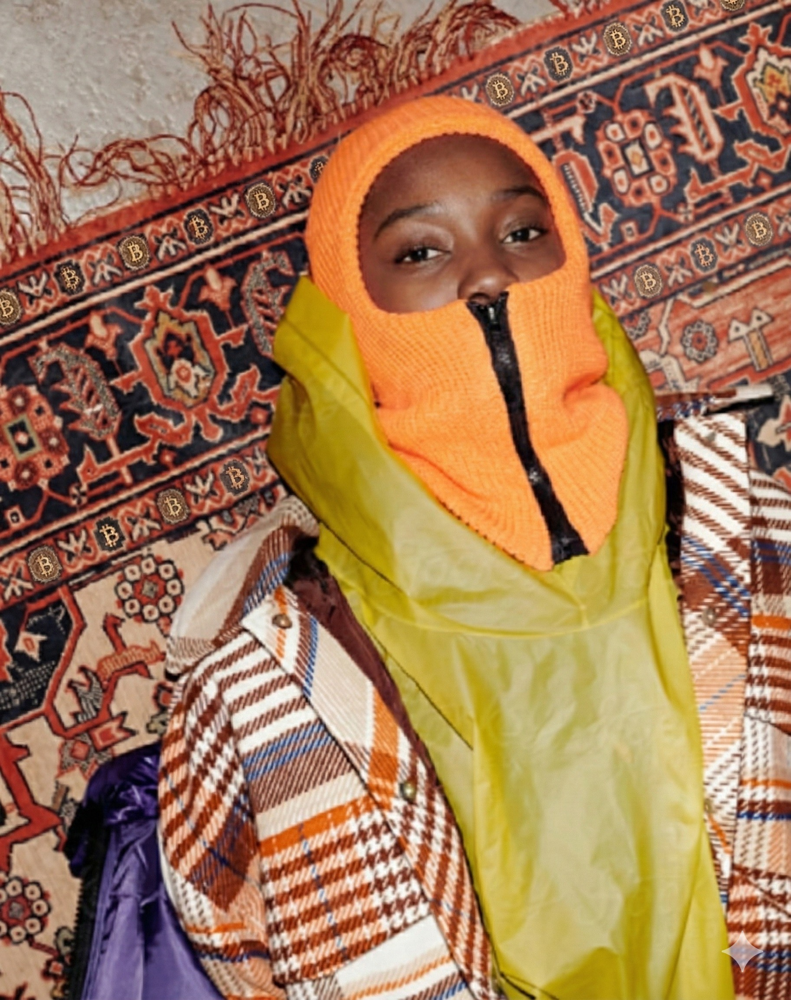

I was asked to edit an image, so I took the original photo of the girl
in the balaclava and rug. First I changed the orange knit balaclava to a
deep gold. Then I added big golden Bitcoin logos to the yellow jacket
and made the logos that were already on the rug bigger, so you notice
them more. The final image shows all of these changes.

