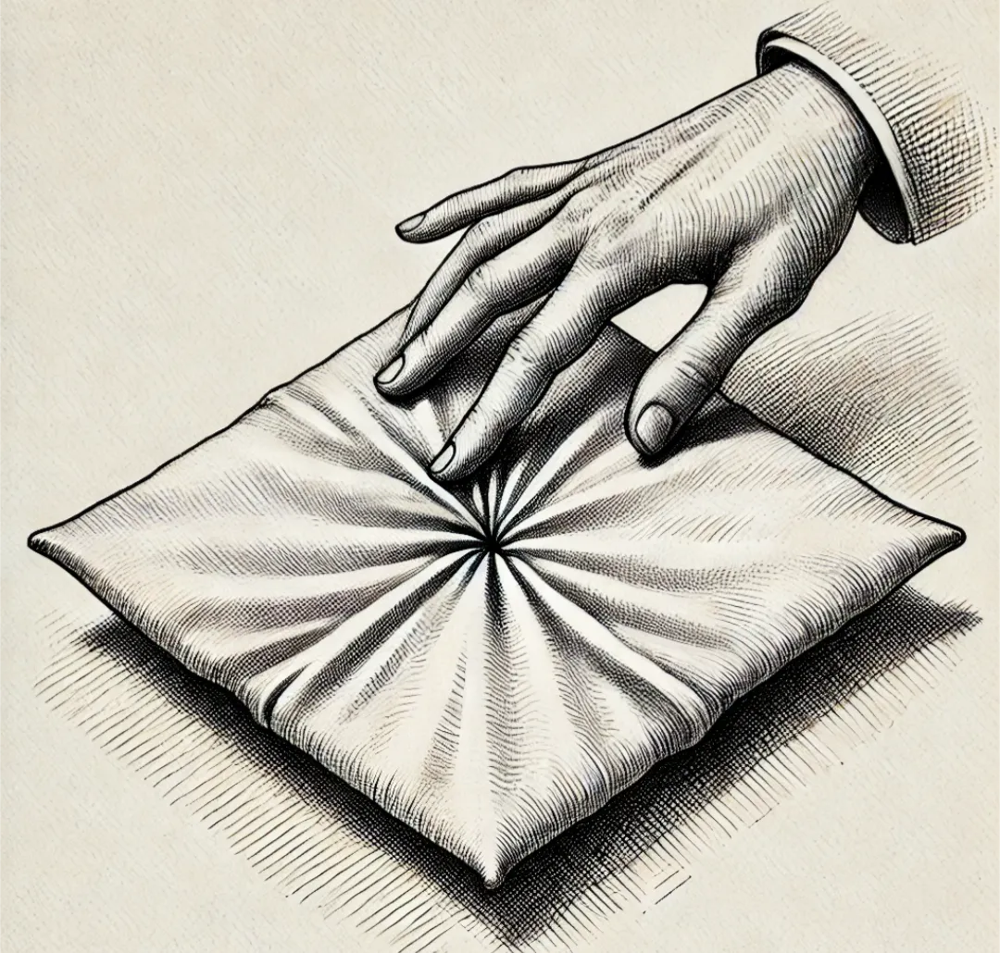

When we look at quantum entanglement, it could just be that even though, because it is already connected, maybe and let’s say we have a we have a piece of cloth that is very tight, holds from all four sides like a square piece of cloth, and on one side of the cloth somebody shakes a little bit, then without the need of traveling through it, it could be felt or there could be an effect on the other end, and that could explain quantum entanglement without the need of a wave that needs to travel because everything is interconnected.

The idea that everything is already connected, like the tight cloth, is a useful way to think about entanglement.

In the analogy the cloth is the quantum field underneath, the fabric of reality that connects everything in the universe. If this fabric is taut and connected everywhere, then a disturbance in one part could instantly affect another part, without a signal that has to physically travel across it.

In quantum entanglement two particles share a quantum state in such a way that measuring one particle instantly determines the state of the other, no matter the distance. With the cloth you can think of the entangled particles as part of the same tight system. If you shake one part of the system, so you observe or measure one particle, the effect is felt right away in the other part, because they are already connected at the base.

Normal signals or waves, like electromagnetic waves, travel at the speed of light. But entanglement seems to happen instantly and goes past this limit. The cloth takes away the need for a signal to travel between the particles, because they are already part of the same connected cloth.

And this makes sense in quantum mechanics. Entanglement is often called non-local, which means the particles behave as if distance doesn't matter. A tightly connected field or fabric fits with that, because any change at one point could right away affect another point.

Then there is wave-particle duality. In quantum mechanics particles like electrons or photons are also waves in their quantum fields. So entangled particles may not be separate things but the same underlying wave or field showing up twice.

And there is Einstein's objection, the EPR paradox. Einstein famously called entanglement "spooky action at a distance" because it seemed to break the speed-of-light limit. The cloth gets around this, because the particles don't need to communicate across space. They are already connected on a deeper level.

So does this remove the need for traveling waves? Yes and no. Yes, because entanglement doesn't rely on a wave or signal that travels between the particles. The effect is instant because the particles are part of the same connected system.

No, because for other quantum interactions or classical communication, waves still travel and carry energy across space, like light or radio waves.

There are also challenges. First, there is no underlying mechanism yet. Quantum mechanics doesn't have a widely accepted explanation for how entanglement works. The cloth is a metaphor, and physicists haven't observed a physical medium like the cloth that connects particles.

Second, quantum field theory. Fields in quantum field theory are local by nature, they affect their immediate surroundings. Entanglement seems to behave differently, because it works non-locally.

Third, Bell's theorem. Experiments that confirm Bell's theorem have shown that entanglement doesn't fit classical ideas of locality. So the tight cloth might not fully explain quantum reality, but it's a helpful way to picture it.

The key idea fits the philosophical side of entanglement. Everything may already be connected at the base. If the universe works as one big connected system, like the cloth, then changes in one part could instantly affect other parts without signals or waves.

This connectedness could be a deeper layer of reality that we don't fully understand yet. Or it could be a feature of the quantum field itself, where particles are not separate but expressions of the same fabric underneath.

The cloth analogy is a fresh way to think about entanglement. It suggests that the connected nature of the universe could explain these instant effects. This is still an open question in physics, and it needs a closer look, maybe in the light of string theory, holographic principles or other advanced theories.
