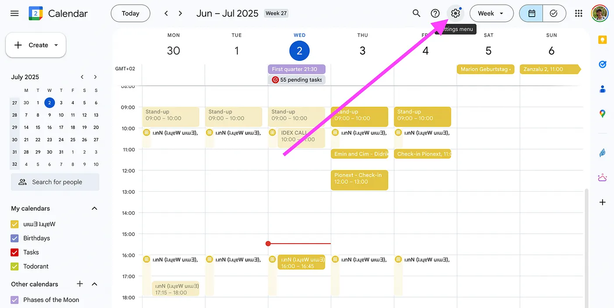
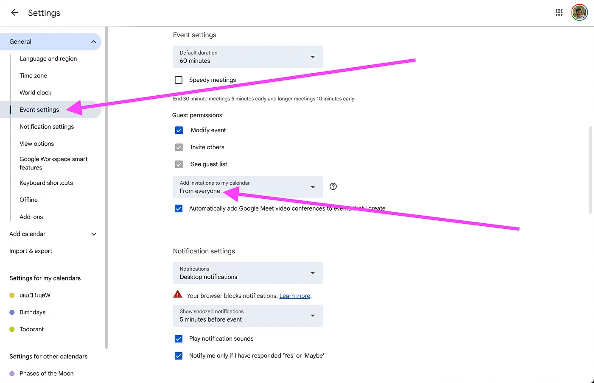
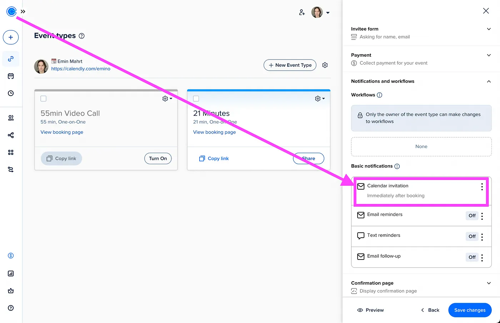

If you’ve scheduled a meeting using someone’s Calendly link but the invitation is no longer automatically appearing on your Google Calendar, you’re not alone. This common issue can stem from a variety of causes, ranging from simple setting misconfigurations to recent changes in how Google handles third-party invitations. Here’s a comprehensive guide to troubleshoot and resolve the problem.

*Go to Google calendar settings on the web.*

### Check Your Google Calendar Settings

The most frequent culprit is a setting within your own Google Calendar designed to prevent spam invitations. By default, **Google may be set to only add invitations from people you know**.

**How to fix it:**

*Go to event settings and activate “invitations from everyone”*

1. Open your Google Calendar on a **web browser**.
1. Click the **Settings menu gear** icon in the top-right corner and select **Settings**.
1. In the left-hand menu, go to **Event settings**.
1. Under “Add invitations to my calendar,” you’ll see a dropdown menu. Change this from “Only if the sender is known” to **“From everyone.”**

This change will allow all invitations, including those from Calendly’s notification system, to be automatically added to your calendar.

### Differentiate Between Email Confirmations and Calendar Invitations

The person whose Calendly link you used has the option to send either an “Email Confirmation” or a “Calendar Invitation.”

- An **Email Confirmation** is a simple email that confirms the meeting details and may include an “.ics” file that you have to manually click to add to your calendar.
- A **Calendar Invitation** is a direct event invitation that your calendar program (like Google Calendar) can automatically process and add.

If you’re consistently not getting automatic additions, the host might have their Calendly event type set to “Email Confirmation.” While you can’t change this on your end, you can manually add the event from the confirmation email.

### For Schedulers: Ensure Your Calendly is Set Up for Calendar Invitations

If you are the one sending out Calendly links and your invitees are experiencing this issue, you should check your event settings.

**How to fix it:**

*It will only work if you have calendar invitation enabled, not email reminders.*

1. Log in to your Calendly account.
1. Go to the specific **Event Type** that is causing the issue.
1. Under the “**Notifications**” or a similar section, ensure that you have selected **“Calendar Invitations”** instead of “**Email Confirmations.**”

### A Note on Recent Google Policy Changes

Google has been implementing stricter measures to combat spam on Google Calendar. This has sometimes impacted how invitations from third-party applications like Calendly are handled. The primary solution for users is the Google Calendar setting adjustment mentioned in the first step. By explicitly allowing invitations from everyone, you are telling Google to trust these incoming events.

By working through these steps, you should be able to resolve the issue of Calendly invitations not appearing on your Google Calendar and ensure you don’t miss any more important meetings.
