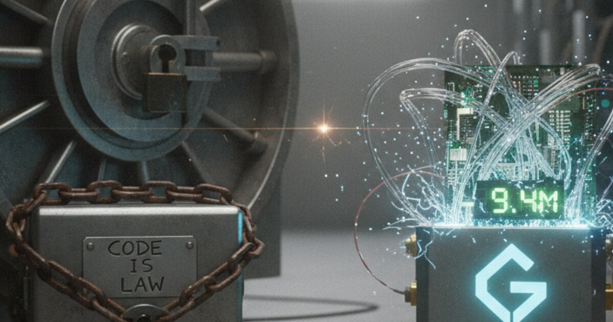

In December 2025 Gnosis Chain did a controversial hard fork to get back $9.4M that was stolen in the Balancer protocol hack. The fight was between the pragmatists, who care most about paying back the victims and about mass adoption, and the purists, who fear the chain loses its credible neutrality and censorship resistance.

The chain got the hacker's funds, but the process skipped the DAO vote. That shows that right now technical governance beats community governance in a crisis. A new intervention framework is being drafted, so future decisions are less arbitrary.

In late 2025 the Balancer protocol was hit by a global exploit. The hack affected several chains, and $9.4 Million of it was stolen on Gnosis Chain.

Ethereum only ever forked for the massive DAO hack, and other L1s might just stay passive. Gnosis Chain validators stepped in, in two steps.

Step 1 was a soft fork. Validators updated their clients to censor the hacker's address, and that froze the funds.

Step 2 was a hard fork. A state change forcibly moved the frozen funds to a DAO-controlled multisig, so they can go back to the victims.

This started a fierce debate on the Gnosis Forum about the soul of the chain.

The pragmatists have four arguments. The first is responsibility as neofinance. If Gnosis wants to be a layer for real-world assets and payments, it can't let theft stand when there is a technical fix. Leaving $9.4M in a frozen wallet helps nobody.

The second is that neutrality was already a sunk cost. The chain's neutrality was technically broken the moment validators agreed to the soft fork and froze the funds. Saying no to the hard fork that returns them would be performative, not principled.

The third is deterrence. Reversing the hack works like a security feature. It tells future attackers that Gnosis Chain is not a soft target where theft pays.

The fourth is consensus reality. Code is law gets replaced by consensus is law. If most validators agree to run the patch, that is the legitimate state of the chain.

The purists see it differently. First, it eats away credible neutrality. Critics warn that this sets a dangerous precedent. If validators can coordinate to seize a hacker's funds, governments could in theory force them to seize anyone's funds.

Second, moral hazard. If protocols believe the Layer-1 will bail them out, they may spend less on security audits. The liability moves from app developers to network validators.

Third, arbitrary justice. The community pointed at the inconsistency. In an earlier incident, the sDAI-EURe pool leak, users lost funds because of a vulnerability and got no bailout. Why was the $9.4M Balancer hack worth a fork and smaller losses were not?

Fourth, legal liability. By stepping in, validators go from neutral infrastructure providers to active decision makers, and that may increase their legal exposure.

So who actually decided? The incident showed a technocracy under the democracy.

The Gnosis core team had the most influence. They prepared the hard fork binaries and decided on their own to skip a formal DAO vote, because time was short and the holidays were coming. One core member admitted, "I simply forgot that I said [there would be a vote]."

Client developers, the teams that run validator software like Lodestar and Nethermind, handed out censoring images to validators, sometimes through private channels. This backroom coordination went around the usual open-source transparency.

The DAO had almost no influence. Validators upgraded their nodes and so executed the decision before a token holder vote could happen.

As one forum member put it, "DAOs have no vote on this... anything else is just theatre."

The hard fork is done and the funds sit in a Gnosis DAO multisig. To repair the damage to trust and answer the arbitrary justice concerns, the community is now drafting a Crisis Intervention Framework.

It proposes a scoring system for bailouts, and future interventions may have to meet strict thresholds.

On impact, the theft must be more than 1% of chain TVL. On protocol status, blue chip protocols, meaning audited and with a long history, get priority over experimental code. On user base, hacks that hit retail and mainstream users count more than degen strategies.

If you want to read more, the original discussion is at [Gnosis Forum: Balancer Hack Hard Fork Debate](#), the Balancer incident report is at [Balancer Security Updates](#), and Gnosis DAO governance is at [Gnosis Snapshot & Forum](#).
